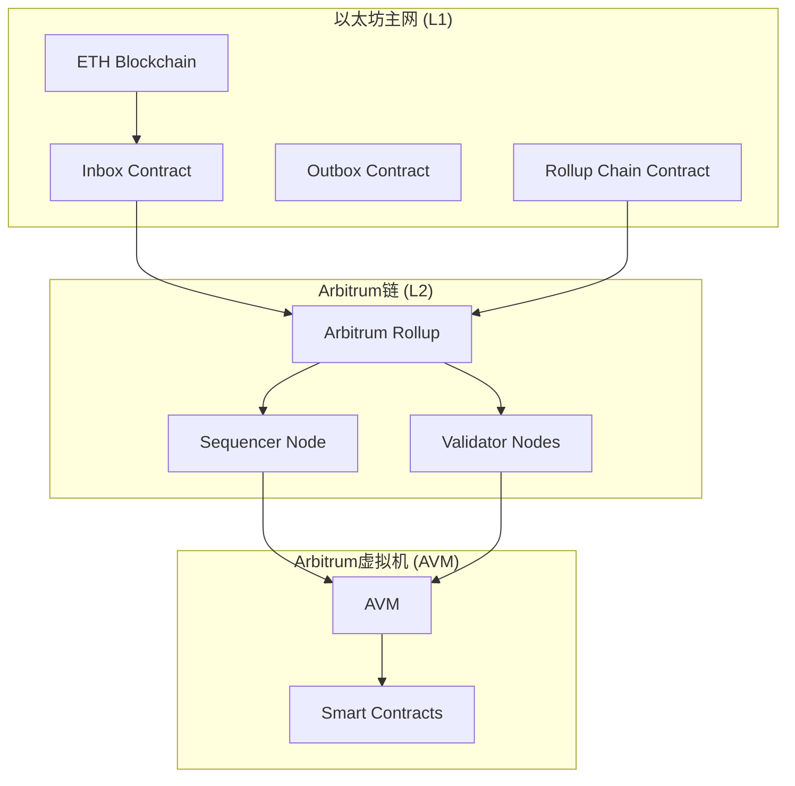
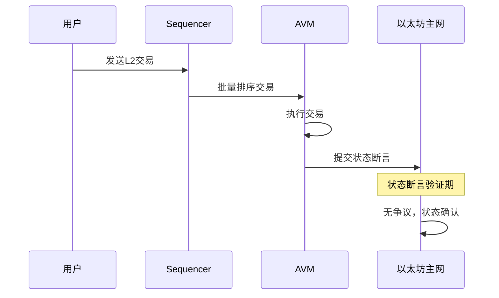
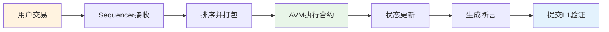

## 前言：区块链扩容的迫切需求

以太坊网络拥堵和高昂的Gas费用已经成了老生常谈。这条最受欢迎的公链每秒只能处理约15笔交易，明显跟不上需求增长。这个问题催生了Layer 2（L2）扩容解决方案的发展，而Arbitrum凭借其Optimistic Rollup技术，成了最受欢迎的扩容方案之一。

Arbitrum由Offchain Labs团队开发，把计算和存储从以太坊主链转移到链下，大幅提升交易速度和降低成本，同时保持以太坊的安全性。这篇文章深入解析Arbitrum的技术原理，看看它如何在保持安全的前提下实现高效扩容。

## 一、Arbitrum核心架构

### 1.1 Optimistic Rollup基本概念

Optimistic Rollup的思路很直接：默认提交到L1的交易都是正确的，只在出现争议时才启动欺诈证明机制。这种"乐观假设"减少了验证开销，提高了效率。

Arbitrum的架构包含三个核心部分：

1. **以太坊主网（L1）**：负责最终状态验证和争议解决
2. **Arbitrum链（L2）**：处理大量交易和计算，提高吞吐量
3. **Arbitrum虚拟机（AVM）**：执行智能合约，处理用户操作

### 1.2 Arbitrum三层架构示意图



### 1.3 核心组件解析

- **Inbox合约**：接收从L1到L2的消息，维护交易顺序
- **Outbox合约**：处理从L2到L1的消息传递
- **Rollup链合约**：管理Arbitrum链的状态和争议解决过程
- **Sequencer节点**：收集L2交易并排序
- **Validator节点**：验证L2状态并参与争议解决

## 二、技术原理解析

### 2.1 交易处理流程

Arbitrum的交易处理涉及三个阶段：

1. **提交阶段**：用户将交易发送到L2
2. **排序阶段**：Sequencer对交易进行排序
3. **执行阶段**：AVM执行交易并更新状态



### 2.2 状态转换证明

Arbitrum采用"状态断言"机制来证明L2状态转换的正确性。每个状态断言包括：

- 初始状态哈希
- 最终状态哈希
- 交易批次
- 计算步骤数

出现争议时，Arbitrum使用"二分博弈"（Bisection Game）算法来确定争议的具体计算步骤：


### 2.3 欺诈证明机制详解

欺诈证明是Optimistic Rollup的核心安全机制，包含下面几个阶段：

1. **断言提交**：任意节点可提交状态断言
2. **挑战期**：其他节点有时间挑战错误断言
3. **争议解决**：通过二分博弈解决争议

**欺诈证明流程**：

| 步骤 | 参与者 | 行为 | 结果 |
|------|--------|------|------|
| 1 | 挑战者 | 提交挑战保证金 | 挑战生效 |
| 2 | 被挑战方 | 继续执行争议计算 | 进入二分博弈 |
| 3 | 双方 | 逐步缩小争议范围 | 精确定位错误 |
| 4 | 验证器 | 执行单步验证 | 确定欺诈方 |

## 三、Arbitrum虚拟机（AVM）

### 3.1 与EVM的兼容性

Arbitrum虚拟机（AVM）设计为兼容EVM字节码，这让以太坊开发者可以无缝迁移智能合约。

AVM和EVM的区别体现在几个方面：

| 特征 | EVM | AVM |
|------|-----|-----|
| 执行模型 | 基于堆栈 | 基于堆栈，但有扩展 |
| 可确定性 | 部分支持 | 完全支持 |
| 随机性访问 | 可访问时间戳等 | 不支持随机性 |
| L2特定功能 | 无 | 支持L1/L2通信 |

### 3.2 AVM设计特色

AVM的关键设计包括：

- **确定性计算**：所有操作必须是完全确定性的
- **L1/L2通信**：支持跨层消息传递
- **Gas计量**：适配L2的Gas模型

```solidity
// AVM兼容示例
contract ExampleBridge {
    // 向L1发送消息
    function sendToL1(bytes memory message) external {
        // AVM提供跨层通信功能
    }

    // 从L1接收消息
    function receiveFromL1(bytes memory message) external {
        // 处理来自L1的调用
    }
}
```

### 3.3 智能合约执行流程



## 四、安全性分析

### 4.1 安全模型

Arbitrum的安全性基于几个假设：

- **至少一个诚实验证者**：总有一个诚实的验证节点监控网络
- **经济激励**：挑战和验证的经济激励确保参与者参与
- **L1最终性**：争议最终在L1解决，依赖以太坊的安全性

### 4.2 欺诈证明的工作原理

欺诈证明机制的安全性来自：

- **断言挑战**：任何节点可挑战错误状态断言
- **二分分解**：将争议计算分解为更小部分
- **单步验证**：在L1验证单个计算步骤的正确性
- **奖惩机制**：惩罚错误方，奖励诚实方

### 4.3 可能的安全隐患

| 潜在风险 | 防护措施 |
|----------|----------|
| 恶意Sequencer | 多重验证，用户可旁路 |
| 挑战期攻击 | 足够长挑战期，激励验证者参与 |
| 代码漏洞 | 严格审计，协议升级机制 |

## 五、性能与优势

### 5.1 吞吐量提升

Arbitrum在性能上相比以太坊主网有显著提升：

| 指标 | 以太坊主网 | Arbitrum | 提升倍数 |
|------|------------|----------|----------|
| TPS | ~15 | ~40,000* | ~2,667x |
| 平均确认时间 | ~13秒 | ~0.5秒 | 26x更快 |
| 普通转账费用 | ~$1-10 | ~$0.001-0.1 | 10-100x更低 |

*理论峰值，实际性能取决于网络状况

### 5.2 Gas费用优化

Arbitrum通过以下方式优化Gas费用：

- **批量处理**：L2交易批量提交，分摊L1成本
- **执行优化**：在L2执行而非L1，大幅降低计算成本
- **存储压缩**：优化数据存储和传输

### 5.3 用户体验改善

Arbitrum显著改善了用户在以太坊生态中的体验：

| 方面 | 以太坊主网 | Arbitrum |
|------|------------|----------|
| 交易费用 | 高昂（$1-10） | 极低（$0.001-0.1） |
| 确认时间 | 约13秒 | 约0.5秒 |
| 网络拥堵 | 频繁发生 | 极少出现 |
| 智能合约交互 | 成本高，体验差 | 成本低，体验佳 |

这种改善使得以前在以太坊主网上无法实现的高频小额交易、实时游戏和复杂DeFi操作在Arbitrum上变得可行。

## 六、挑战与局限性

### 6.1 挑战期问题

Optimistic Rollup的挑战期（通常7天）带来实际问题：

- **资金锁定时间**：提款需等待挑战期结束
- **用户体验**：较慢的L2到L1转账
- **流动性成本**：需要流动性提供者缩短等待时间

### 6.2 流动性限制

Arbitrum仍面临一些流动性挑战：

- **跨链桥依赖**：需要可靠的L1-L2流动性
- **中心化风险**：某些跨链桥可能存在中心化风险

### 6.3 其他技术瓶颈

技术方面还存在一些限制：

- **可扩展性限制**：仍受限于L1数据可用性
- **复杂性**：协议复杂度高，实现难度大

## 七、实际应用案例

### 7.1 Arbitrum网络现状

Arbitrum已成为领先的L2解决方案：

- **总锁仓价值（TVL）**：数十亿美元
- **活跃用户数**：数百万用户
- **集成项目**：数百个DeFi、NFT等项目

### 7.2 在DeFi领域的应用

Arbitrum为DeFi应用提供了高效执行环境：

- **Uniswap**：在Arbitrum上部署，降低交易成本
- **GMX**：原生Arbitrum项目，提供高效的衍生品交易
- **Jones DAO**：Arbitrum原生的期权协议

## 八、未来发展

### 8.1 技术发展方向

Arbitrum团队推进了多个技术更新：

- **Nitro升级**：结合Optimistic和ZK Rollup优势，大幅提升效率
- **AnyTrust**：针对特定用例的低成本解决方案
- **Stylus**：支持Rust、Go等高级语言的智能合约

### 8.2 与以太坊主网的协同发展

Arbitrum将继续与以太坊主网协同发展：

- **数据可用性解决方案**：与以太坊分片技术结合
- **跨层互操作性**：更高效的L1-L2通信
- **安全模型演进**：不断优化安全机制

## 九、结语

Arbitrum通过其创新的技术架构和安全模型，为以太坊生态系统的扩容提供了重要支撑。它在保持去中心化和安全性的同时，大幅提升了交易处理效率和用户体验。

随着Arbitrum Nitro等技术升级的推进，以及对更多编程语言和应用场景的扩展，Arbitrum在区块链生态系统中的前景广阔。对开发者和用户而言，Arbitrum提供既高效又安全的平台，使复杂去中心化应用成为可能。

Arbitrum的成功验证了Optimistic Rollup技术的可行性，也为整个Layer 2生态系统的发展提供了宝贵经验。