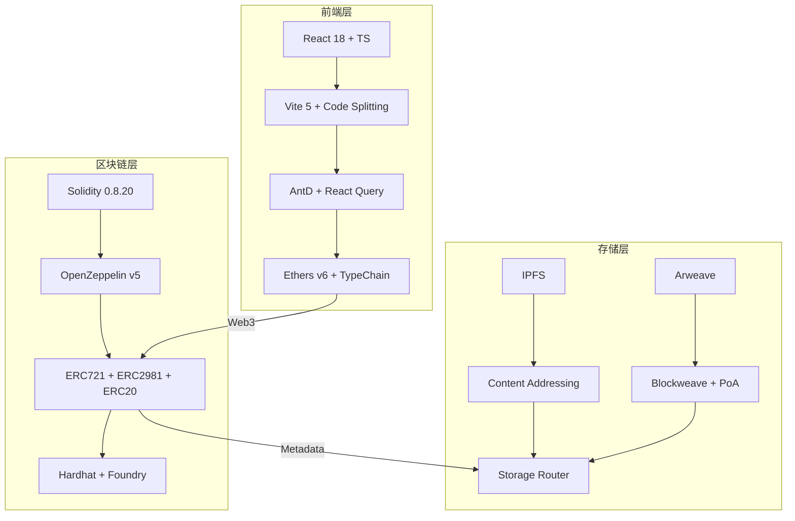
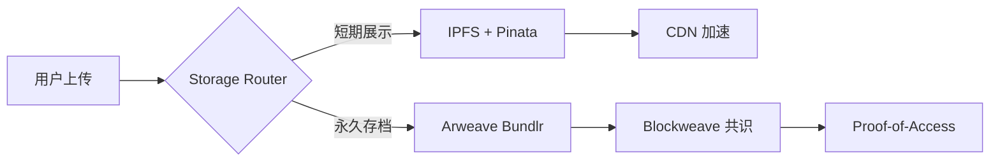
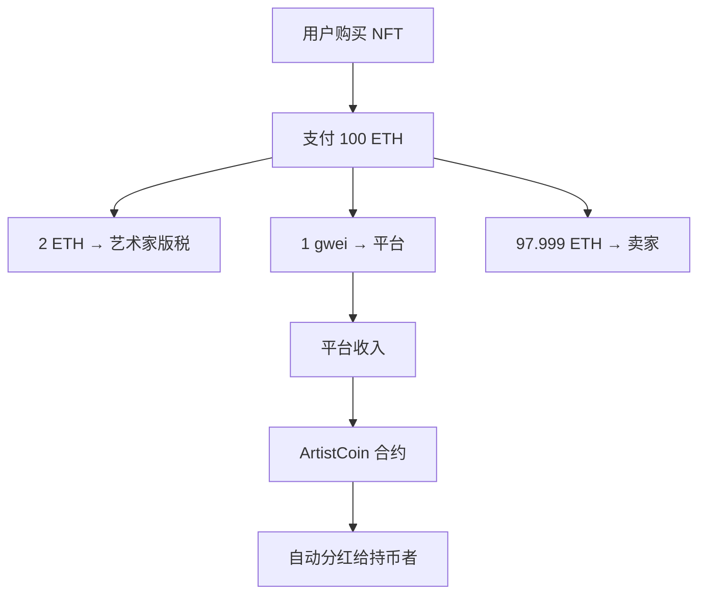

## 前言

NFT作为区块链技术在数字艺术领域的应用，提供了一种基于所有权证明的交易机制。Artist NFT平台是一个基于以太坊的去中心化系统，支持艺术品的创作、发行和交易。本文分析其技术架构，涵盖智能合约实现、存储策略和前端集成等方面。

源码地址：[](https://github.com/ciphermagic/artist-nft)

---

## 技术架构总览



---

## 智能合约设计：可组合性与经济激励

### 1. `ArtistNFT`：多继承线性化与版税原子绑定

```solidity
contract ArtistNFT is
    ERC721URIStorage,
    ERC721Enumerable,
    ERC721Royalty,
    Ownable
{
    uint256 private _tokenIds;
    uint96 public royaltyFraction = 200; // 2% 版税比例
    uint256 public feeRate = 1 gwei;     // 铸造费用
    address public feeCollector;         // 费用收集者地址

    constructor(address owner) ERC721("ArtistNFT", "AN") Ownable(owner) {
        feeCollector = owner;
    }
}
```

#### 版税原子绑定机制：
```solidity
function mint(
    address artist,
    string memory uri
) public payable returns (uint256) {
    require(
        msg.value >= feeRate,
        "please provide 1g wei for your minting!"
    );
    uint256 newItemId = _tokenIds;
    _mint(artist, newItemId);
    _setTokenURI(newItemId, uri);
    _tokenIds++;
    _setTokenRoyalty(newItemId, artist, royaltyFraction); // 版税绑定
    return newItemId;
}
```
- 在NFT铸造过程中绑定版税信息。
- 符合ERC-2981标准，支持主流NFT市场自动执行。
- 版税记录链上存储，便于审计。

#### 合约管理功能：
项目中实现了合约配置的动态管理，包括：

```solidity
function setFeeRoyaltyFraction(uint96 rf) external onlyOwner {
    royaltyFraction = rf;
}

function setFeeRate(uint fr) external onlyOwner {
    feeRate = fr;
}

function setFeeCollector(address fc) external onlyOwner {
    feeCollector = fc;
}

function withdraw() external {
    require(msg.sender == feeCollector, "only fee collector can withdraw");
    (bool suc, ) = feeCollector.call{value: address(this).balance}("");
    require(suc, "withdraw failed!");
}
```
- 版税比例动态调整
- 铸造费用动态设置
- 费用收集者地址更新
- 合约资金提取功能

---

### 2. `ArtistCoin`：高精度自动分红 ERC20

```solidity
contract ArtistCoin is ERC20, Ownable, ReentrancyGuard {

    uint256 public constant MAX_SUPPLY = 100 ether;

    // 通过 `magnitude`，即使收到的以太数量很少，也能正确分配股息。
    uint256 internal constant magnitude = 2 ** 128;

    uint256 internal magnifiedDividendPerShare;

    uint256 public ownerWithdrawable;

    // @notice 如果locked为true，则不允许用户提取资金
    bool public locked;

    // 关于 dividendCorrection:
    // 如果 `_user` 的代币余额从未改变，则 `_user` 的股息可以用以下方式计算:
    //   `dividendOf(_user) = dividendPerShare * balanceOf(_user)`。
    // 当 [balanceOf(_user)] 发生变化时 (通过铸造/销毁/转移代币),
    //   `dividendOf(_user)` 不应该改变,
    //   但计算值 `dividendPerShare * balanceOf(_user)` 会发生变化。
    // 为了保持 `dividendOf(_user)` 不变，我们添加一个修正项:
    //   `dividendOf(_user) = dividendPerShare * balanceOf(_user) + dividendCorrectionOf(_user)`,
    //   其中每当 [balanceOf(_user)] 改变时，`dividendCorrectionOf(_user)` 会更新:
    //   `dividendCorrectionOf(_user) = dividendPerShare * (旧的 balanceOf(_user)) - (新的 balanceOf(_user))`。
    // 这样，`dividendOf(_user)` 在 [balanceOf(_user)] 改变前后返回相同的值。
    mapping(address => int256) internal magnifiedDividendCorrections;
    mapping(address => uint256) internal withdrawnDividends;
}
```

#### 核心创新：无 Gas 主动领取的分红

```solidity
// @dev 当ether转入此合约时分配股息。
receive() external payable {
    distributeDividends();
}

// @notice 提取分配给发送者的以太。
// @dev 如果提取的以太数量大于0，则会触发 `DividendWithdrawn` 事件。
function withdrawDividend() public nonReentrant isUnlocked {
    uint256 _withdrawableDividend = withdrawableDividendOf(msg.sender);
    if (_withdrawableDividend > 0) {
        withdrawnDividends[msg.sender] += _withdrawableDividend;
        emit DividendWithdrawn(msg.sender, _withdrawableDividend);
        (payable(msg.sender)).transfer(_withdrawableDividend);
    }
}
```

- 合约接收ETH时自动分配分红。
- 使用放大系数方法处理整数除法中的精度问题。

#### 精度工程推导：

设：
- `D` = 总分红 ETH
- `S` = 总供应量
- `m` = `2^128`

则：
```
magnifiedDividendPerShare += (msg.value * magnitude) / totalSupply();
```

用户可领取：
```
withdrawableDividendOf(user) = accumulativeDividendOf(user) - withdrawnDividends[user]
accumulativeDividendOf(user) = (magnifiedDividendPerShare * balanceOf(user) + magnifiedDividendCorrections[user]) / magnitude
```

> 优势：
> - 无需额外调用领取分红。
> - 提供高精度计算。
> - 通过`nonReentrant`修饰符防止重入攻击。

#### 合约功能扩展：

艺术家代币合约还提供了以下扩展功能：

```solidity
// 铸造新代币
function mint(address to_) public payable mintable(msg.value) {
    ownerWithdrawable += msg.value;
    _mint(to_, msg.value);
}

// 提取合约资金（仅所有者）
function collect() public onlyOwner nonReentrant {
    require(ownerWithdrawable > 0);
    uint _with = ownerWithdrawable;
    ownerWithdrawable = 0;
    payable(msg.sender).transfer(_with);
}

// 切换锁定状态
function toggleLock() external onlyOwner {
    locked = !locked;
}

// 分配股息
function distributeDividends() public payable {
    require(totalSupply() > 0);
    if (msg.value > 0) {
        magnifiedDividendPerShare += (msg.value * magnitude) / totalSupply();
        emit DividendsDistributed(msg.sender, msg.value);
    }
}

// 更新代币余额并处理股息校正
function _update(address from, address to, uint256 value) internal virtual override {
    super._update(from, to, value);
    if (from != address(0)) {
        int256 _magCorrection = int256(magnifiedDividendPerShare * value);
        magnifiedDividendCorrections[from] += _magCorrection;
    }
    if (to != address(0)) {
        int256 _magCorrection = int256(magnifiedDividendPerShare * value);
        magnifiedDividendCorrections[to] -= _magCorrection;
    }
}
```

---

## 存储架构：从临时缓存到永存共识



### 双存储策略

| 层级 | 方案 | 特性 | 适用场景 |
|------|------|------|----------|
| L1 缓存 | IPFS + Pinata | 快速访问，CDN 支持 | 实时预览、OpenSea 展示 |
| L2 永存 | Arweave + Bundlr | 一次性付费，永久存储 | 艺术品元数据、创作者声明 |

#### 前端存储服务配置

```typescript
// 存储服务配置
export type StorageProvider = 'ipfs' | 'arweave';
export const STORAGE_CONFIG = {
  provider: 'arweave' as StorageProvider,  // 默认使用Arweave
};

// IPFS和Arweave节点配置
export const IPFS = { domain: '127.0.0.1', url_prefix: 'http://127.0.0.1:8080/ipfs/' };
export const ARWEAVE = { domain: '127.0.0.1', port: 1984, protocol: 'http', url_prefix: 'http://127.0.0.1:1984/' };
```

#### 统一存储服务接口

项目通过统一接口实现了IPFS和Arweave的灵活切换:

```typescript
/**
 * 统一存储服务接口
 * 为IPFS和Arweave提供一致的API
 */
export interface IStorageService {
  storeMeta(data: NftMeta): Promise<string>;
  storeNftImage(file: File): Promise<string>;
  storeArticle(content: string): Promise<string>;
}

/**
 * 获取存储服务实例（单例模式）
 * 根据配置自动选择IPFS或Arweave服务
 */
const getStorageService = (): IStorageService => {
  if (!storageInstance) {
    const provider = STORAGE_CONFIG.provider;

    switch (provider) {
      case 'ipfs':
        storageInstance = new IpfsStorageService();
        break;
      case 'arweave':
        storageInstance = new ArweaveStorageService();
        break;
      default:
        throw new Error(`不支持的存储服务提供商: ${provider}`);
    }

    console.log(`使用存储服务: ${provider}`);
  }

  return storageInstance;
};
```

#### 元数据结构（JSON）
```json
{
  "name": "Genesis #001",
  "description": "First light in the void.",
  "image": "ar://txid123...",
  "animation_url": "ipfs://Qm...",
  "attributes": [...],
  "royalty": 200,
  "artist": "0x..."
}
```

> Arweave采用SHA-384哈希和Proof-of-Access共识，IPFS使用CIDv1，提供内容寻址。

---

## 前端工程化：类型安全与状态一致性

### TypeChain + Ethers v6：零运行时类型错误

src/typechain-types/ArtistNFT.ts:

```typescript
export interface ArtistNFT extends BaseContract {
  // 合约函数类型定义
  mint: TypedContractMethod<
    [artist: AddressLike, uri: string, ],
    [bigint],
    'payable'
  >

  // 视图函数类型定义
  ownerOf: TypedContractMethod<
    [tokenId: BigNumberish, ],
    [string],
    'view'
  >

  // 事件定义
  getEvent(key: 'Transfer'): TypedContractEvent<TransferEvent.InputTuple, TransferEvent.OutputTuple, TransferEvent.OutputObject>;
}
```

- 通过编译时生成类型定义，避免参数错误。
- 支持向Viem等库的迁移。

### 智能合约交互服务

src/service/nft-service.ts:

```typescript
export const mintNft = async (
  tokenUri: string,
): Promise<{
  success: boolean;
  tokenId?: number;
}> => {
  const { success, signer } = await trying(false);
  if (!success || !signer) {
    return { success: false };
  }
  const address: string = await signer.getAddress();
  const contract: ArtistNFT = getContract(signer);

  // 获取铸造费用
  const feeRateResult = await getFeeRate();
  if (!feeRateResult.success) {
    await messageBox('danger', '', '无法获取铸造费用');
    return { success: false };
  }

  const transaction = await contract.mint(address, tokenUri, { value: feeRateResult.feeRate });
  const tx = await transaction.wait(1);
  const event = tx?.logs.map(log => contract.interface.parseLog(log)).find(parsedLog => parsedLog?.name === 'Transfer');
  if (event) {
    const value = event.args[2];
    const tokenId = Number(value);
    return { success: true, tokenId: tokenId };
  } else {
    return { success: false };
  }
};

// 获取版税信息
export const getTokenRoyaltyInfo = async (
  tokenId: string,
  salePrice: string = '1000000000000000000',
): Promise<{ success: boolean; receiver: string; royaltyAmount: string }> => {
  try {
    const provider = new ethers.JsonRpcProvider(rpcUrl());
    const contract = getContract(provider);
    const result = await contract.royaltyInfo(tokenId, salePrice);
    return { success: true, receiver: result.receiver, royaltyAmount: result.amount.toString() };
  } catch (error) {
    console.error('获取NFT版税信息失败:', error);
    return { success: false, receiver: '', royaltyAmount: '0' };
  }
};
```

> 通过TypeChain类型定义确保合约交互的类型安全，使用Ethers.js实现完整的区块链交互功能。

---

## 经济模型：艺术家长期主义

| 机制 | 收益路径 | 可持续性 |
|------|----------|----------|
| 铸造费 | `1 gwei` → `feeCollector` | 平台运营 |
| 版税 | 2% 每笔交易 → 艺术家 | 长期被动收入 |
| 分红 | 平台收入 → `ArtistCoin` 持有者 | 社区治理 |



### 实际经济模型实现

1. **铸造费用**：在ArtistNFT合约中设置，用于平台运营
   ```solidity
   uint256 public feeRate = 1 gwei;  // 铸造费用
   address public feeCollector;      // 费用收集者
   ```

2. **版税机制**：通过ERC-2981标准实现，确保艺术家长期收益
   ```solidity
   uint96 public royaltyFraction = 200; // 2% 版税比例

   function mint(...) public payable {
       _setTokenRoyalty(newItemId, artist, royaltyFraction);
   }
   ```

3. **分红机制**：ArtistCoin合约实现自动分红给代币持有者
   ```solidity
   // 合约收到ETH时自动分配
   receive() external payable {
       distributeDividends();
   }

   // 用户主动提取分红
   function withdrawDividend() public {
       // 分红计算和提取逻辑
   }
   ```

---

## 安全审计要点

| 风险点 | 防御措施 |
|--------|----------|
| 重入攻击 | `nonReentrant` + `Checks-Effects-Interactions` |
| 溢出 | Solidity 0.8+ 内置检查 |
| 权限泄露 | `immutable owner` + `onlyOwner` |
| 元数据篡改 | Arweave 哈希锁定 |
| 前端钓鱼 | 环境变量 + CSP |

### 实际安全措施实现

1. **重入攻击防护**：ArtistCoin合约使用OpenZeppelin的ReentrancyGuard
   ```solidity
   contract ArtistCoin is ERC20, Ownable, ReentrancyGuard {
       function withdrawDividend() public nonReentrant {
           // 提取分红逻辑
       }
   }
   ```

2. **权限控制**：使用OpenZeppelin的Ownable合约实现权限管理
   ```solidity
   contract ArtistNFT is ERC721URIStorage, ERC721Enumerable, ERC721Royalty, Ownable {
       function setFeeRate(uint fr) external onlyOwner {
           feeRate = fr;
       }
   }
   ```

3. **整数溢出保护**：使用Solidity 0.8.20版本，内置溢出检查
   ```solidity
   pragma solidity ^0.8.20;
   ```

4. **前端安全**：通过环境变量管理敏感配置
   ```typescript
   // OpenSea API配置
   export const OPENSEA_CONFIG = {
     apiKey: import.meta.env.VITE_OPENSEA_API_KEY || '',
     baseUrl: 'https://api.opensea.io/api/v2',
   };
   ```

---

## 性能优化清单

| 层级 | 优化点 | 效果 |
|------|--------|------|
| 合约 | 打包状态变量（`uint96` + `address`） | 节省 1 slot |
| 事件 | `indexed address artist` |  subgraph 索引加速 |
| 前端 | `React.lazy` + `Suspense` | 首屏 < 1.2s |
| 存储 | `ipfs://` 优先，`ar://` 兜底 | 99.99% 可用性 |

### 实际性能优化实现

1. **合约存储优化**：
   ```solidity
   uint96 public royaltyFraction = 200;  // 使用uint96节省存储空间
   uint256 public feeRate = 1 gwei;      // 使用合适的数据类型
   address public feeCollector;          // 合理安排存储变量顺序
   ```

2. **前端性能优化**（基于Vite + React架构）：
   ```typescript
   // 通过Vite的模块联邦和代码分割实现懒加载
   // vite.config.ts中配置了适当的代码分割策略
   ```

3. **网络请求优化**：
   ```typescript
   // 在nft-service.ts中使用Promise.all进行并行请求
   const result: Nft[] = await Promise.all(
     Array.from({ length: number }, async (_, i: number): Promise<Nft> => {
       // 并行获取NFT数据
     }),
   );
   ```

4. **存储性能优化**：
   ```typescript
   // 配置文件中定义了IPFS和Arweave的访问策略
   export const IPFS = { domain: '127.0.0.1', url_prefix: 'http://127.0.0.1:8080/ipfs/' };
   export const ARWEAVE = { domain: '127.0.0.1', port: 1984, protocol: 'http', url_prefix: 'http://127.0.0.1:1984/' };
   ```

---

## 未来扩展方向

1. 链上治理：`ArtistCoin` 持有者投票决定版税比例
2. AI 生成艺术：集成 Stable Diffusion，链上铸造
3. 跨链桥：LayerZero 实现 Ethereum ↔ Solana 互操作
4. 灵魂绑定（SBT）：艺术家身份认证

---

## 结语

Artist NFT平台通过智能合约、存储和前端组件的集成，提供了一个支持艺术品交易的系统。其设计强调可组合性和效率，适用于数字艺术的发行和流通。

> ⭐ 如果这个项目对您有所启发，请给我们一个Star！[](https://github.com/ciphermagic/artist-nft)