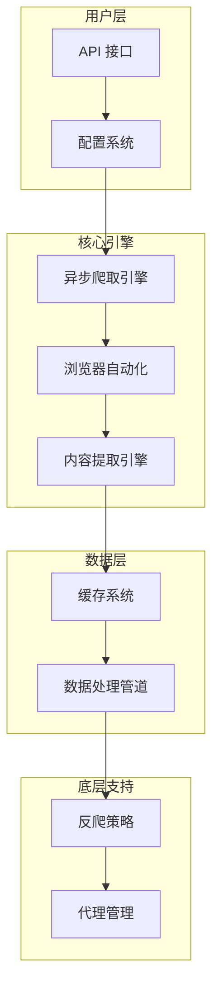

在 AI 时代，高质量的数据采集成为构建智能应用的关键能力。传统爬虫工具要么输出混乱的 HTML，需要大量清洗工作；要么依赖昂贵的 API 服务，成本难以控制。crawl4ai 的出现正是为了解决这个实际问题。本文将从功能特性、技术架构、安装踩坑到实战配置，带你全面掌握这款 AI 友好的开源爬虫工具。

## 一、为什么需要 crawl4ai？

在构建 AI 应用的过程中，数据采集一直是一个令人头疼的问题。传统的爬虫工具要么输出混乱的 HTML，需要大量清洗工作；要么依赖昂贵的 API 服务，成本难以控制。

crawl4ai 的设计理念正是**为 AI 应用而生**。它不仅能够处理动态网页、执行 JavaScript，还能直接输出 Markdown、JSON 等 AI 模型可直接处理的格式，大大简化了数据预处理流程。

## 二、核心特性

### 2.1 数据输出格式

crawl4ai 最核心的特点就是**专为 AI 应用场景优化**的数据输出能力：

| 输出格式 | 适用场景 |
|---------|----------|
| **Markdown** | RAG 管道、文档处理、内容分析 |
| **JSON** | 结构化数据提取、API 集成 |
| **清洁 HTML** | 保留样式的信息提取 |

```python
# 基础爬取示例
import asyncio
from crawl4ai import AsyncWebCrawler

async def main():
    async with AsyncWebCrawler() as crawler:
        result = await crawler.arun(url="https://example.com")
        print(result.markdown)  # Markdown 输出
        print(result.json)      # JSON 输出
```

### 2.2 浏览器控制

基于 Playwright 实现浏览器自动化：

```python
# 浏览器配置
result = await crawler.arun(
    url="https://example.com",
    browser_config={
        "headless": True,           # 无头模式
        "stealth_mode": True,       # 隐身模式
        "user_data_dir": "./cache"  # 会话缓存
    }
)
```

**核心能力**：
- 🗂️ **会话管理**：浏览器上下文复用，避免重复登录
- 🌐 **代理支持**：内置代理轮换，规避 IP 封禁
- 👻 **隐身模式**：模拟真实用户行为，绕过反爬检测
- 🔧 **自定义钩子**：请求前后插入自定义处理逻辑

### 2.3 性能优化

```python
# 并发爬取
results = await crawler.arun_many(
    urls=["url1", "url2", "url3"],
    max_concurrency=5
)
```

**优化策略**：
- ⚡ **异步并行**：基于 Python asyncio，支持高并发
- 💾 **智能缓存**：多级缓存（内存→磁盘→分布式），减少重复请求
- 📦 **分块处理**：大规模数据分批提取，避免内存溢出

### 2.4 反爬策略

crawl4ai 内置多种反爬对抗策略：

```python
# 配置请求头
result = await crawler.arun(
    url="https://example.com",
    browser_config={
        "headers": {
            "User-Agent": "Mozilla/5.0 (Macintosh; Intel Mac OS X 10_15_7)",
            "Accept": "text/html,application/xhtml+xml",
        }
    }
)
```

## 三、技术架构

整体采用模块化、分层设计：



### 3.1 异步爬取引擎

crawl4ai 基于 Python 的 `asyncio` 和 `aiohttp` 构建异步爬取核心：

```python
# 事件循环调度
async def request_scheduler(urls, max_concurrent=5):
    semaphore = asyncio.Semaphore(max_concurrent)

    async def fetch_with_limit(url):
        async with semaphore:
            async with AsyncWebCrawler() as crawler:
                return await crawler.arun(url=url)

    tasks = [fetch_with_limit(url) for url in urls]
    return await asyncio.gather(*tasks)
```

**优势**：
- 事件循环管理并发请求
- 自动管理连接池和资源释放
- 支持协程级别的任务调度

### 3.2 浏览器自动化

Playwright 控制，处理动态网页：

```python
browser_config = {
    "browser_type": "chromium", # 支持 chromium/firefox/safari
    "headless": True,
    "stealth_mode": True,
    "args": ["--disable-blink-features=AutomationControlled"]
}
```

### 3.3 内容提取

两种策略：CSS 选择器（无 LLM）和 LLM 智能提取。

```python
# 策略一：CSS 选择器（无 LLM）
result = await crawler.arun(
    url="https://example.com",
    extraction_config={
        "selectors": {
            "title": "h1.main-title",
            "content": "div.article-content"
        }
    }
)

# 策略二：LLM 智能提取
result = await crawler.arun(
    url="https://example.com",
    extraction_config={
        "llm_strategy": {
            "mode": "structured",
            "schema": {
                "title": "string",
                "author": "string",
                "content": "array"
            }
        }
    }
)
```

### 3.4 缓存

```python
crawler_config = {
    "cache_mode": "disk",      # memory / disk / distributed
    "cache_dir": "./cache",
    "cache_expiry": 3600       # 缓存有效期（秒）
}
```

## 四、应用场景

### 4.1 AI 训练数据采集

```python
async def collect_training_data():
    async with AsyncWebCrawler() as crawler:
        urls = [
            "https://example.com/docs/tech-articles",
            "https://example.com/docs/api-reference"
        ]

        results = await crawler.arun_many(urls=urls)

        # 直接输出 Markdown，供 LLM 训练使用
        for result in results:
            save_to_file(result.markdown)
```

### 4.2 内容聚合

```python
# 新闻聚合示例
async def news_aggregator():
    sources = [
        "https://news.example.com/tech",
        "https://news.example.com/ai"
    ]

    async with AsyncWebCrawler() as crawler:
        for url in sources:
            result = await crawler.arun(url=url)
            articles = extract_articles(result.markdown)
            yield from articles
```

### 4.3 竞品分析

```python
# 竞品分析数据采集
async def competitor_analysis():
    competitors = [
        "https://competitor-a.com",
        "https://competitor-b.com",
        "https://competitor-c.com"
    ]

    results = []
    async with AsyncWebCrawler() as crawler:
        for site in competitors:
            result = await crawler.arun(url=site)
            results.append({
                "site": site,
                "content": result.markdown,
                "json": result.json
            })

    return analyze_competitors(results)
```

## 五、安装指南

### 5.1 环境要求

| 要求 | 最低 | 推荐 |
|-----|------|------|
| Python | 3.10 | 3.11+ |
| 系统 | macOS/Linux/Windows | macOS/Linux |

```bash
python --version # 建议使用 Python 3.11 或更高版本
```

### 5.2 安装方式

#### 方式一：pipx（推荐）

```bash
# pipx 提供良好的环境隔离
pipx install crawl4ai

# 验证安装
crawl4ai --version
```

#### 方式二：conda 环境

```bash
# 创建独立环境
conda create -n crawl4ai python=3.11
conda activate crawl4ai

# 安装 crawl4ai
pip install crawl4ai
```

#### 方式三：Docker（适合服务器部署）

```bash
# 拉取官方镜像
docker pull unclecode/crawl4ai

# 运行容器
docker run -d -p 8000:8000 unclecode/crawl4ai
```

## 六、安装踩坑记录

这部分记录了我在实际安装中遇到的几个问题。

### 6.1 坑一：pipx 安装后找不到命令

用 `pipx install crawl4ai` 装完后，命令行报找不到命令。

排查：
```bash
pipx list
which crawl4ai
# 输出：crawl4ai not found
```

原因：pipx 安装的程序需要 `~/.local/bin` 在 PATH 里。

解决：
```bash
export PATH="$HOME/.local/bin:$PATH"
source ~/.zshrc
crawl4ai --version
```

### 6.2 坑二：Miniconda 环境冲突

系统装了 Miniconda，可能和全局 Python 冲突。

```bash
conda --version
# 输出：conda 24.1.2
which python
# 可能指向 conda 环境的 Python
```

建议单独建个环境：
```bash
conda create -n crawl4ai python=3.11
conda activate crawl4ai
pip install crawl4ai
```

### 6.3 坑三：Python 版本

crawl4ai 需要 Python 3.10+，有些特性需要 3.11+。

升级方法：
```bash
# macOS
brew install python@3.11

# 或用 pyenv
pyenv install 3.11
pyenv global 3.11
```

### 6.4 最佳安装实践

综合以上经验，推荐的安装流程如下：
```bash
# 1. 确保 Python 版本 >= 3.10
python --version

# 2. 推荐使用 pipx 安装（隔离性好）
pipx install crawl4ai

# 3. 验证安装
crawl4ai --version

# 4. 如果 CLI 不可用，检查 PATH
echo $PATH | grep -o "\.local/bin"
# 确保 ~/.local/bin 在 PATH 中

# 5. 或者使用 conda 环境（推荐多环境用户）
conda create -n crawl4ai python=3.11
conda activate crawl4ai
pip install crawl4ai
```

## 七、实战：配置为 Claude Code Skill

### 7.1 什么是 Skill？

Claude Code Skill 是扩展能力，可以自定义工具。把 crawl4ai 配成 Skill，就能直接在对话里调用。

### 7.2 配置步骤

#### Step 1：创建目录

```bash
# 在 Claude Code skills 目录下创建 crawl4ai skill
mkdir -p ~/.claude/skills/crawl4ai
mkdir -p ~/.claude/skills/crawl4ai/scripts
```

#### Step 2：创建 SKILL.md

```bash
cat > ~/.claude/skills/crawl4ai/SKILL.md << 'EOF'
# crawl4ai

网页数据采集工具，为 AI 应用提供高质量的结构化数据。

## 功能

- Markdown 格式输出
- JSON 结构化提取
- 动态网页处理
- LLM 智能提取

## 使用方式

```bash
# 激活 crawl4ai 环境
source ~/miniconda/bin/activate crawl4ai

# 爬取网页
crwl <url> -o markdown

# 查看帮助
crwl --help

## 依赖

- Python 3.10+
- crawl4ai
- playwright
EOF
```

#### Step 3：创建脚本

```python
# ~/.claude/skills/crawl4ai/scripts/basic_crawler.py
"""
crawl4ai 基础爬取脚本
支持 Markdown 和 JSON 两种输出格式
"""

import asyncio
import sys
import argparse
from crawl4ai import AsyncWebCrawler


async def crawl_url(url: str, output_format: str = "markdown"):
    """爬取指定 URL 的内容"""
    async with AsyncWebCrawler() as crawler:
        result = await crawler.arun(
            url=url,
            markdown=True,
            json=True
        )

        if output_format == "markdown":
            return result.markdown
        elif output_format == "json":
            return result.json
        else:
            raise ValueError(f"不支持的格式: {output_format}")


async def main():
    parser = argparse.ArgumentParser(description="crawl4ai 爬取工具")
    parser.add_argument("url", help="目标网页 URL")
    parser.add_argument("--format", "-f", choices=["markdown", "json"],
                       default="markdown", help="输出格式")
    parser.add_argument("--output", "-o", help="输出文件路径")

    args = parser.parse_args()

    try:
        content = await crawl_url(args.url, args.format)

        if args.output:
            with open(args.output, "w", encoding="utf-8") as f:
                f.write(content)
            print(f"已保存到: {args.output}")
        else:
            print(content)

    except Exception as e:
        print(f"爬取失败: {e}", file=sys.stderr)
        sys.exit(1)


if __name__ == "__main__":
    asyncio.run(main())
```

### 7.3 使用

配置完成后，就可以愉快地使用 crawl4ai 了：

```bash
# CLI 方式
crawl4ai https://example.com -o markdown

# Python 脚本
python ~/.claude/skills/crawl4ai/scripts/basic_crawler.py https://example.com

# 方式3：在 Claude Code 中使用
# 通过 Skill 集成，可以直接在对话中调用 crawl4ai
```

### 7.4 进阶：配置 MCP Server

```json
// ~/.claude/mcp-servers/crawl4ai.json
{
  "mcpServers": {
    "crawl4ai": {
      "command": "python",
      "args": ["-m", "crawl4ai", "--server"]
    }
  }
}
```

## 八、总结

### 优势

- 🎯 **AI 友好**：专为 RAG 管道优化，直接输出 Markdown/JSON
- ⚡ **高性能**：异步架构，支持高并发和智能缓存
- 🌐 **全功能**：动态网页、反爬策略、代理轮换面面俱到
- 📦 **开源免费**：无 API 费用，可自托管部署
- 🛠️ **高度可配置**：灵活适应各种采集需求

### 局限

- 📚 **学习曲线**：配置选项较多，需要时间熟悉
- 💻 **资源消耗**：完整功能需要较多系统资源
- 🔧 **依赖管理**：需要维护多个 Python 依赖

---

## 参考

- [crawl4ai 官方 GitHub](https://github.com/unclecode/crawl4ai)
- [crawl4ai 官方文档](https://crawl4ai.com/mkdocs/)
- [crawl4ai PyPI](https://pypi.org/project/crawl4ai/)
