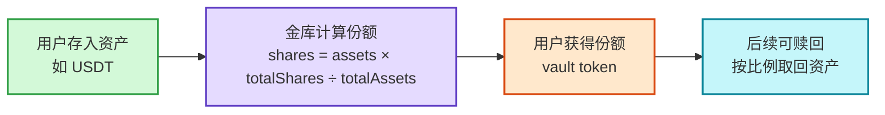
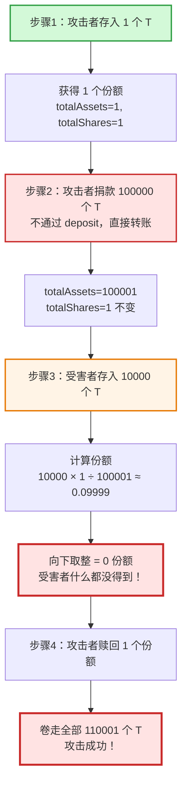
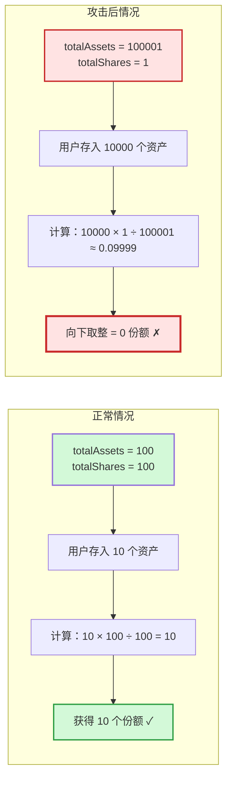
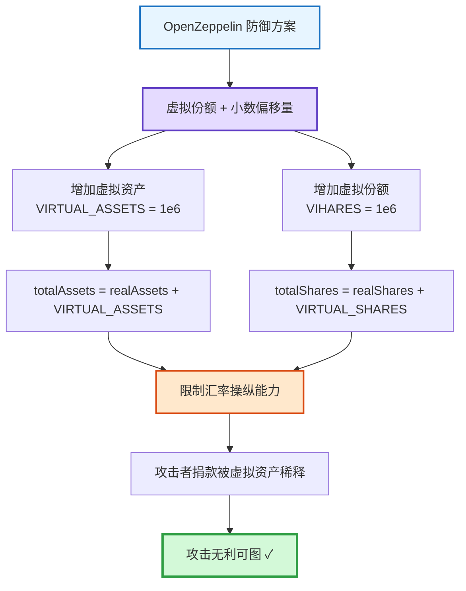

## 前言

2023年，某 DeFi 金库刚上线，攻击者只花了1块钱，就把整个金库的钱全卷走了。这不是科幻，这就是 ERC-4626 金库的"捐款陷阱"——通胀攻击（Inflation Attack）。

这个漏洞利用了金库在初始阶段的设计缺陷，让攻击者几乎零成本稀释其他用户的份额，最终把整个金库的资金卷走。本文会用通俗的语言讲清楚这个攻击是怎么回事，同时也会给开发者提供技术细节和防御方案。

## ERC-4626 是什么

ERC-4626 是以太坊上一种标准化金库合约（Vault）。工作原理很简单：

- 你存入**底层资产**（比如 USDT、ETH）
- 金库给你**份额**（shares，也叫 vault token）
- 以后你可以用份额赎回资产，还能赚取收益

核心公式：

```
你得到的份额 = (你存的钱 × 总份额) ÷ 总资产
```

**关键点**：这是整数除法，会**向下取整**（小数直接砍掉）。这就是漏洞的根源。

### ERC-4626 存款流程



## 通胀攻击原理

### 通俗解释

想象一下：你买10000张彩票，结果系统把它四舍五入成0张……这就是通胀攻击的本质。

攻击者通过"捐款"把金库的总资产拉得很大，而总份额很小，导致后续用户存钱时，计算出来的份额因为向下取整变成0。用户的钱进了金库，但什么都没拿到，最后攻击者把所有钱全拿走。

### 攻击流程（4步）



**攻击成本**：几乎为0（第一次的1个T最后也拿回来了）
**攻击获利**：受害者的全部存款

### 技术深入：数学根源

ERC-4626 的 `convertToShares` 函数使用了整数除法：

```solidity
function convertToShares(uint256 assets) public view returns (uint256) {
    if (totalAssets() == 0) {
        return assets;
    }
    return totalSupply() * assets / totalAssets();  // 向下取整
}
```

当 `totalAssets` 远大于 `totalSupply` 时，`assets * totalSupply` 还没除，就因为整数除法被抹掉小数。攻击者通过 donate 把 `totalAssets` 拉到极大，让任何后续 deposit 的分子都被"稀释"成0。

### 正常情况 vs 攻击后对比



## 真实案例

### 时间线与影响

- **2023-2025年**：多个知名 DeFi 项目早期金库都被这样攻击过
- **涉及金额**：数百万美元的潜在风险交易（幸运的是大部分未被利用）
- **高危时期**：新金库刚上线、TVL（总锁仓价值）接近0的时候

### 实际案例

**Morpho DAO**：
- 防御方式：在金库初始化时存入资产，对应的份额铸造给金库自身（作为非操作地址）
- 效果：初始存入的资产越多，攻击难度越大
- 缺点：这些资产实际上被锁死了

**YieldBox**：
- 防御方式：使用虚拟份额和虚拟资产
- 效果：不需要烧掉任何代币就能达到防御效果
- 实现：设置 asset offset 为1，supply offset 为1e8

## 防御方案

### 用户层面：如何保护自己

如果你是 DeFi 用户，记住这几点：

1. **不要急着冲新上线的金库** - 等 TVL 起来、审计报告出来再参与
2. **观察项目是否使用了防御措施** - 查看项目文档或审计报告
3. **小额测试** - 第一次存款用小额测试，确认能正常获得份额

### 开发者层面：技术防御

目前主流有3种成熟防护方案：

#### 1. 虚拟份额 + 小数偏移量（最推荐）

这是 OpenZeppelin 官方推荐的方案：

```solidity
uint256 private constant VIRTUAL_SHARES = 1e6;
uint256 private constant VIRTUAL_ASSETS = 1e6;

// 修改计算公式
totalAssets = realAssets + VIRTUAL_ASSETS;
totalShares = realShares + VIRTUAL_SHARES;
```

**工作原理**：



**效果**：
- 即使 `totalAssets` 被捐到100000，也不会让新用户的 shares 直接变成0
- 虚拟资产和份额会捕获部分捐款，使攻击无利可图
- 偏移量越大，攻击者损失越多，安全性越高

#### 2. 最小存款检查

在 `deposit` 前加入最小金额检查
```solidity
require(assets >= MIN_DEPOSIT, "Deposit too small");
```

**优点**：实现简单
**缺点**：提高了使用门槛，对小额用户不友好

#### 3. 使用 OpenZeppelin ERC4626 最新版

OpenZeppelin 已在 v5+ 版本中默认加入虚拟份额保护，直接继承使用即可：

```solidity
import "@openzeppelin/contracts/token/ERC20/extensions/ERC4626.sol";

contract MyVault is ERC4626 {
    constructor(IERC20 asset) ERC4626(asset) ERC20("MyVault", "MVT") {}
}
```

## 总结

**一句话记住这个漏洞**：

> 攻击者捐了一大笔钱，把金库的总资产吹得很大，后续存钱的人就什么份额都拿不到，最后捐款的人把所有钱全拿走。

**给用户的建议**：
- 新金库别急着冲，等 TVL 起来再说
- 观察项目是否有审计报告和防御措施

**给开发者的建议**：
- 使用 OpenZeppelin 最新版 ERC4626
- 或实现虚拟份额 + 小数偏移量防护
- 在金库初始化时进行充分测试

技术漏洞可以修复，但安全意识要时刻保持。DeFi 的世界很精彩，但也充满风险，保护好自己的资产才是第一位的。

---

**参考资料**：
- [OpenZeppelin: A Novel Defense Against ERC4626 Inflation Attacks](https://www.openzeppelin.com/news/a-novel-defense-against-erc4626-inflation-attacks)
- [MixBytes: Overview of the Inflation Attack](https://mixbytes.io/blog/overview-of-the-inflation-attack)
- [RareSkills: ERC4626 Interface Explained](https://rareskills.io/post/erc4626)
- [OpenZeppelin Forum: ERC4626 Inflation Attack Discussion](https://forum.openzeppelin.com/t/erc4626-inflation-attack-discussion/41643)
