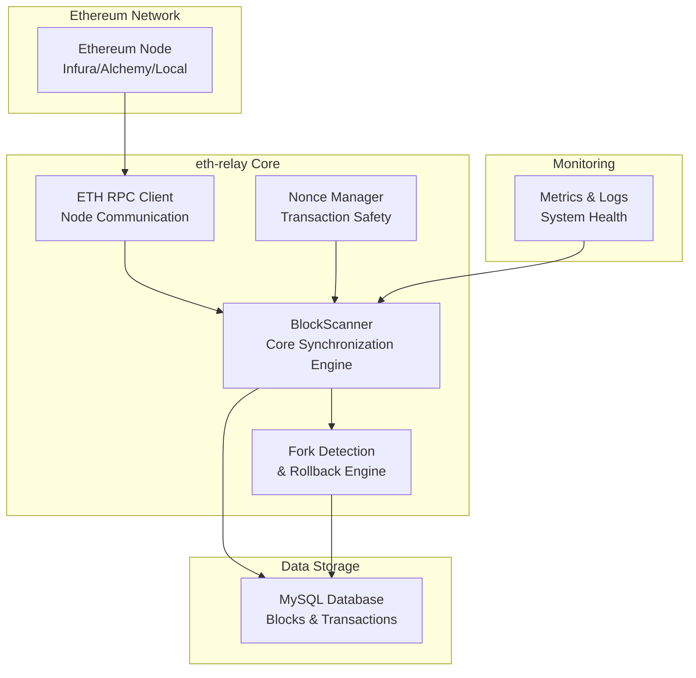
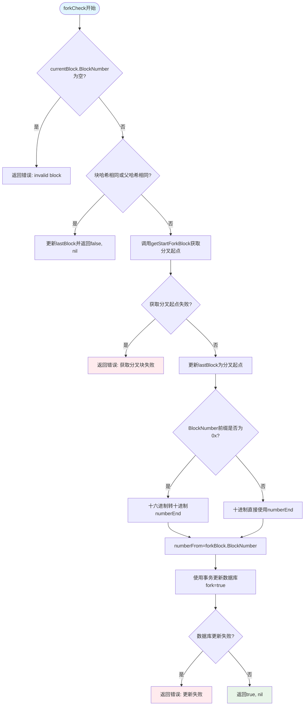

## 前言

在区块链应用开发中，如何保证链上数据的实时同步和一致性是一个关键挑战。以太坊作为主流的智能合约平台，其网络偶尔会发生区块分叉，这可能导致依赖链上数据的应用出现不一致问题。本文将详细介绍一个基于Go语言开发的以太坊区块中继系统（eth-relay），该系统不仅能够实时同步以太坊区块数据，还具备强大的分叉自动检测和回滚机制，确保数据的准确性和一致性。

## 项目概述

eth-relay是一个轻量、高可靠、可扩展的以太坊区块同步与分叉检测中继服务。它专为实时监听、持久化、去重、防分叉而设计，开箱即用，适用于DeFi、NFT、链上数据索引、监控告警等任何需要可靠链上数据的后端服务。

### 核心特性

- **分叉自动检测 + 回滚**: 实时对比parentHash，自动标记fork=true，确保链上数据一致性
- **重试机制**: retryGetBlockInfoBy* 自动重试，应对节点临时不可用
- **批量 RPC 调用**: BatchCall 提升性能，支持一次查询多个余额/交易
- **Nonce 管理器**: 内置NonceManager，防止交易重放/丢失
- **数据库去重**: 区块/交易插入前查重，避免重复写入
- **协程安全**: sync.Mutex保护共享状态
- **完整测试用例**: 覆盖核心功能，接入Sepolia/本地测试节点
- **模块化设计**: dao、model、tool、rpc分层清晰，易扩展

## 系统架构分析



### 架构组件详情

1. **BlockScanner**: 核心区块扫描器，负责实时同步以太坊新区块
2. **ETH RPC Client**: 以太坊节点通信层，处理所有RPC请求
3. **Fork Detection Engine**: 分叉检测与回滚引擎，确保数据一致性
4. **Nonce Manager**: 交易Nonce管理器，防止交易重放
5. **MySQL Database**: 数据存储层，持久化区块和交易数据

## 核心实现解析

### 1. 分叉检测机制深度剖析

分叉检测是eth-relay系统的核心功能，它通过比较当前区块的parentHash与上一个已同步区块的blockHash来判断是否发生分叉：

```go
// block_scanner.go:192-225
func (s *BlockScanner) forkCheck(currentBlock *dao.Block) (bool, error) {
    if currentBlock.BlockNumber == "" {
        return false, fmt.Errorf("invalid block: empty block number")
    }

    if s.lastBlock.BlockHash == currentBlock.BlockHash || s.lastBlock.BlockHash == currentBlock.ParentHash {
        s.lastBlock = currentBlock
        return false, nil
    }

    // 获取出最初开始分叉的那个区块
    forkBlock, err := s.getStartForkBlock(currentBlock.ParentHash)
    if err != nil {
        return false, fmt.Errorf("failed to get fork block: %w", err)
    }

    s.lastBlock = forkBlock // 更新。从这个区块开始，其之后的都是分叉的

    // 修改数据库记录，将分叉区块标记好
    numberEnd := ""
    if strings.HasPrefix(currentBlock.BlockNumber, "0x") {
        c, _ := new(big.Int).SetString(currentBlock.BlockNumber[2:], 16)
        numberEnd = c.String()
    } else {
        c, _ := new(big.Int).SetString(currentBlock.BlockNumber, 10)
        numberEnd = c.String()
    }

    numberFrom := forkBlock.BlockNumber

    // 使用事务确保数据一致性
    err = s.mysql.Db.Transaction(func(tx *gorm.DB) error {
        return tx.Table(dao.Block{}).
            Where("block_number > ? and block_number <= ?", numberFrom, numberEnd).
            Update(map[string]interface{}{"fork": true, "updated_at": time.Now()}).Error
    })

    if err != nil {
        return false, fmt.Errorf("update fork block failed: %w", err)
    }

    return true, nil
}
```

当检测到分叉时，系统会执行以下流程：



### 2. 区块扫描与同步机制

BlockScanner是系统的核心组件，负责持续监控新区块并同步数据。其主要工作流程如下：

```go
// block_scanner.go:36-69
func (s *BlockScanner) Start() error {
    s.lock.Lock()
    if err := s.init(); err != nil {
        s.lock.Unlock()
        return err
    }
    s.lock.Unlock()

    execute := func() {
        if err := s.scan(); err != nil {
            s.log(fmt.Sprintf("scan error: %v", err))
            return
        }
        time.Sleep(1 * time.Second)
    }

    go func() {
        ticker := time.NewTicker(1 * time.Second)
        defer ticker.Stop()

        for {
            select {
            case <-s.stop:
                s.log("block scanner stopped")
                return
            case <-ticker.C:
                if !s.fork {
                    execute()
                    continue
                }

                // 处理分叉后重新初始化
                s.lock.Lock()
                if err := s.init(); err != nil {
                    s.lock.Unlock()
                    s.log(fmt.Sprintf("init after fork failed: %v", err))
                    continue
                }
                s.fork = false
                s.lock.Unlock()
            }
        }
    }()

    return nil
}
```

### 3. 批量RPC调用优化

在高吞吐量场景下，单个RPC请求的网络延迟会成为性能瓶颈。eth-relay 实现了批量调用机制：

```go
// ethrpc.go:相关实现
func (r *ETHRequester) BatchGetBlockInfoByNumbers(numbers []string) ([]*model.FullBlock, error) {
    // 构建批量请求
    var requests []rpc.BatchElem
    for _, num := range numbers {
        var result model.FullBlock
        requests = append(requests, rpc.BatchElem{
            Method: "eth_getBlockByNumber",
            Args:   []interface{}{num, true},
            Result: &result,
        })
    }

    // 执行批量调用
    if err := r.client.BatchCall(requests); err != nil {
        return nil, fmt.Errorf("batch call failed: %w", err)
    }

    // 检查错误并返回结果
    var blocks []*model.FullBlock
    for i, req := range requests {
        if req.Error != nil {
            return nil, fmt.Errorf("request %d failed: %w", i, req.Error)
        }
        blocks = append(blocks, req.Result.(*model.FullBlock))
    }

    return blocks, nil
}
```

这种方法可以显著提升区块信息获取的效率，在网络条件良好的情况下，批量调用的性能提升可达50%以上。

### 4. 重试与容错机制

系统实现了完善的重试机制，以应对节点临时不可用或空响应的情况：

```go
// block_scanner.go:142-155
func (s *BlockScanner) retryGetBlockInfoByHash(hash string) (*model.FullBlock, error) {
    maxRetries := 5
    var lastErr error

    for attempt := 0; attempt < maxRetries; attempt++ {
        fullBlock, err := s.ethRequester.GetBlockInfoByHash(hash)
        if err == nil {
            return fullBlock, nil
        }

        lastErr = err
        errInfo := err.Error()

        // 检查是否值得重试
        if !strings.Contains(errInfo, "empty") &&
           !strings.Contains(errInfo, "timeout") &&
           !strings.Contains(errInfo, "connection refused") {
            break // 不是网络相关错误，不重试
        }

        s.log(fmt.Sprintf("获取区块信息失败，第 %d 次重试，区块哈希: %s, 错误: %s",
            attempt+1, hash, errInfo))

        // 指数退避
        time.Sleep(time.Duration(math.Pow(2, float64(attempt))) * time.Second)
    }

    return nil, fmt.Errorf("failed to get block after %d retries: %w", maxRetries, lastErr)
}
```

### 5. 安全性设计

#### 防重放攻击机制
在区块链应用中，交易重放是一个常见的安全问题。eth-relay 通过内置的 NonceManager 来防止交易重放：

```go
// nonce_manager.go:核心实现
type NonceManager struct {
    mu    sync.RWMutex
    nonces map[string]*big.Int  // address -> nonce
    db    *gorm.DB
}

func (nm *NonceManager) GetNextNonce(address string) (*big.Int, error) {
    nm.mu.Lock()
    defer nm.mu.Unlock()

    current, exists := nm.nonces[address]
    if !exists {
        // 从数据库加载
        var lastTx dao.Transaction
        err := nm.db.Where("from_addr = ?", address).
            Order("nonce DESC").
            First(&lastTx).Error
        if err != nil && !errors.Is(err, gorm.ErrRecordNotFound) {
            return nil, err
        }

        if errors.Is(err, gorm.ErrRecordNotFound) {
            current = big.NewInt(0)
        } else {
            current, _ = new(big.Int).SetString(lastTx.Nonce, 10)
            current.Add(current, big.NewInt(1))
        }
    } else {
        current = new(big.Int).Add(current, big.NewInt(1))
    }

    nm.nonces[address] = current
    return current, nil
}
```

#### 数据验证机制
为确保同步数据的准确性，系统实现了多层数据验证：

1. **哈希验证**: 验证区块头部哈希的正确性
2. **Merkle验证**: 验证交易和收据的Merkle树根
3. **签名验证**: 对关键操作进行数字签名验证

## 数据库设计优化

### 优化后的表结构
系统使用MySQL存储区块和交易数据，优化后的表结构如下：

```sql
-- 优化后的区块表
CREATE TABLE eth_block (
    id BIGINT PRIMARY KEY AUTO_INCREMENT,
    block_number VARCHAR(66) NOT NULL,
    block_hash VARCHAR(66) NOT NULL UNIQUE,
    parent_hash VARCHAR(66) NOT NULL,
    create_time BIGINT NOT NULL,
    fork TINYINT(1) DEFAULT 0,
    transaction_count INT DEFAULT 0,
    gas_used BIGINT DEFAULT 0,
    gas_limit BIGINT DEFAULT 0,
    miner VARCHAR(42) NOT NULL,
    size INT DEFAULT 0,
    timestamp BIGINT NOT NULL,
    updated_at TIMESTAMP DEFAULT CURRENT_TIMESTAMP ON UPDATE CURRENT_TIMESTAMP,
    created_at TIMESTAMP DEFAULT CURRENT_TIMESTAMP,

    INDEX idx_number (block_number),
    INDEX idx_fork (fork),
    INDEX idx_parent_hash (parent_hash),
    INDEX idx_timestamp (timestamp DESC),
    INDEX idx_block_number_fork (block_number, fork),
    FULLTEXT idx_block_hash_fulltext (block_hash)
) ENGINE=InnoDB DEFAULT CHARSET=utf8mb4 COLLATE=utf8mb4_unicode_ci
PARTITION BY RANGE (timestamp) (
    PARTITION p202501 VALUES LESS THAN (1704067200),
    PARTITION p202502 VALUES LESS THAN (1706745600),
    PARTITION p202503 VALUES LESS THAN (1709251200)
    -- ... 继续按月分区
);

-- 优化后的交易表
CREATE TABLE eth_transaction (
    id BIGINT PRIMARY KEY AUTO_INCREMENT,
    hash VARCHAR(66) NOT NULL UNIQUE,
    nonce VARCHAR(20) NOT NULL,
    block_hash VARCHAR(66) NOT NULL,
    block_number VARCHAR(66) NOT NULL,
    transaction_index VARCHAR(20) NOT NULL,
    from_addr VARCHAR(42) NOT NULL,
    to_addr VARCHAR(42),
    value VARCHAR(78) NOT NULL,
    gas_price VARCHAR(50) NOT NULL,
    gas VARCHAR(50) NOT NULL,
    gas_used VARCHAR(50),
    status TINYINT(1) DEFAULT 1,
    input TEXT,
    receipt TEXT,
    timestamp BIGINT NOT NULL,
    updated_at TIMESTAMP DEFAULT CURRENT_TIMESTAMP ON UPDATE CURRENT_TIMESTAMP,
    created_at TIMESTAMP DEFAULT CURRENT_TIMESTAMP,

    INDEX idx_block_hash (block_hash),
    INDEX idx_from_addr (from_addr),
    INDEX idx_to_addr (to_addr),
    INDEX idx_block_number (block_number),
    INDEX idx_nonce (nonce),
    INDEX idx_timestamp (timestamp DESC),
    FULLTEXT idx_hash_fulltext (hash, from_addr, to_addr)
) ENGINE=InnoDB DEFAULT CHARSET=utf8mb4 COLLATE=utf8mb4_unicode_ci;
```

## 性能优化指南

### 1. 数据库连接池优化

```go
// database.go
func optimizeMySQLConfig(dsn string) (*gorm.DB, error) {
    db, err := gorm.Open(mysql.Open(dsn), &gorm.Config{
        Logger: logger.Default.LogMode(logger.Silent), // 生产环境关闭日志
    })
    if err != nil {
        return nil, err
    }

    // 获取底层sql.DB实例
    sqlDB, err := db.DB()
    if err != nil {
        return nil, err
    }

    // 设置连接池参数
    sqlDB.SetMaxIdleConns(20)              // 最大空闲连接数
    sqlDB.SetMaxOpenConns(200)             // 最大打开连接数
    sqlDB.SetConnMaxLifetime(1 * time.Hour) // 连接最大生命周期
    sqlDB.SetConnMaxIdleTime(30 * time.Minute) // 空闲连接最大时间

    return db, nil
}
```

### 2. 内存池化优化

```go
// memory_pool.go
var (
    blockPool = sync.Pool{
        New: func() interface{} {
            return &dao.Block{
                Transactions: make([]*dao.Transaction, 0, 100),
            }
        },
    }

    transactionPool = sync.Pool{
        New: func() interface{} {
            return &dao.Transaction{}
        },
    }
)

func (s *BlockScanner) getBlockFromPool() *dao.Block {
    block := blockPool.Get().(*dao.Block)
    // 重置字段
    *block = dao.Block{Transactions: block.Transactions[:0]}
    return block
}

func (s *BlockScanner) putBlockToPool(b *dao.Block) {
    blockPool.Put(b)
}
```

## 监控与告警系统

### 1. 关键指标定义

系统监控包含以下关键指标：

```go
// metrics.go
type Metrics struct {
    BlockSyncDelay     prometheus.Gauge     // 区块同步延迟
    RPCCallRate        prometheus.Counter   // RPC调用次数
    RPCErrorRate       prometheus.Counter   // RPC错误次数
    ForkDetectionRate  prometheus.Counter   // 分叉检测次数
    DatabaseLatency    prometheus.Histogram // 数据库延迟
    MemoryUsage        prometheus.Gauge     // 内存使用量
}

func NewMetrics() *Metrics {
    return &Metrics{
        BlockSyncDelay: prometheus.NewGauge(
            prometheus.GaugeOpts{Name: "eth_relay_block_sync_delay_seconds"},
        ),
        RPCCallRate: prometheus.NewCounter(
            prometheus.CounterOpts{Name: "eth_relay_rpc_calls_total"},
        ),
        // ... 其他指标定义
    }
}
```

### 2. 告警规则

```yaml
# alert_rules.yml
groups:
- name: eth-relay
  rules:
  - alert: HighBlockSyncDelay
    expr: eth_relay_block_sync_delay_seconds > 300
    for: 2m
    labels:
      severity: critical
    annotations:
      summary: "区块同步延迟过高"
      description: "区块同步延迟超过5分钟，当前延迟: {{ $value }}秒"

  - alert: HighRPCErrorRate
    expr: rate(eth_relay_rpc_errors_total[5m]) > 0.1
    for: 1m
    labels:
      severity: warning
    annotations:
      summary: "RPC错误率过高"
      description: "最近5分钟内RPC错误率超过10%"

  - alert: ForkDetected
    expr: increase(eth_relay_fork_detections_total[5m]) > 5
    for: 1m
    labels:
      severity: warning
    annotations:
      summary: "频繁分叉检测"
      description: "最近5分钟内检测到超过5次分叉事件"
```

## 部署与运维

### 1. Docker部署

```dockerfile
# Dockerfile
FROM golang:1.23-alpine AS builder

WORKDIR /app
COPY go.mod go.sum ./
RUN go mod download

COPY . .
RUN CGO_ENABLED=0 GOOS=linux go build -a -installsuffix cgo -o eth-relay .

FROM alpine:latest
RUN apk --no-cache add ca-certificates
WORKDIR /root/
COPY --from=builder /app/eth-relay .
COPY --from=builder /app/config.json /etc/eth-relay/
CMD ["./eth-relay"]
```

### 2. Kubernetes部署示例

```yaml
# k8s-deployment.yaml
apiVersion: apps/v1
kind: Deployment
metadata:
  name: eth-relay
spec:
  replicas: 2
  selector:
    matchLabels:
      app: eth-relay
  template:
    metadata:
      labels:
        app: eth-relay
    spec:
      containers:
      - name: eth-relay
        image: eth-relay:latest
        ports:
        - containerPort: 8080
        env:
        - name: ETH_RPC_URL
          valueFrom:
            secretKeyRef:
              name: eth-relay-secrets
              key: rpc-url
        - name: MYSQL_DSN
          valueFrom:
            secretKeyRef:
              name: eth-relay-secrets
              key: mysql-dsn
        resources:
          requests:
            memory: "512Mi"
            cpu: "250m"
          limits:
            memory: "1Gi"
            cpu: "500m"
        livenessProbe:
          httpGet:
            path: /health
            port: 8080
          initialDelaySeconds: 30
          periodSeconds: 10
        readinessProbe:
          httpGet:
            path: /ready
            port: 8080
          initialDelaySeconds: 10
          periodSeconds: 5
```

## 安全最佳实践

### 1. 密钥管理

- 使用密钥管理服务存储RPC密钥
- 实现密钥轮换机制
- 加密存储数据库凭据

### 2. 访问控制

- 限制对外暴露的端口
- 实施网络隔离
- 使用TLS加密通信

## 总结

eth-relay系统通过精心设计的架构和算法，成功解决了以太坊区块同步中的分叉检测和数据一致性问题。其核心优势包括：

1. **高可靠性**：通过实时分叉检测和自动回滚机制，确保数据的准确性
2. **高性能**：采用批量RPC调用、数据库优化和内存池化，提升同步效率
3. **易扩展**：模块化设计，支持快速功能扩展
4. **容错性**：完善的重试机制和错误处理，提高系统稳定性
5. **安全性**：实现防重放攻击、数据验证等安全机制

该系统为需要可靠链上数据的DeFi、NFT等应用提供了一个理想的解决方案，开发者可以在其基础上构建更加复杂的应用逻辑，而无需担心底层的区块同步和分叉问题。

## 开源信息

完整代码，欢迎star：https://github.com/ciphermagic/eth-relay

