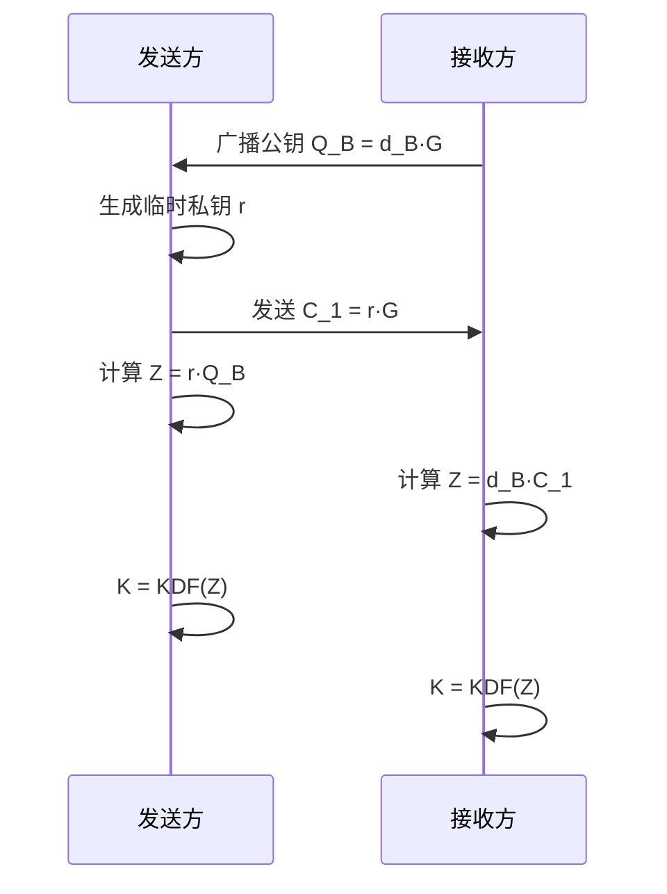
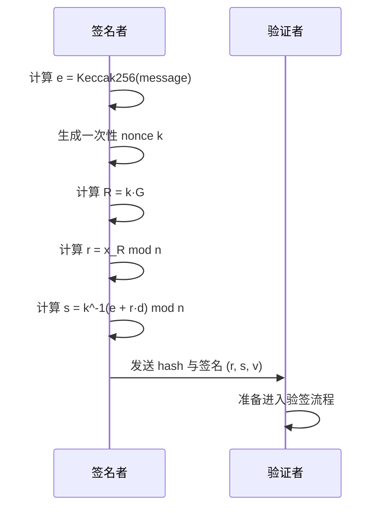
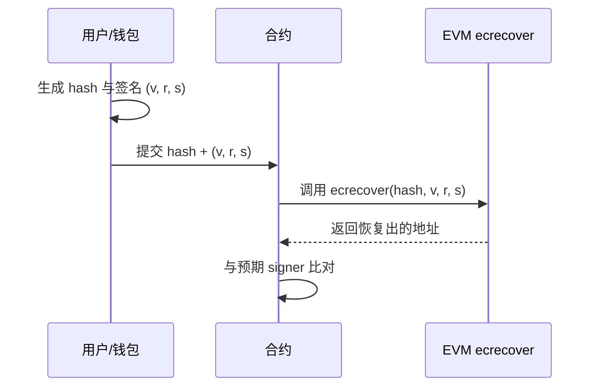

## 前言

在钱包交互中，签名是最常见、也最容易被忽视的一步。

连接钱包、弹出签名窗口、点击确认，请求通过，后端完成登录，或者合约继续执行。仅从交互表面看，签名接近一次普通确认。很多示例也只解释到这一层：用户发起签名，系统识别地址，流程即可完成。

但这条流程本身并没有回答核心问题。

没有转账，没有部署合约，也没有修改链上状态，为什么签名仍然可以被用来证明身份？进一步看，签名和加密也经常被混为一谈：它们都和私钥有关，结果也都是一串十六进制数据，但解决的问题并不相同。

本文尝试从数学公式入手，讲清楚加密、签名的核心原理。

## 先分清三个概念：私钥、公钥、地址

以太坊当前使用的是 `secp256k1` 曲线。对本文来说，不需要先完整掌握整套椭圆曲线理论，先把私钥、公钥、地址三个概念分清即可。

私钥可以记成 $d$。它是一个只有持有者自己知道的标量。谁掌握这个值，谁就能代表这个账户去签名。

公钥不是随便生成出来的，它是私钥和曲线基点相乘的结果：

$$
Q = d \cdot G
$$

这条式子表达的关系并不复杂：给定私钥 $d$ 和基点 $G$，可以相对容易地算出公钥 $Q$；但反过来，已知 $Q$ 和 $G$，想把 $d$ 反推出去，在计算上非常困难。这也是椭圆曲线密码学成立的基础。

地址则是另一层概念。以太坊地址通常不是“公钥本体”，而是未压缩公钥去掉 `0x04` 前缀后的 64 字节做一次 Keccak256，再取后 20 字节：

$$
address = last20bytes(Keccak256(uncompressed\_pubkey[1:]))
$$

这里需要先明确两点。

第一，私钥、公钥、地址不是一回事。地址不是私钥，也不是公钥原样截取一段得到的结果。

第二，后面讲 `ecrecover` 时，重点不是“直接从签名得到地址”，而是“先恢复出公钥线索，再映射到地址”。这一层先说明清楚，后面的验签过程才不容易混淆。

## 签名不是加密

先澄清一个最常见的误解：签名不等于加密。

加密要解决的问题是“内容怎么只让特定接收者看懂”。椭圆曲线世界里，一个常见思路是 ECDH / ECIES：发送方和接收方先协商出一个共享秘密，再从这个共享秘密派生出对称密钥，后续真正加密明文的是那个对称密钥。

如果接收方私钥是 $d_B$，公钥是 $Q_B = d_B \cdot G$，发送方临时生成一个随机数 $r$，并发出临时公钥 $C_1 = r \cdot G$，那么双方都能算出同一个共享点：

$$
Z = r \cdot Q_B = d_B \cdot C_1
$$

这条等式可以直接代入定义来看。因为 $Q_B = d_B \cdot G$，$C_1 = r \cdot G$，所以：

$$
r \cdot Q_B = r \cdot (d_B \cdot G) = (r d_B) \cdot G
$$

$$
d_B \cdot C_1 = d_B \cdot (r \cdot G) = (d_B r) \cdot G
$$

两边最后都落到同一个点上。由于标量乘法满足这里的结合关系，而整数乘法又满足交换律，所以 $(r d_B) \cdot G = (d_B r) \cdot G$。这就是发送方和接收方能够得到同一个共享点 `Z` 的原因。

这个共享点通常不会直接拿来用，而是再经过密钥派生函数得到真正的会话密钥：

$$
K = KDF(Z)
$$



这张图对应的是加密链路里的核心过程：双方最终会得到同一个共享秘密，再用它完成保密通信。

公式推导流程图:


- Z：共享点（核心是**用自己的私钥乘对方的公钥**）
- K：临时的对称密钥 
- KDF（密钥派生函数） 常用 HKDF、SHA-256 等算法

签名要解决的是另一类问题。签名不是为了隐藏内容，而是为了证明“这段内容确实经过私钥持有者认可”。一个关注保密，一个关注身份。它们都和私钥有关，但目标不同。

## ECDSA 的签名过程

下面进入签名主线。

为了说明签名过程，先把最终待签名信息简写成 `message`。在真实的以太坊场景里，签名对象往往不是原始字符串，而是加了前缀后的载荷、结构化编码后的结果，或者最终 digest 的前像。这里统一写成 `message`，是为了先把签名公式本身说明清楚。

第一步，先把消息压成固定长度的摘要：

$$
e = Keccak256(message)
$$

后面进入签名和验签流程的核心对象，不是原始内容，而是这个摘要 `e`。

第二步，签名者生成一个一次性随机数：

$$
k \in [1, n-1]
$$

这个 `k` 必须一次一用，而且不能泄露。因为后面的签名公式会把私钥和 `k` 关联起来；一旦 `k` 重复或者可预测，私钥就可能被反推出去。

第三步，用这个一次性随机数去乘基点，得到一个临时点：

$$
R = k \cdot G = (x_R, y_R)
$$

这里的 `R` 不是公钥，也不是长期存在的身份信息。它只服务于这一次签名。

第四步，从这个临时点里取横坐标，压成签名里的第一部分：

$$
r = x_R \bmod n
$$

因此，`r` 承载的是这次临时点投影出来的横坐标信息。

第五步，把消息摘要、私钥和临时随机数结合起来，得到签名里的第二部分：

$$
s = k^{-1}(e + r \cdot d) \bmod n
$$

这条式子是 ECDSA 的关键。`s` 不是独立产生的，它把 `e`、`r`、`d` 和 `k` 关联在了一起。

到这里，签名主体就是 `(r, s)`。以太坊在工程里通常还会再带一个 `v`，用于补足恢复候选点时需要的信息，所以很多场景里最后看到的是 `(r, s, v)`。



这张图主要对应 `(r, s, v)` 的生成过程。地址恢复和签名者比对放在下一节展开。

## 验签为什么成立

这里最容易被简化成黑盒的问题是：验证者没有私钥，为什么仍然能够判断签名是否有效？

先从签名公式本身出发：

$$
s = k^{-1}(e + r \cdot d) \bmod n
$$

把两边都乘上 `k`，会得到：

$$
s \cdot k = e + r \cdot d
$$

再把等式两边同时乘上基点 $G$：

$$
(s \cdot k) \cdot G = e \cdot G + (r \cdot d) \cdot G
$$


并代入 $R = k \cdot G$ 与 $Q = d \cdot G$，可以得到：

$$
s \cdot R = e \cdot G + r \cdot Q
$$

这条式子解释了“为什么验签可行”：如果签名确实是由私钥 `d` 生成的，那么用对应公钥 `Q` 代入，这个关系就成立。

但验证者在标准 ECDSA 验签里，并不会直接拿原始 `R` 去算。工程上通常会把这条关系改写成更适合计算的形式。

先定义：

$$
w = s^{-1} \bmod n
$$

再定义两个中间量：

$$
u1 = e \cdot w
$$

$$
u2 = r \cdot w
$$

然后验证者构造等价点：

$$
X = u1 \cdot G + u2 \cdot Q
$$

如果签名有效，那么这个点的横坐标会满足：

$$
x_X \bmod n = r
$$

因此，验签并不是简单检查一串十六进制数据是否匹配，而是在检查这组数据能否重新构造出与签名公式一致的椭圆曲线关系。

换个角度看，签名者在生成 `(r, s)` 时，把“我知道私钥 `d`”这件事写进了数学关系里；验证者并不需要知道私钥本身，只需要检查这组关系是否成立。

## 以太坊里的 `r / s / v` 和 `ecrecover`

在以太坊的工程语境里，最常见的签名通常由三段组成：`r`、`s`、`v`。

`r` 和 `s` 是签名主体，前一节已经推过来源。`v` 则更像一个恢复标识：它帮助恢复流程在多个候选点里缩小范围，补足“这次签名到底对应哪一个 `R` 候选点”的信息。

在合约 `ecrecover` 的语境里，很多文章会直接用 `27 / 28` 来讲 `v`，这样和 Solidity 接口更接近。而前端库或者某些底层实现里，也可能看到 `0 / 1` 或 `yParity` 这样的表示，它们本质上是在表达同一类恢复信息。

需要补充的是，交易签名里的 `v` 在 EIP-155 之后还带有链 ID 相关语义。那属于交易签名的另一层上下文，本文不展开，只聚焦消息签名和验签语境。

对应到工程链路，可以写成这样：

`message -> hash -> signature(r, s, v) -> ecrecover -> address`



`ecrecover(hash, v, r, s)` 的作用，不是直接返回一个孤立的地址结果，而是：

1. 先利用 `r` 和 `v` 缩小候选恢复点范围
2. 再结合签名公式恢复出对应的公钥线索
3. 最后把公钥映射成地址
4. 把恢复出的地址和预期 signer 做比对

因此，合约不需要事先保存完整公钥，也能判断“这份签名是不是某个地址签的”。只要消息摘要和签名都在，链上就能把身份线索恢复到地址层。

工程上还有一个常见约束：很多实现会要求 `s` 落在低半区，也就是所谓的低 `s` 规范。同一条消息在数学上可能存在两个等价签名 `(r, s)` 和 `(r, n - s)`。如果不约束 `s`，就会带来签名可塑性的问题。很多库和合约都会直接拒绝高 `s` 签名。

完整的公式推导流程图：


如果想先在链下验证这条逻辑，可以用 `viem` 做一个最小示例：

```typescript
import { createWalletClient, custom, recoverMessageAddress } from 'viem'

const walletClient = createWalletClient({
  transport: custom(window.ethereum),
})

const [account] = await walletClient.getAddresses()
const message = 'hello world'

const signature = await walletClient.signMessage({
  account,
  message,
})

const recovered = await recoverMessageAddress({
  message,
  signature,
})

console.log({
  signature,
  recovered,
  matches: recovered.toLowerCase() === account.toLowerCase(),
})
```

这段代码先让钱包对消息签名，再根据消息和签名恢复地址，最后和原账户做比对。链下恢复地址这一步，就是把前面的原理对应到工程实现中。

## 以太坊中基于签名的延伸应用

到这里，签名原理已经说明完毕。后面这些标准和应用，变化的不是“签名本身”，而是“签名对象的编码方式和业务语义”。

#### EIP-191

`personal_sign` 这一类消息签名，本质上就是给原始消息加上一个固定前缀，再去做哈希和签名。常见形式类似：

`\x19Ethereum Signed Message:\n<length>`

它的作用是告诉钱包和验证方：这是一条“给人读或给业务系统验证”的消息，不是交易本体，也不是别的可执行载荷。

所以 EIP-191 的价值，不是改变签名算法，而是减少误签和错用场景。它把“你到底在签什么”这件事先分清了。

#### EIP-712

EIP-712 解决的是另一类问题：当业务消息越来越复杂，普通字符串签名既不直观，也不够安全。

结构化签名的好处有三个。

第一，可读性更好。用户看到的不是整段难以辨认的十六进制数据，而是字段化的数据。

第二，域隔离更清楚。`name`、`version`、`chainId`、`verifyingContract` 这些字段会一起进入签名域，减少跨应用、跨合约、跨链误用的风险。

第三，它更适合真实业务。订单、授权、报价、Permit 这类消息，天然就是结构化数据。

用 `viem` 写一个最小的 typed data 签名闭环，示例如下：

```typescript
import { createWalletClient, custom, recoverTypedDataAddress } from 'viem'

const walletClient = createWalletClient({
  transport: custom(window.ethereum),
})

const [account] = await walletClient.getAddresses()

const domain = {
  name: 'Ether Mail',
  version: '1',
  chainId: 1,
  verifyingContract: '0xCcCCccccCCCCcCCCCCCcCcCccCcCCCcCcccccccC',
} as const

const types = {
  Mail: [{ name: 'contents', type: 'string' }],
} as const

const message = { contents: 'Hello, Bob!' } as const

const signature = await walletClient.signTypedData({
  account,
  domain,
  types,
  primaryType: 'Mail',
  message,
})

const recovered = await recoverTypedDataAddress({
  domain,
  types,
  primaryType: 'Mail',
  message,
  signature,
})

console.log({
  signature,
  recovered,
  matches: recovered.toLowerCase() === account.toLowerCase(),
})
```

如果只关心 `true / false` 的验签结果，也可以进一步用 `verifyTypedData` 直接验证。但为了贴近本文主线，这里优先展示“恢复地址”这条路径。

#### Permit / EIP-2612

Permit 是签名能力在以太坊中的一个典型延伸。

传统 ERC20 授权通常要先发一笔 `approve` 交易，再发一笔真正的业务交易。Permit 的做法是：不先上链授权，而是把“我同意某个 spender 在某个期限内、按某个额度使用我的资产”这件事写进消息里，先由用户离线签名。

等到真正执行时，合约再去验这份签名。只要签名有效、nonce 没被用过、deadline 还没过，授权就能成立。

所以它省掉的不是安全校验，而是那笔单独的授权交易。签名算法没有变，变的是业务语义：现在签的不是一句普通消息，而是一段结构化的授权意图。

从原理上看，以太坊签名做的事情可以概括为：把“我知道私钥”压进一组可以验证的数据里，再沿着公钥恢复和地址映射把身份还原出来。

EIP-191、EIP-712、Permit 看起来用途差异很大，但底层仍然是同一套签名能力。它们分别解决的是不同层面的问题：消息该如何编码、上下文该如何隔离，以及签名结果要在什么业务语境中生效。

## 总结

以太坊签名本质上是 ECDSA 在 `secp256k1` 曲线上的工程实现：签名者通过私钥 `d`、消息摘要 `e` 和一次性随机数 `k`，生成 `(r, s, v)` 三元组；验证者（或 `ecrecover`）则无需知道私钥，仅通过数学关系 `s·R = e·G + r·Q` 重构点并恢复公钥，进而映射出地址，从而完成“身份证明”。

签名与加密的根本区别在于目标：前者证明“我认可这段内容”（非对称身份认证），后者实现保密通信（共享秘密）。文章从私钥-公钥-地址的关系入手，逐步推导签名生成、验签成立性，以及以太坊特有的 `v` 恢复机制和低 `s` 规范，避免了签名可塑性风险。

更重要的是，这一底层能力通过 **EIP-191**（简单前缀消息）、**EIP-712**（结构化类型数据）和 **ERC-2612 Permit** 等标准，演化为丰富应用：

- **Gasless 授权与单笔交易**：用户离线签名 Permit，无需单独发送 `approve` 交易，即可完成代币授权（如 Uniswap Permit2、DAI 等），极大降低 gas 消耗并提升 UX；
- **Meta-transactions 与 Gasless 操作**：用户签名结构化交易数据，由中继器（relayer）代付 gas 执行，常用于新用户 onboarding、Web3 游戏微交易、NFT 铸造或 DAO 投票；
- **DeFi 核心流程**：Aave 的信用委托（credit delegation）、Uniswap 的订单与路由、Hyperliquid 等协议的链上订单簿，都依赖 EIP-712 实现可读、安全的 off-chain 授权；
- **NFT 与市场场景**：OpenSea 等平台曾用签名实现 gasless 上架与交易，减少用户多次确认；
- **登录与后端验证**：`Sign in with Ethereum`（SIWE）让 dApp 无需密码即可安全认证用户身份；
- **更广场景**：状态通道、后端验证的批量操作、甚至结合 Account Abstraction（EIP-7702）的 gas 赞助流程。

无论签名对象如何编码，核心始终不变——将“私钥知识”安全地嵌入可验证的数学关系中，让链上合约能在不暴露私钥的前提下，高效、可靠地还原签名者地址。

签名这个看似简单的一步确认，却是以太坊信任机制的基石，也是现代 DeFi、NFT 和 GameFi 顺畅体验的隐形引擎。