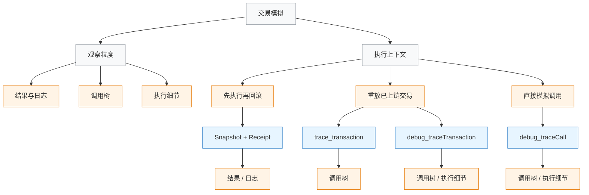

## 前言

交易模拟看起来像一个很具体的能力，真正落到工程里才会发现，它对应的其实不是单一接口。

有的方案只能给出执行结果和事件日志，有的能展开内部调用树，有的则会把一笔已经上链的交易重新跑一遍，把调用栈、gas 和回滚位置都暴露出来。接口名字里都带着 `trace` 或 `debug`，但底层关注的对象并不相同。

这也是很多项目在实现交易模拟时容易混淆的地方：同样是“预执行”，为什么有时拿到的是 receipt，有时是 trace，有时又必须依赖 `debug` 命名空间。差别不在接口名字，而在节点究竟执行了什么、又愿意把什么暴露出来。

本文基于一份 TypeScript 交易模拟器实现，拆开看四种常见路径：`Snapshot + Receipt`、`trace_transaction`、`debug_traceTransaction` 和 `debug_traceCall`。重点不是做选型清单，而是把这四种做法背后的观察粒度和执行上下文讲清楚。

## 交易模拟到底在模拟什么

“模拟”这个词很容易把问题说得过于简单。对节点来说，它至少包含两层含义：一层是观察粒度，另一层是执行上下文。

观察粒度决定能看到多少信息。最浅的一层是结果：交易成功还是失败、消耗了多少 gas、打出了哪些日志。再往下，是调用过程：谁调用了谁，ETH 和 Token 在哪几层调用里发生了流转。最深的一层是执行细节：哪一层调用回滚、哪一步 opcode 出错、gas 在哪里被消耗掉。

执行上下文则决定这些信息是怎么来的。一次模拟可能是先执行交易、拿到结果、再回滚状态；也可能是基于一笔已经上链的交易重放执行过程；还可能根本不发送交易，只拿一个 call object 在指定区块状态下做一次带 trace 的调用。

这两条线放在一起，四种方法的边界就比较清楚了。



## 一、Snapshot + Receipt：先执行，再回滚

四种方法里，最直观的一种是 `Snapshot + Receipt`。

它的思路很简单：先在本地节点上做一次状态快照，执行交易，拿到 receipt，分析结果后再回滚到原来的状态。整条路径里并没有真正的 trace，核心依赖的是本地节点的 `evm_snapshot` / `evm_revert` 能力，以及交易执行后生成的回执。

在这份实现里，对应的是 `simulateTransactionBasic`：

```ts
const snapshotId = await this.createSnapshot();
const txHash = await this.executeTransaction(txRequest);
const receipt = await this.publicClient.waitForTransactionReceipt({ hash: txHash });
const transfers = await this.analyzeTransactionReceipt(txHash, receipt);
await this.revertToSnapshot(snapshotId);
```

这条路径看到的信息主要来自两部分。

第一部分是顶层交易结果，包括是否成功、`gasUsed`、返回状态等。第二部分是 receipt 里的日志。日志对于 ERC20 和 ERC721 场景很有用，因为标准转账行为通常会体现在 `Transfer` 事件里。实现中的 `extractTokenTransfersFromLogs` 就是沿着这条线处理的：遇到 `Transfer` 事件签名后，再根据 `topics` 数量区分 ERC20 和 ERC721。

这类方案的问题也很明显。receipt 记录的是交易执行结束后留下来的结果，它并不负责把整个内部调用过程展开出来。顶层 ETH 转账可以直接从交易本身读到，Token 转账可以从日志中恢复出来，但如果一笔交易内部经过多层合约调用，ETH 又在多次内部 `call` 中转移，单靠 receipt 很难把过程完整还原。

所以 `Snapshot + Receipt` 更接近“结果导向”的模拟。它适合基础预执行、日志解析和本地开发调试，但不适合回答“这笔交易中间到底发生了什么”。

## 二、trace_transaction：把调用树展开

从 `trace_transaction` 开始，重点就不再是结果，而是过程。

`trace_transaction` 的输入是一笔已经执行过的交易哈希，输出通常是一组结构化 trace。每条 trace 会描述某一层调用的 `from`、`to`、`value`、`input`、`result`、`traceAddress` 和 `subtraces` 等信息。它做的事情不是“告诉你最终发生了什么”，而是“把这笔交易的内部调用结构摊开”。

在本文这份实现里，对应入口是 `simulateTransactionWithTrace`：先执行一次本地交易拿到 `txHash`，再调用 `trace_transaction` 去读取 trace 结果。

```ts
const traces = await this.publicClient.request({
  method: 'trace_transaction' as any,
  params: [txHash] as any,
} as any);

const ethTransfers = this.extractAllTransfersFromTrace(traces);
```

这里有一个很关键的区别：`trace_transaction` 面向的是“已执行交易”。哪怕在本地环境中也是如此——先执行，再拿哈希，再追踪。因此它的执行上下文和“直接模拟调用”完全不同。

这类接口的优势在于调用树足够清楚。以太坊上的很多复杂交互，本质上都是一串嵌套的消息调用：代理合约调用实现合约，路由合约继续调用多个池子，池子内部又发生资金转移。receipt 只能看到最终留下的日志，`trace_transaction` 则能把中间每一层调用关系展开。实现中的 `extractAllTransfersFromTrace` 也是基于这一点工作：遍历 trace 数组，直接从 `trace.action.value` 提取 ETH 流转。

但 `trace_transaction` 的边界也很明确。它更像一份结构化的调用轨迹，不是完整的执行重放。它适合回答“谁调用了谁、ETH 经过了哪些层、合约是在哪一层创建的”，却不擅长回答“哪一步 opcode 失败了、gas 到底耗在什么地方”。

另外，`trace_*` 命名空间在客户端支持上也更偏 Erigon / OpenEthereum 一系。换句话说，它非常适合做内部调用理解和资金流分析，但不是最重型的调试工具。

## 三、debug_traceTransaction：对真实交易做执行重放

`debug_traceTransaction` 和 `trace_transaction` 看起来很像：输入都是交易哈希，输出都能做调用分析。但两者背后的思路并不一样。

`trace_transaction` 更像把交易的外部调用轨迹整理成结构化结果；`debug_traceTransaction` 则是把一笔已经上链的交易重新执行一遍，并在执行过程中按 tracer 的要求把信息收集出来。

在这份实现里，它使用的是 `callTracer`：

```ts
const traces = await this.publicClient.request({
  method: 'debug_traceTransaction' as any,
  params: [
    txHash,
    {
      tracer: 'callTracer',
      tracerConfig: {
        onlyTopCall: false,
        withLog: true,
      },
    },
  ] as any,
} as any);
```

这里的 `callTracer` 会把结果整理成嵌套调用树，因此从外观上看，和 `trace_transaction` 会有几分相似。但差别在于，`debug_traceTransaction` 并不被限制在“调用树”这一种视角里。只要换掉 tracer，它就可以继续向更细的执行层走。默认的结构化 logger 会暴露 opcode 级别的信息，`prestateTracer` 则可以观察状态差异。这就是为什么 `debug_traceTransaction` 的上限明显更高。

这条路径更适合处理“交易已经发生，但结果解释不清”的场景。比如某笔交易链上已经失败，receipt 只给了一个 `reverted`；这时问题通常不在于有没有失败，而在于失败发生在第几层调用、回滚原因来自哪个合约、gas 是否消耗在某段异常路径上。`debug_traceTransaction` 正是为这种复盘场景准备的。

代价也很直接。执行重放意味着节点负担更重，对历史状态的要求更高，输出结果也可能非常大。如果真的下探到 opcode 级别，trace 数据量会迅速膨胀。因此这类接口更像深度调试工具，而不是轻量查询接口。

## 四、debug_traceCall：带 trace 的 eth_call

如果前面三种方法多少都和“真实交易”有关，那么 `debug_traceCall` 走的是另一条路。

它的本质是：拿一个 call object，按 `eth_call` 的方式在指定区块状态上执行一次调用，同时把 trace 结果带回来。换句话说，`debug_traceCall` 更像“带 trace 的 `eth_call`”，而不是“对真实交易做追踪”。

这份实现里的 `simulateTransactionWithTraceCall` 正是这样组织参数的：

```ts
const traces = await this.publicClient.request({
  method: 'debug_traceCall' as any,
  params: [
    {
      from: txRequest.from,
      to: txRequest.to,
      value: txRequest.value ? `0x${txRequest.value.toString(16)}` : undefined,
      data: txRequest.data,
      gas: txRequest.gas ? `0x${txRequest.gas.toString(16)}` : undefined,
    },
    'latest',
    {
      tracer: 'callTracer',
      tracerConfig: {
        onlyTopCall: false,
        withLog: true,
      },
    },
  ] as any,
} as any);
```

这里没有交易哈希，因为根本不存在那笔“已发生交易”。节点拿到的是一组调用参数：谁发起、调哪个合约、带什么 calldata、附带多少 ETH、在什么区块状态下执行。执行完成后，交易不会真的广播上链，但调用树和执行细节可以直接返回。

这就是 `debug_traceCall` 最适合做预模拟的原因。钱包在发交易前预览行为、前端在提交前检查路径、路由器在链下测试一段复杂调用，最需要的不是历史交易重放，而是在当前状态下预看“如果现在发出去，会发生什么”。`debug_traceCall` 天然适合这类问题。

它和 `eth_call` 的区别也正好落在这里：`eth_call` 只给结果，`debug_traceCall` 既给结果，也给过程。

在实现层面，这条路径还有一个很有意思的细节。由于没有 receipt 可直接复用，Token 行为不一定还能完全靠日志恢复，所以代码里补了一层对 calldata 的解析。`extractTokenTransfersFromTraceCalls` 会递归遍历 trace call 树，匹配 `transfer(address,uint256)` 和 `transferFrom(address,address,uint256)` 的函数签名，再用 `decodeFunctionData` 还原参数。这说明 `debug_traceCall` 不是 receipt 的平替，而是另一种数据来源：很多信息需要直接从调用本身推导出来。

## 五、把四种方法放在一起看

到这里再回头看四种做法，差别其实已经比较清楚了。

| 方法 | 主要观察粒度 | 执行上下文 | 输入 | 内部调用能力 | 更适合的场景 |
| --- | --- | --- | --- | --- | --- |
| Snapshot + Receipt | 结果、日志 | 先执行，再回滚 | 交易参数 | 弱 | 基础预执行、日志解析 |
| `trace_transaction` | 调用树 | 基于已执行交易 | `txHash` | 强 | 内部调用结构、ETH 流向分析 |
| `debug_traceTransaction` | 调用树、执行细节 | 重放已上链交易 | `txHash` + tracer | 强 | 失败复盘、gas 分析、深度调试 |
| `debug_traceCall` | 调用树、执行细节 | 直接模拟调用 | call object + block tag | 强 | 发交易前预模拟、前端预检查 |

如果只从接口名出发，很容易把 `trace_transaction` 和 `debug_traceTransaction` 看成同一类东西，再把 `debug_traceCall` 当成“没上链版的 `debug_traceTransaction`”。真正拉开边界的，是这两个问题：节点是在重放一笔已经存在的交易，还是在当前状态下执行一次假想调用；输出的目标是给出结构化调用树，还是保留继续向执行细节下探的能力。

## 六、这份实现真正处理的难点

从工程角度看，这份 TypeScript 模拟器真正有价值的地方，不在于把四个 RPC 挨个调了一遍，而在于它把不同来源的数据整理进了同一套语义里。

先看结果抽象：

```ts
type Transfer = ETHTransfer | ERC20Transfer | ERC721Transfer;

interface SimulationResult {
  success: boolean;
  transfers: Transfer[];
  gasUsed?: bigint;
  error?: string;
}
```

这段定义看起来普通，实际却是整个实现最核心的一层。因为四种方法拿到的原始数据并不统一：receipt 给的是日志，`trace_transaction` 给的是 trace 数组，`debug_traceTransaction` 给的是 tracer 结果，`debug_traceCall` 则是 call object 的模拟输出。真正困难的地方，不是“接口怎么调”，而是“怎么把不同形态的数据整理成一份统一结果”。

也正因为如此，代码里真正承担语义归一工作的，是下面几组提取逻辑：

- `analyzeTransactionReceipt`
- `extractTokenTransfersFromLogs`
- `extractAllTransfersFromTrace`
- `extractAllTransfersFromDebugTrace`
- `extractTokenTransfersFromTraceCalls`

它们分别处理日志、trace、debug trace 和 calldata，再把 ETH、ERC20、ERC721 三类资产行为统一收进 `SimulationResult`。从这层抽象往回看，四种“交易模拟”并不是四段互不相干的 RPC 调用，而是四种不同的数据获取路径。

## 七、完整代码和使用例子

如果想直接看完整实现，可以先看下面两份代码：

- [`transaction_simulator.ts`](https://github.com/ciphermagic/learnblockchain/blob/main/scripts/transaction_simulator.ts)：模拟器主体，包含四种模拟路径、ETH/ERC20/ERC721 转账提取，以及 receipt、trace、debug trace 的统一结果整理。
- [`simulator_example.ts`](https://github.com/ciphermagic/learnblockchain/blob/main/scripts/simulator_example.ts)：使用示例，演示 ETH 转账、ERC20 转账、向合约存入 ETH、向合约存入 ERC20 这几类典型调用。

这套实现的入口很直接：先创建 `TransactionSimulator`，再选择具体的模拟方法。

```ts
import { TransactionSimulator } from './transaction_simulator.js';
import { parseEther, type Address } from 'viem';

const simulator = new TransactionSimulator(process.env.RPC_URL!);

const result = await simulator.simulateTransactionBasic({
  from: '0x...' as Address,
  to: '0x...' as Address,
  value: parseEther('1'),
});
```

如果要切换到底层不同的模拟路径，调用入口也是同一组 `txRequest`，只是换一个方法：

```ts
await simulator.simulateTransactionBasic(txRequest);
await simulator.simulateTransactionWithTrace(txRequest);
await simulator.simulateTransactionWithDebugTrace(txRequest);
await simulator.simulateTransactionWithTraceCall(txRequest);
```

示例文件里给了几种更接近真实工程的调用方式：

- 直接模拟一笔 ETH 转账
- 编码 ERC20 `transfer(address,uint256)` 后模拟代币转账
- 编码 `depositEth(uint256)`，模拟“调用合约 + 附带 ETH”
- 先 `approve`，再模拟 ERC20 `deposit(uint256)`

真正接到工程里时，最需要先确认的不是代码怎么写，而是 `RPC_URL` 指向的节点支持什么能力。本地 Anvil 适合做 `Snapshot + Receipt` 这类流程；如果要继续使用 `trace_transaction`、`debug_traceTransaction`、`debug_traceCall`，还要确认节点本身暴露了对应的 `trace_*` 或 `debug_*` 命名空间。

## 八、总结

交易模拟不是一个单独的技术名词，而是一组围绕“预执行”和“执行观察”展开的接口集合。

`Snapshot + Receipt` 回答的是结果问题：交易成功没有、日志里留下了什么。`trace_transaction` 回答的是过程问题：内部调用树怎么展开，ETH 在哪几层流动。`debug_traceTransaction` 进一步把问题推进到执行层：一笔已经发生的交易，到底是在哪一层、哪一步出了问题。`debug_traceCall` 则换了一种上下文，不再依赖真实交易，而是直接在当前状态下做一次带 trace 的调用模拟。

把这几层区分开之后，再看各种钱包、聚合器和风控系统里的“交易模拟”能力，很多实现差异就不难理解了。它们并不是在争夺同一套接口，而是在不同的观察粒度和执行上下文之间做取舍。

## 九、参考资料

- [Geth debug namespace](https://geth.ethereum.org/docs/interacting-with-geth/rpc/ns-debug)
- [Geth built-in tracers](https://geth.ethereum.org/docs/developers/evm-tracing/built-in-tracers)
- [Erigon trace docs](https://docs.erigon.tech/fundamentals/interacting-with-erigon/trace)
- [Ethereum Execution APIs: eth_call](https://ethereum.github.io/execution-apis/api/methods/eth_call/)
- [ethereum.org JSON-RPC API](https://ethereum.org/developers/docs/apis/json-rpc/)
