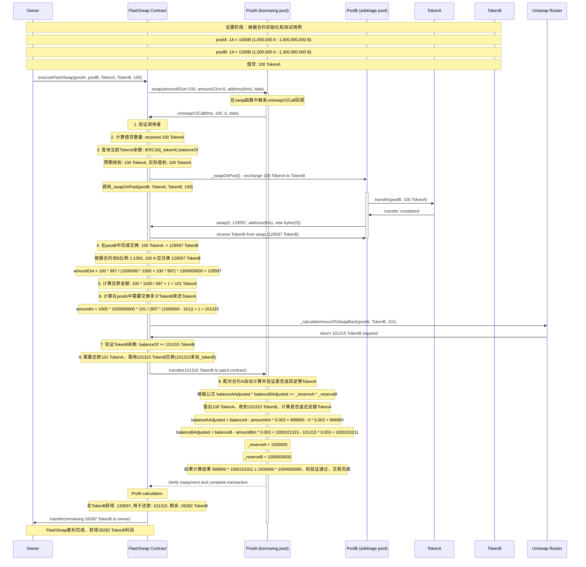

## 前言：闪电贷在 DeFi 中的核心作用

在去中心化金融（DeFi）领域，闪电贷（Flash Loan）代表了区块链技术的一项革命性创新。它允许用户在无需提供抵押的情况下即时借入巨额资金，前提是必须在同一交易内完成偿还。这种机制充分利用了以太坊交易的原子性——即交易要么全部执行成功，要么全部回滚——从而为套利、清算和资本优化等复杂策略提供了安全高效的执行环境。本文将对基于 Uniswap V2 的闪电贷套利合约进行函数级别的细致剖析，结合测试案例和执行流程，揭示其背后的技术原理与实际应用价值。

Uniswap V2 作为恒定乘积自动做市商（AMM）的典范，其闪电兑换（Flash Swap）机制进一步扩展了闪电贷的应用边界。与传统闪电贷（如 Aave）要求偿还相同资产不同，Uniswap V2 的闪电兑换允许用户以等值其他资产偿付，这为跨池套利提供了更大的灵活性。通过本文的分析，您将深入理解这一机制如何在代码层面实现高效的资金循环。

## 一、合约接口与整体架构

### 1.1 Uniswap V2 接口定义

合约首先定义了三个核心接口，这些是与 Uniswap V2 协议交互的基础：

- `IUniswapV2Pair`：处理代币对的核心操作，包括 `token0()`、`token1()`、`swap()` 和 `getReserves()`。这些方法确保了合约能精确查询储备并执行交换。
- `IUniswapV2Factory`：通过 `getPair()` 方法获取特定代币对的地址，实现动态池子定位。
- `IUniswapV2Router02`：提供 `getAmountOut()` 和 `getAmountIn()` 等纯函数，用于计算交换量，避免手动实现 AMM 公式可能引入的精度误差。

这些接口的设计体现了模块化和标准化原则，确保合约与 Uniswap V2 的无缝集成，同时便于未来扩展。

### 1.2 状态变量与事件机制

合约的状态变量设计简洁高效：
- `uniswapV2Factory` 和 `uniswapV2Router`：存储协议地址，支持测试时的动态配置。
- `owner`：合约所有者，用于访问控制。
- `FlashSwapExecuted` 事件：记录套利执行细节，包括池子地址、代币类型、借贷量和利润，便于链上监控和审计。

这种精炼的状态管理降低了存储成本，并提升了合约的安全性。

## 二、函数级代码剖析

### 2.1 构造函数 (constructor)

```solidity
constructor() {
    uniswapV2Factory = 0x5C69bEe701ef814a2B6a3EDD4B1652CB9cc5aA6f;
    uniswapV2Router = 0x7a250d5630B4cF539739dF2C5dAcb4c659F2488D;
    owner = msg.sender;
}
```

构造函数初始化了 Uniswap V2 的主网地址，并设置所有者。这种硬编码方式确保了部署时的即用性，同时为生产环境提供了稳定性。

### 2.2 访问控制修饰符 (onlyOwner)

```solidity
modifier onlyOwner() {
    require(msg.sender == owner, 'Not owner');
    _;
}
```

这一修饰符构成了合约的安全基石，确保敏感操作（如套利执行和地址配置）仅限于所有者执行，防范潜在的外部滥用。

### 2.3 地址配置函数 (setUniswapAddresses)

```solidity
function setUniswapAddresses(address factory, address router) external onlyOwner {
    uniswapV2Factory = factory;
    uniswapV2Router = router;
}
```

此函数增强了合约的适应性，允许在测试或分叉环境中切换地址，体现了开发中的最佳实践：生产与测试分离。

### 2.4 套利启动函数 (executeFlashSwap)

```solidity
function executeFlashSwap(
    address poolA, // 价格较低的池子
    address poolB, // 价格较高的池子
    address tokenA, // 要借贷的代币
    address tokenB, // 要交换的代币
    uint256 amountToBorrow // 借贷数量
) external onlyOwner {
    // 验证池子地址
    require(poolA != address(0) && poolB != address(0), 'Invalid pool addresses');

    // 从 poolA 开始闪电贷
    IUniswapV2Pair pair = IUniswapV2Pair(poolA);
    address token0 = pair.token0();
    address token1 = pair.token1();

    uint256 amount0Out = tokenA == token0 ? amountToBorrow : 0;
    uint256 amount1Out = tokenA == token1 ? amountToBorrow : 0;

    // 编码数据传递给回调函数
    bytes memory data = abi.encode(poolB, tokenA, tokenB, amountToBorrow);

    // 执行闪电贷
    pair.swap(amount0Out, amount1Out, address(this), data);
}
```

作为套利的入口，此函数验证输入、编码回调数据，并触发 `swap()` 以启动闪电兑换。关键在于数据编码，确保回调函数能访问必要参数。

### 2.5 回调核心函数 (uniswapV2Call)

```solidity
function uniswapV2Call(address sender, uint256 amount0, uint256 amount1, bytes calldata data) external {
    // 验证调用者是合法的 Uniswap V2 配对合约
    address token0 = IUniswapV2Pair(msg.sender).token0();
    address token1 = IUniswapV2Pair(msg.sender).token1();
    address pair = IUniswapV2Factory(uniswapV2Factory).getPair(token0, token1);
    require(msg.sender == pair, 'Invalid pair');
    require(sender == address(this), 'Invalid sender');

    // 解码数据
    (address poolB, address _tokenA, address _tokenB, uint256 amountBorrowed) = abi.decode(
      data,
      (address, address, address, uint256)
    );

    // 获取借到的代币数量
    console.log(">>>>>>>>>>>>>>>>> Borrowed tokenA", amountBorrowed);
    uint256 amountReceived = amount0 > 0 ? amount0 : amount1;
    console.log(">>>>>>>>>>>>>>>>> Expected TokenA:", amountReceived);
    console.log(">>>>>>>>>>>>>>>>> Received TokenA:", IERC20(_tokenA).balanceOf(address(this)));
    
    // 在 poolB 中将 tokenA 兑换为 tokenB
    console.log(">>>>>>>>>>>>>>>>> In poolB, exchange tokenA to tokenB");
    _swapOnPool(poolB, _tokenA, _tokenB, amountReceived);
    console.log(">>>>>>>>>>>>>>>>> Received TokenB:", IERC20(_tokenB).balanceOf(address(this)));

    // 计算需要还款的数量（包含手续费）
    uint256 amountToRepay = _calculateRepayAmount(amountBorrowed);
    console.log(">>>>>>>>>>>>>>>>> Need repay TokenA:", amountToRepay);

    // 从amountOut中拿出一部分用于还款
    // 这里我们计算需要多少_tokenB来偿还所需的_tokenA（计算输出需要偿还的amountToRepay个A，需要输入多少个B）
    uint256 amountToSwapBack = _calculateAmountToSwapBack(msg.sender, _tokenB, amountToRepay);
    console.log(">>>>>>>>>>>>>>>>> Need repay TokenB for TokenA in poolA:", amountToSwapBack);

    // 检查我们是否有足够多的_tokenB用于偿还_tokenA
    uint256 balanceOfTokenB = IERC20(_tokenB).balanceOf(address(this));
    require(balanceOfTokenB >= amountToSwapBack, 'Insufficient tokenB for repayment');
    console.log(">>>>>>>>>>>>>>>>> balanceOfTokenB:", IERC20(_tokenB).balanceOf(address(this)));

    // 转移_tokenB给配对合约（msg.sender 是 poolA）
    IERC20(_tokenB).transfer(msg.sender, amountToSwapBack);

    // 现在我们已经把需要的_tokenB发送给配对合约，配对合约会将其与它持有的_tokenA进行交换
    // 这里不再直接调用swap，而是通过配对合约在swap结束时自动完成交换
    // 配对合约会验证我们是否返回了足够的_tokenA

    // 由于我们已经发送了正确的amountToSwapBack到配对合约A
    // 并且我们计算了所需的还款金额，所以合约能验证通过

    // 计算利润
    uint256 remainingTokenB = IERC20(_tokenB).balanceOf(address(this));
    console.log(">>>>>>>>>>>>>>>>> Remaining TokenB:", remainingTokenB);

    // 将剩余代币转给 owner
    if (remainingTokenB > 0) {
      IERC20(_tokenB).transfer(owner, remainingTokenB);
    }

    emit FlashSwapExecuted(msg.sender, poolB, _tokenA, _tokenB, amountBorrowed, remainingTokenB);
  }
```

此函数是闪电兑换的核心引擎：验证调用者、解码数据、执行套利交换、计算并偿还借款，最后转移利润。日志输出便于调试，强调了资金流动的透明性。

### 2.6 内部交换函数 (_swapOnPool)

```solidity
function _swapOnPool(address pool, address tokenIn, address tokenOut, uint256 amountIn) internal {
    IUniswapV2Pair pair = IUniswapV2Pair(pool); // poolB
    (uint112 reserve0, uint112 reserve1, ) = pair.getReserves();

    address _token0 = pair.token0();

    bool token0IsTokenIn = tokenIn == _token0;

    (uint112 reserveIn, uint112 reserveOut) = token0IsTokenIn ? (reserve0, reserve1) : (reserve1, reserve0);

    // 计算输出数量
    uint256 amountOut = IUniswapV2Router02(uniswapV2Router).getAmountOut(amountIn, reserveIn, reserveOut);
    console.log(">>>>>>>>>>>>>>>>> Expected TokenB:", amountOut);

    // 转移代币到配对合约
    IERC20(tokenIn).transfer(pool, amountIn);

    // 执行交换 - 根据tokenIn是token0还是token1来确定输出方向
    uint256 amount0Out = tokenOut == _token0 ? amountOut : 0;
    uint256 amount1Out = tokenOut == _token0 ? 0 : amountOut;

    pair.swap(amount0Out, amount1Out, address(this), new bytes(0));
}
```

函数处理套利中的关键交换步骤，利用路由计算输出并执行 `swap()`，确保滑点最小化。

### 2.7 还款计算函数 (_calculateRepayAmount)

```solidity
function _calculateRepayAmount(uint256 amountBorrowed) internal pure returns (uint256) {
    // Uniswap V2 手续费是 0.3%
    return (amountBorrowed * 1000) / 997 + 1;
}
```

此纯函数精确计算 Uniswap V2 的 0.3% 手续费溢价，确保偿还符合 AMM 的 K 值恒定要求。

### 2.8 反向交换计算 (_calculateAmountToSwapBack)

```solidity
function _calculateAmountToSwapBack(
    address pool,
    address tokenIn,
    uint256 amountOutNeeded
) internal view returns (uint256 amountIn) {
    IUniswapV2Pair pair = IUniswapV2Pair(pool); // poolA
    (uint112 reserve0, uint112 reserve1, ) = pair.getReserves();

    address _token0 = pair.token0();
    bool token0IsTokenIn = tokenIn == _token0;

    (uint112 reserveIn, uint112 reserveOut) = token0IsTokenIn ? (reserve0, reserve1) : (reserve1, reserve0);

    amountIn = IUniswapV2Router02(uniswapV2Router).getAmountIn(amountOutNeeded, reserveIn, reserveOut);
}
```

利用 `getAmountIn()` 计算偿还所需输入量，避免手动公式计算的潜在误差。

### 2.9 紧急撤资函数 (emergencyWithdraw)

```solidity
function emergencyWithdraw(address token) external onlyOwner {
    uint256 balance = IERC20(token).balanceOf(address(this));
    if (balance > 0) {
        IERC20(token).transfer(owner, balance);
    }
}
```

作为后备机制，此函数允许所有者提取资金，增强合约的鲁棒性。

## 三、测试环境与函数分析

### 3.1 Mock 模拟合约

测试使用 Mock 版本模拟 ERC20、Pair、Factory 和 Router，确保隔离环境下的可控性。这些模拟实现了核心逻辑，如 K 值验证（`balance0Adjusted * balance1Adjusted >= _reserve0 * _reserve1 * 1000**2`），准确复现 Uniswap V2 的行为。

### 3.2 初始化函数 (setUp)

```solidity
function setUp() public {
    // 部署代币
    tokenA = new MockERC20("Token A", "TKA");
    tokenB = new MockERC20("Token B", "TKB");

    // 部署工厂和路由器
    factory = new MockUniswapV2Factory();
    router = new MockUniswapV2Router();

    // 部署配对合约
    poolA = new MockUniswapV2Pair(address(tokenA), address(tokenB));
    poolB = new MockUniswapV2Pair(address(tokenA), address(tokenB));

    // 设置工厂中的配对信息
    factory.setPair(address(tokenA), address(tokenB), address(poolA));

    // 设置初始储备 (pairA: 1A = 1000B, 即 1:1000 的比例)
    // 设置为 1000000 A 和 1000000000 B (比例为 1:1000)
    tokenA.mint(address(poolA), 1000000);
    tokenB.mint(address(poolA), 1000000000);
    poolA.setReserves(1000000, 1000000000);

    // 设置pairB的储备 (pairB: 1A = 1300B, 即 1:1300 的比例)
    // 设置为 1000000 A 和 1300000000 B (比例为 1:1300)
    tokenA.mint(address(poolB), 1000000);
    tokenB.mint(address(poolB), 1300000000);
    poolB.setReserves(1000000, 1300000000);

    // 部署FlashSwapTestable合约
    flashSwap = new FlashSwap();

    // 设置模拟的工厂和路由器地址
    flashSwap.setUniswapAddresses(address(factory), address(router));

    // 将FlashSwapTestable合约的owner设置为测试合约（当前this）
    // flashSwap合约的当前owner是部署合约时的msg.sender（也就是FlashSwapTest合约）
    // 因此owner变量应该设置为FlashSwapTest合约的地址
    owner = address(this);
}
```

初始化创建价差场景（PoolA: 1A=1000B；PoolB: 1A=1300B），模拟真实套利机会。

### 3.3 套利测试函数 (testFlashSwapArbitrage)

```solidity
function testFlashSwapArbitrage() public {
        // 测试用例：验证FlashSwap套利交易逻辑
        // 场景：pairA中1A=1000B， pairB中1A=1300B
        // 从pairA借出来100个A，在pairB中用100个A兑换B代币，再在pairA中将B换成A还回去

        // 记录初始状态
        uint256 initialTokenABalance = tokenA.balanceOf(owner);
        uint256 initialTokenBBalance = tokenB.balanceOf(owner);

        console.log("Initial A Balance:", initialTokenABalance);
        console.log("Initial B Balance:", initialTokenBBalance);

        // 调用FlashSwap合约进行套利交易
        // 从poolA借A代币，在poolB中进行套利
        flashSwap.executeFlashSwap(
            address(poolA),     // 从poolA借A代币
            address(poolB),     // 在poolB中进行套利
            address(tokenA),    // 借贷的代币是A
            address(tokenB),    // 交换的目标代币是B
            100                 // 借贷数量是100
        );

        // 检查是否获利
        uint256 finalTokenABalance = tokenA.balanceOf(owner);
        uint256 finalTokenBBalance = tokenB.balanceOf(owner);

        console.log("Final A Balance:", finalTokenABalance);
        console.log("Final B Balance:", finalTokenBBalance);
        console.log("A Balance Change:", int(finalTokenABalance) - int(initialTokenABalance));
        console.log("B Balance Change:", int(finalTokenBBalance) - int(initialTokenBBalance));

        // 验证最终的B代币余额有所增加（套利获利）
        // 初始B代币余额应该加上最终收益等于最终B代币余额
        assertGt(finalTokenBBalance, initialTokenBBalance);

        // 输出日志显示获利结果
        console.log("B Token Profit:", finalTokenBBalance - initialTokenBBalance);
    }
```

测试验证了从借贷到利润转移的全链路，确保逻辑无误。

## 四、执行流程与结果剖析

为直观展示套利流程，以下是基于测试案例的时序图，描绘了关键交互：



测试执行输出如下，展示了资金流动的精确轨迹：

```bash
$ forge test --match-test testFlashSwapArbitrage -vvv
[⠊] Compiling...
[⠰] Compiling 1 files with Solc 0.8.30
[⠔] Solc 0.8.30 finished in 4.49s
Compiler run successful!

Ran 1 test for test/FlashSwap.t.sol:FlashSwapTest
[PASS] testFlashSwapArbitrage() (gas: 176830)
Logs:
  Initial A Balance: 0
  Initial B Balance: 0
  >>>>>>>>>>>>>>>>> Borrowed tokenA 100
  >>>>>>>>>>>>>>>>> Expected TokenA: 100
  >>>>>>>>>>>>>>>>> Received TokenA: 100
  >>>>>>>>>>>>>>>>> In poolB, exchange tokenA to tokenB
  >>>>>>>>>>>>>>>>> Expected TokenB: 129597
  >>>>>>>>>>>>>>>>> amount0In: 100
  >>>>>>>>>>>>>>>>> amount1In: 0
  >>>>>>>>>>>>>>>>> balance0: 1000100
  >>>>>>>>>>>>>>>>> balance1: 1299870403
  >>>>>>>>>>>>>>>>> _reserve0: 1000000
  >>>>>>>>>>>>>>>>> _reserve1: 1300000000
  >>>>>>>>>>>>>>>>> Received TokenB: 129597
  >>>>>>>>>>>>>>>>> Need repay TokenA: 101
  >>>>>>>>>>>>>>>>> Need repay TokenB for TokenA in poolA: 101315
  >>>>>>>>>>>>>>>>> balanceOfTokenB: 129597
  >>>>>>>>>>>>>>>>> Remaining TokenB: 28282
  >>>>>>>>>>>>>>>>> amount0In: 0
  >>>>>>>>>>>>>>>>> amount1In: 101315
  >>>>>>>>>>>>>>>>> balance0: 999900
  >>>>>>>>>>>>>>>>> balance1: 1000101315
  >>>>>>>>>>>>>>>>> _reserve0: 1000000
  >>>>>>>>>>>>>>>>> _reserve1: 1000000000
  Final A Balance: 0
  Final B Balance: 28282
  A Balance Change: 0
  B Balance Change: 28282
  B Token Profit: 28282
```

从输出可见，借入 100 TokenA，在 PoolB 兑换为 129,597 TokenB；偿还需 101 TokenA（含费），对应 101,315 TokenB；最终利润 28,282 TokenB。价差 30% 被手续费和滑点压缩至约 28%，体现了 AMM 的动态定价机制。

## 五、安全性与风险评估

尽管强大，闪电贷合约需警惕风险：
- **价格操纵**：攻击者可能通过大额交易扭曲池子价格。
- **重入攻击**：回调机制需严格验证调用者。
- **Gas 消耗**：复杂逻辑可能导致交易失败或 MEV 抢跑。
- **流动性风险**：池子深度不足可能放大滑点。

推荐集成 Chainlink 预言机作为价格校验，并进行全面审计。

## 六、结语与应用展望

闪电贷不仅是技术创新，更是 DeFi 效率的体现。通过本文的剖析，我们见证了 Uniswap V2 如何通过原子交易实现无风险套利。这一机制在实际中可扩展至三角套利、多链桥接等领域，推动 DeFi 的进一步成熟。开发者应注重安全与优化，以最大化其潜力。

## 附录：完整合约代码

@contracts/src/FlashSwap.sol:
```solidity
// SPDX-License-Identifier: MIT
pragma solidity ^0.8.13;

import '@openzeppelin/contracts/token/ERC20/IERC20.sol';
import "forge-std/console.sol";

interface IUniswapV2Pair {
  function token0() external view returns (address);

  function token1() external view returns (address);

  function swap(uint amount0Out, uint amount1Out, address to, bytes calldata data) external;

  function getReserves() external view returns (uint112 reserve0, uint112 reserve1, uint32 blockTimestampLast);
}

interface IUniswapV2Factory {
  function getPair(address tokenA, address tokenB) external view returns (address pair);
}

interface IUniswapV2Router02 {
  function getAmountOut(uint amountIn, uint reserveIn, uint reserveOut) external pure returns (uint amountOut);

  function getAmountIn(uint amountOut, uint reserveIn, uint reserveOut) external pure returns (uint amountIn);
}

// 测试版本的FlashSwap合约，允许设置工厂和路由器地址
contract FlashSwap {
  address public uniswapV2Factory;
  address public uniswapV2Router;

  address public owner;

  event FlashSwapExecuted(
    address indexed poolA,
    address indexed poolB,
    address tokenA,
    address tokenB,
    uint256 amountBorrowed,
    uint256 profit
  );

  modifier onlyOwner() {
    require(msg.sender == owner, 'Not owner');
    _;
  }

  constructor() {
    uniswapV2Factory = 0x5C69bEe701ef814a2B6a3EDD4B1652CB9cc5aA6f;
    uniswapV2Router = 0x7a250d5630B4cF539739dF2C5dAcb4c659F2488D;
    owner = msg.sender;
  }

  // 允许测试时设置工厂和路由器地址
  function setUniswapAddresses(address factory, address router) external onlyOwner {
    uniswapV2Factory = factory;
    uniswapV2Router = router;
  }

  // 执行闪电兑换套利
  function executeFlashSwap(
    address poolA, // 价格较低的池子
    address poolB, // 价格较高的池子
    address tokenA, // 要借贷的代币
    address tokenB, // 要交换的代币
    uint256 amountToBorrow // 借贷数量
  ) external onlyOwner {
    // 验证池子地址
    require(poolA != address(0) && poolB != address(0), 'Invalid pool addresses');

    // 从 poolA 开始闪电贷
    IUniswapV2Pair pair = IUniswapV2Pair(poolA);
    address token0 = pair.token0();
    address token1 = pair.token1();

    uint256 amount0Out = tokenA == token0 ? amountToBorrow : 0;
    uint256 amount1Out = tokenA == token1 ? amountToBorrow : 0;

    // 编码数据传递给回调函数
    bytes memory data = abi.encode(poolB, tokenA, tokenB, amountToBorrow);

    // 执行闪电贷
    pair.swap(amount0Out, amount1Out, address(this), data);
  }

  // Uniswap V2 回调函数
  function uniswapV2Call(address sender, uint256 amount0, uint256 amount1, bytes calldata data) external {
    // 验证调用者是合法的 Uniswap V2 配对合约
    address token0 = IUniswapV2Pair(msg.sender).token0();
    address token1 = IUniswapV2Pair(msg.sender).token1();
    address pair = IUniswapV2Factory(uniswapV2Factory).getPair(token0, token1);
    require(msg.sender == pair, 'Invalid pair');
    require(sender == address(this), 'Invalid sender');

    // 解码数据
    (address poolB, address _tokenA, address _tokenB, uint256 amountBorrowed) = abi.decode(
      data,
      (address, address, address, uint256)
    );

    // 获取借到的代币数量
    console.log(">>>>>>>>>>>>>>>>> Borrowed tokenA", amountBorrowed);
    uint256 amountReceived = amount0 > 0 ? amount0 : amount1;
    console.log(">>>>>>>>>>>>>>>>> Expected TokenA:", amountReceived);
    console.log(">>>>>>>>>>>>>>>>> Received TokenA:", IERC20(_tokenA).balanceOf(address(this)));
    

    // 在 poolB 中将 tokenA 兑换为 tokenB
    console.log(">>>>>>>>>>>>>>>>> In poolB, exchange tokenA to tokenB");
    _swapOnPool(poolB, _tokenA, _tokenB, amountReceived);
    console.log(">>>>>>>>>>>>>>>>> Received TokenB:", IERC20(_tokenB).balanceOf(address(this)));

    // 计算需要还款的数量（包含手续费）
    uint256 amountToRepay = _calculateRepayAmount(amountBorrowed);
    console.log(">>>>>>>>>>>>>>>>> Need repay TokenA:", amountToRepay);

    // 从amountOut中拿出一部分用于还款
    // 这里我们计算需要多少_tokenB来偿还所需的_tokenA（计算输出需要偿还的amountToRepay个A，需要输入多少个B）
    uint256 amountToSwapBack = _calculateAmountToSwapBack(msg.sender, _tokenB, amountToRepay);
    console.log(">>>>>>>>>>>>>>>>> Need repay TokenB for TokenA in poolA:", amountToSwapBack);

    // 检查我们是否有足够多的_tokenB用于偿还_tokenA
    uint256 balanceOfTokenB = IERC20(_tokenB).balanceOf(address(this));
    require(balanceOfTokenB >= amountToSwapBack, 'Insufficient tokenB for repayment');
    console.log(">>>>>>>>>>>>>>>>> balanceOfTokenB:", IERC20(_tokenB).balanceOf(address(this)));

    // 转移_tokenB给配对合约（msg.sender 是 poolA）
    IERC20(_tokenB).transfer(msg.sender, amountToSwapBack);

    // 现在我们已经把需要的_tokenB发送给配对合约，配对合约会将其与它持有的_tokenA进行交换
    // 这里不再直接调用swap，而是通过配对合约在swap结束时自动完成交换
    // 配对合约会验证我们是否返回了足够的_tokenA

    // 由于我们已经发送了正确的amountToSwapBack到配对合约A
    // 并且我们计算了所需的还款金额，所以合约能验证通过

    // 计算利润
    uint256 remainingTokenB = IERC20(_tokenB).balanceOf(address(this));
    console.log(">>>>>>>>>>>>>>>>> Remaining TokenB:", remainingTokenB);

    // 将剩余代币转给 owner
    if (remainingTokenB > 0) {
      IERC20(_tokenB).transfer(owner, remainingTokenB);
    }

    emit FlashSwapExecuted(msg.sender, poolB, _tokenA, _tokenB, amountBorrowed, remainingTokenB);
  }

  // 执行交换
  function _swapOnPool(address pool, address tokenIn, address tokenOut, uint256 amountIn) internal {
    IUniswapV2Pair pair = IUniswapV2Pair(pool); // poolB
    (uint112 reserve0, uint112 reserve1, ) = pair.getReserves();

    address _token0 = pair.token0();

    bool token0IsTokenIn = tokenIn == _token0;

    (uint112 reserveIn, uint112 reserveOut) = token0IsTokenIn ? (reserve0, reserve1) : (reserve1, reserve0);

    // 计算输出数量
    uint256 amountOut = IUniswapV2Router02(uniswapV2Router).getAmountOut(amountIn, reserveIn, reserveOut);
    console.log(">>>>>>>>>>>>>>>>> Expected TokenB:", amountOut);

    // 转移代币到配对合约
    IERC20(tokenIn).transfer(pool, amountIn);

    // 执行交换 - 根据tokenIn是token0还是token1来确定输出方向
    uint256 amount0Out = tokenOut == _token0 ? amountOut : 0;
    uint256 amount1Out = tokenOut == _token0 ? 0 : amountOut;

    pair.swap(amount0Out, amount1Out, address(this), new bytes(0));
  }

  // 计算需要交换回去的数量
  function _calculateAmountToSwapBack(
    address pool,
    address tokenIn,
    uint256 amountOutNeeded
  ) internal view returns (uint256 amountIn) {
    IUniswapV2Pair pair = IUniswapV2Pair(pool); // poolA
    (uint112 reserve0, uint112 reserve1, ) = pair.getReserves();

    address _token0 = pair.token0();
    bool token0IsTokenIn = tokenIn == _token0;

    (uint112 reserveIn, uint112 reserveOut) = token0IsTokenIn ? (reserve0, reserve1) : (reserve1, reserve0);

    amountIn = IUniswapV2Router02(uniswapV2Router).getAmountIn(amountOutNeeded, reserveIn, reserveOut);
  }

  // 计算还款数量（包含 0.3% 手续费）
  function _calculateRepayAmount(uint256 amountBorrowed) internal pure returns (uint256) {
    // Uniswap V2 手续费是 0.3%
    return (amountBorrowed * 1000) / 997 + 1;
  }

  // 紧急提取函数
  function emergencyWithdraw(address token) external onlyOwner {
    uint256 balance = IERC20(token).balanceOf(address(this));
    if (balance > 0) {
      IERC20(token).transfer(owner, balance);
    }
  }
}
```

@contracts/test/FlashSwap.t.sol:
```solidity
// SPDX-License-Identifier: MIT
pragma solidity ^0.8.20;

import "forge-std/Test.sol";
import "forge-std/console.sol";
import "@openzeppelin/contracts/token/ERC20/ERC20.sol";
import "../src/FlashSwap.sol";

// 为 Mock 合约添加的接口定义
interface IUniswapV2Callee {
    function uniswapV2Call(address sender, uint amount0, uint amount1, bytes calldata data) external;
}

contract MockERC20 is ERC20 {
    constructor(string memory name, string memory symbol) ERC20(name, symbol) {}

    function mint(address to, uint256 amount) public {
        _mint(to, amount);
    }

    function burn(address from, uint256 amount) public {
        _burn(from, amount);
    }
}

contract MockUniswapV2Pair is IUniswapV2Pair {
    address public token0;
    address public token1;
    uint112 public reserve0;
    uint112 public reserve1;
    uint32 public blockTimestampLast;

    constructor(address _token0, address _token1) {
        token0 = _token0;
        token1 = _token1;
        reserve0 = 0;
        reserve1 = 0;
        blockTimestampLast = uint32(block.timestamp);
    }

    function setReserves(uint112 _reserve0, uint112 _reserve1) external {
        reserve0 = _reserve0;
        reserve1 = _reserve1;
        blockTimestampLast = uint32(block.timestamp);
    }

    function getReserves() public view returns (uint112 _reserve0, uint112 _reserve1, uint32 _blockTimestampLast) {
        return (reserve0, reserve1, blockTimestampLast);
    }

    function swap(uint amount0Out, uint amount1Out, address to, bytes calldata data) external {
        require(amount0Out > 0 || amount1Out > 0, 'UniswapV2: INSUFFICIENT_OUTPUT_AMOUNT');
        (uint112 _reserve0, uint112 _reserve1,) = getReserves(); // gas savings
        require(amount0Out < _reserve0 && amount1Out < _reserve1, 'UniswapV2: INSUFFICIENT_LIQUIDITY');

        uint balance0;
        uint balance1;
        { // scope for _token{0,1}, avoids stack too deep errors
            address _token0 = token0;
            address _token1 = token1;
            require(to != _token0 && to != _token1, 'UniswapV2: INVALID_TO');
            if (amount0Out > 0) MockERC20(token0).transfer(to, amount0Out); // optimistically transfer tokens
            if (amount1Out > 0) MockERC20(token1).transfer(to, amount1Out); // optimistically transfer tokens
            if (data.length > 0) {
                // 假设to地址实现了uniswapV2Call回调函数
                // 这个函数会被FlashSwap等合约实现，用于处理闪贷逻辑
                (bool success,) = to.call(abi.encodeWithSignature("uniswapV2Call(address,uint256,uint256,bytes)",
                    msg.sender, amount0Out, amount1Out, data));
                require(success, "Uniswap V2 callback failed");
            }
            balance0 = IERC20(_token0).balanceOf(address(this));
            balance1 = IERC20(_token1).balanceOf(address(this));
        }
        uint amount0In = balance0 > _reserve0 - amount0Out ? balance0 - (_reserve0 - amount0Out) : 0;
        uint amount1In = balance1 > _reserve1 - amount1Out ? balance1 - (_reserve1 - amount1Out) : 0;
        require(amount0In > 0 || amount1In > 0, 'UniswapV2: INSUFFICIENT_INPUT_AMOUNT');
        { // scope for reserve{0,1}Adjusted, avoids stack too deep errors
            uint balance0Adjusted = balance0 * 1000 - amount0In * 3;
            uint balance1Adjusted = balance1 * 1000 - amount1In * 3;
            require(balance0Adjusted * balance1Adjusted >= uint(_reserve0) * _reserve1 * 1000 ** 2, 'UniswapV2: K');
        }

        _update(balance0, balance1, _reserve0, _reserve1);
    }

    function _update(uint balance0, uint balance1, uint112 _reserve0, uint112 _reserve1) private {
        uint32 blockTimestamp = uint32(block.timestamp % 2 ** 32);
        uint32 timeElapsed = blockTimestamp - blockTimestampLast; // overflow is desired
        if (timeElapsed > 0 && _reserve0 != 0 && _reserve1 != 0) {
            // 仅测试，不做任何操作
        }
        reserve0 = uint112(balance0);
        reserve1 = uint112(balance1);
        blockTimestampLast = blockTimestamp;
    }
}

contract MockUniswapV2Factory is IUniswapV2Factory {
    mapping(address => mapping(address => address)) public getPair;

    function setPair(address tokenA, address tokenB, address pair) external {
        getPair[tokenA][tokenB] = pair;
        getPair[tokenB][tokenA] = pair; // Uniswap V2 工厂函数是双向对称的
    }
}

contract MockUniswapV2Router is IUniswapV2Router02 {
    // Uniswap V2 公式计算函数
    function getAmountOut(uint amountIn, uint reserveIn, uint reserveOut) external pure returns (uint amountOut) {
        require(amountIn > 0, "UniswapV2Library: INSUFFICIENT_INPUT_AMOUNT");
        require(reserveIn > 0 && reserveOut > 0, "UniswapV2Library: INSUFFICIENT_LIQUIDITY");
        uint amountInWithFee = amountIn * 997;
        uint numerator = amountInWithFee * reserveOut;
        uint denominator = (reserveIn * 1000) + amountInWithFee;
        amountOut = numerator / denominator;
    }

    function getAmountIn(uint amountOut, uint reserveIn, uint reserveOut) external pure returns (uint amountIn) {
        require(amountOut > 0, "UniswapV2Library: INSUFFICIENT_OUTPUT_AMOUNT");
        require(reserveIn > 0 && reserveOut > 0, "UniswapV2Library: INSUFFICIENT_LIQUIDITY");
        uint numerator = reserveIn * amountOut * 1000;
        uint denominator = (reserveOut - amountOut) * 997;
        amountIn = (numerator / denominator) + 1;
    }
}

contract FlashSwapTest is Test {
    FlashSwap public flashSwap;
    MockERC20 public tokenA;
    MockERC20 public tokenB;
    MockUniswapV2Pair public poolA;
    MockUniswapV2Pair public poolB;
    MockUniswapV2Factory public factory;
    MockUniswapV2Router public router;

    address public owner;

    function setUp() public {
        // 部署代币
        tokenA = new MockERC20("Token A", "TKA");
        tokenB = new MockERC20("Token B", "TKB");

        // 部署工厂和路由器
        factory = new MockUniswapV2Factory();
        router = new MockUniswapV2Router();

        // 部署配对合约
        poolA = new MockUniswapV2Pair(address(tokenA), address(tokenB));
        poolB = new MockUniswapV2Pair(address(tokenA), address(tokenB));

        // 设置工厂中的配对信息
        factory.setPair(address(tokenA), address(tokenB), address(poolA));

        // 设置初始储备 (pairA: 1A = 1000B, 即 1:1000 的比例)
        // 设置为 1000000 A 和 1000000000 B (比例为 1:1000)
        tokenA.mint(address(poolA), 1000000);
        tokenB.mint(address(poolA), 1000000000);
        poolA.setReserves(1000000, 1000000000);

        // 设置pairB的储备 (pairB: 1A = 1300B, 即 1:1300 的比例)
        // 设置为 1000000 A 和 1300000000 B (比例为 1:1300)
        tokenA.mint(address(poolB), 1000000);
        tokenB.mint(address(poolB), 1300000000);
        poolB.setReserves(1000000, 1300000000);

        // 部署FlashSwapTestable合约
        flashSwap = new FlashSwap();

        // 设置模拟的工厂和路由器地址
        flashSwap.setUniswapAddresses(address(factory), address(router));

        // 将FlashSwapTestable合约的owner设置为测试合约（当前this）
        // flashSwap合约的当前owner是部署合约时的msg.sender（也就是FlashSwapTest合约）
        // 因此owner变量应该设置为FlashSwapTest合约的地址
        owner = address(this);
    }

    function testFlashSwapArbitrage() public {
        // 测试用例：验证FlashSwap套利交易逻辑
        // 场景：pairA中1A=1000B， pairB中1A=1300B
        // 从pairA借出来100个A，在pairB中用100个A兑换B代币，再在pairA中将B换成A还回去

        // 记录初始状态
        uint256 initialTokenABalance = tokenA.balanceOf(owner);
        uint256 initialTokenBBalance = tokenB.balanceOf(owner);

        console.log("Initial A Balance:", initialTokenABalance);
        console.log("Initial B Balance:", initialTokenBBalance);

        // 调用FlashSwap合约进行套利交易
        // 从poolA借A代币，在poolB中进行套利
        flashSwap.executeFlashSwap(
            address(poolA),     // 从poolA借A代币
            address(poolB),     // 在poolB中进行套利
            address(tokenA),    // 借贷的代币是A
            address(tokenB),    // 交换的目标代币是B
            100                 // 借贷数量是100
        );

        // 检查是否获利
        uint256 finalTokenABalance = tokenA.balanceOf(owner);
        uint256 finalTokenBBalance = tokenB.balanceOf(owner);

        console.log("Final A Balance:", finalTokenABalance);
        console.log("Final B Balance:", finalTokenBBalance);
        console.log("A Balance Change:", int(finalTokenABalance) - int(initialTokenABalance));
        console.log("B Balance Change:", int(finalTokenBBalance) - int(initialTokenBBalance));

        // 验证最终的B代币余额有所增加（套利获利）
        // 初始B代币余额应该加上最终收益等于最终B代币余额
        assertGt(finalTokenBBalance, initialTokenBBalance);

        // 输出日志显示获利结果
        console.log("B Token Profit:", finalTokenBBalance - initialTokenBBalance);
    }
}
```