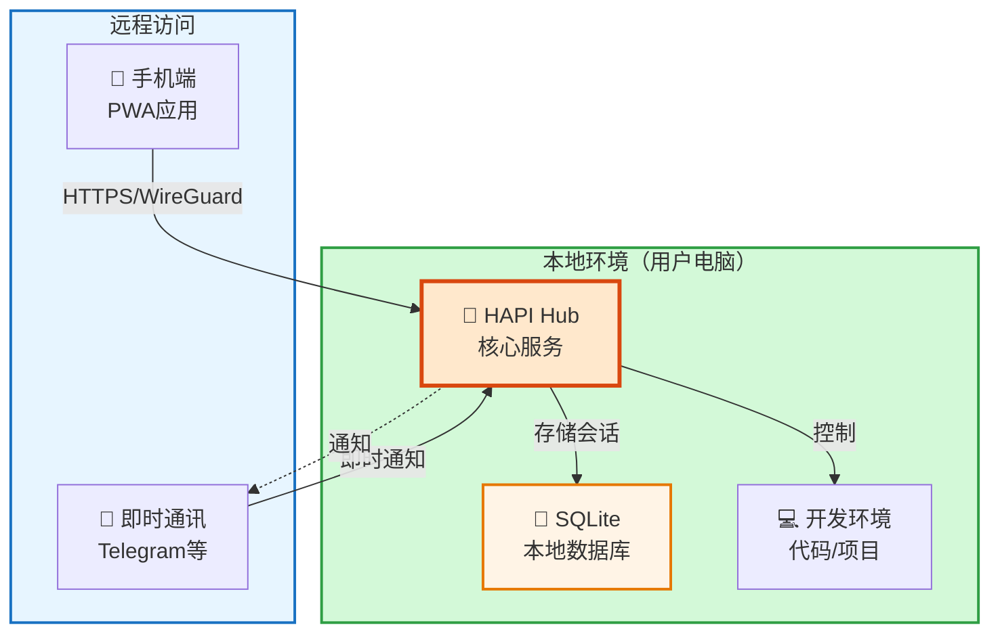
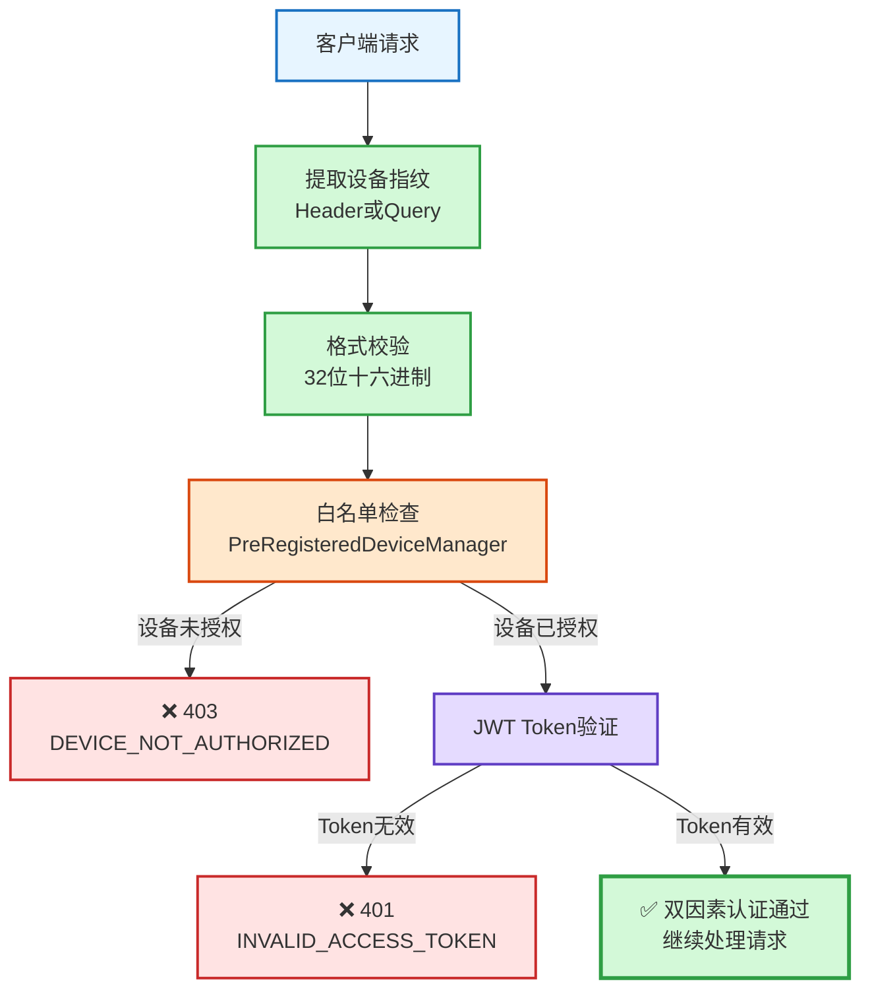

最近在用 HAPI 这个去中心化 AI 代理平台，体验了"Vibe Coding"的自由感——在咖啡馆、徒步时也能远程控制本地开发环境。但在实际使用中发现了安全隐患：原生的 JWT Token 认证在多设备场景下缺少设备级管控。于是我 fork 了项目，新增了设备指纹认证功能，实现"设备 + Token"的双因素验证。

这篇文章分享从使用者到贡献者的完整实践过程，包括 HAPI 项目介绍、安全问题分析、设备指纹认证的前后端实现，以及实际部署经验。

## HAPI 是什么

HAPI 是一个去中心化的 AI 代理平台，支持"Vibe Coding"理念——随时随地自由编程，AI 代理在后台为你工作。

### 核心特性

**Vibe Coding 理念**

去徒步、去喝咖啡，或者只是放松一下。你的 AI 代理在后台为你工作，只有在需要你确认时，才会通过即时通讯应用通知你。

**去中心化架构**

每个用户运行自己的 hub，数据留在本地。不像其他云服务把你的代码和会话存储在中心化服务器上，HAPI 让你完全掌控数据主权。

**远程控制**

通过 PWA 或即时通讯应用（如 Telegram）访问本地开发环境。会话驻留在你的电脑上，手机只是一个窗口。本地就是原生 Claude Code 或 Codex，外出时切换到手机，双空格键瞬间切回本地。

**即时通讯集成**

距离与控制的完美平衡。通过 Telegram 或其他应用，只在真正需要你输入时才通知你。

**技术栈**

TypeScript + Hono 框架 + SQLite，单二进制部署，零配置启动。

### 架构设计



数据主权完全掌握在用户手中，没有中心化服务器存储你的代码和会话。

## 原生认证方案的不足

### 原生方案是什么

HAPI 原生使用 JWT Token 认证。用户登录后获得 Token，后续请求携带 Token 验证身份。这是标准的 Web 应用认证方式。

### 实际使用中的问题

**Token 泄露风险**

如果 Token 被窃取（网络抓包、XSS 攻击），攻击者可以在任何设备上使用。

**多设备管控缺失**

无法区分是"我的手机"还是"别人的设备"在访问。

**无法远程撤销**

发现异常访问时，只能重置 Token，但所有设备都会失效。

**缺少审计能力**

无法追踪"哪个设备在什么时间访问了什么"。

### 为什么需要设备级管控

远程编程场景下，设备是"信任边界"。即使 Token 泄露，攻击者也无法在未授权设备上使用。可以实现"设备白名单"机制，只允许信任的设备访问。

**对比：纯 Token 认证 vs 双因素认证**

| 维度 | 纯 Token 认证 | 设备指纹 + Token |
|------|--------------|-----------------|
| Token 泄露 | 攻击者可在任何设备使用 | 攻击者无法在未授权设备使用 |
| 设备管控 | 无法区分设备 | 设备白名单机制 |
| 撤销粒度 | 重置 Token 影响所有设备 | 可单独撤销某个设备 |
| 审计能力 | 无法追踪设备 | 可追踪设备访问记录 |

## 设备指纹认证方案设计

### 核心思路

双因素认证：设备指纹（你的设备）+ JWT Token（你的身份）。类比银行 U 盾，既要密码（Token），又要 U 盾（设备）。

### 技术选型

**为什么选择浏览器指纹**

- 纯前端实现，无需用户操作
- 同一设备生成的指纹高度一致
- 无需额外硬件支持

**为什么不用其他方案**

| 方案 | 问题 |
|------|------|
| Cookie/LocalStorage | 用户清除后失效 |
| 设备 ID（如 IMEI） | 隐私问题，浏览器无法访问 |
| 硬件密钥（如 YubiKey） | 成本高，用户体验差 |

### 整体架构

**前端**：采集设备特征（屏幕、Canvas、WebGL 等）→ SHA-256 哈希 → 32 位指纹

**后端**：白名单管理（JSON 配置文件）→ 认证中间件（先验证设备，再验证 Token）

**配置**：~/.hapi/settings.json 存储设备白名单

### 验证流程



验证顺序很关键：先验证设备，再验证 Token。设备验证更快（内存查询），可以快速拒绝未授权设备，减少 JWT 验证的计算开销。

## 前端实现 - 设备指纹生成器

### 核心思路

收集浏览器和硬件的各种特征，组合后生成唯一标识。即使用户清除 Cookie，只要设备不变，指纹就不会变。

### 设备特征采集

**基础特征**

- 屏幕分辨率、颜色深度
- User Agent、平台信息
- CPU 核心数（hardwareConcurrency）
- 设备内存（deviceMemory）
- 时区、语言
- 触摸点数量（maxTouchPoints）

**Canvas Fingerprinting（重点）**

原理：不同设备的 GPU、字体渲染引擎、抗锯齿算法有细微差异。

实现：绘制特定图形（矩形 + 文字 + emoji），toDataURL() 返回 base64 图像数据。

实践心得：
- 文字要包含 emoji（不同系统渲染差异大）
- 颜色和字体多样化，增加渲染复杂度
- 隐私模式下可能有变化

**WebGL Fingerprinting**

原理：直接读取 GPU 的 RENDERER 和 VENDOR 信息。

实现：gl.getParameter(gl.RENDERER)

输出：如 "Apple GPU - Apple Inc."

实践心得：某些浏览器会屏蔽 WebGL 信息，返回空字符串不影响整体指纹。

### SHA-256 哈希

所有特征 JSON 序列化，使用浏览器原生 crypto.subtle.digest，取前 32 位作为最终指纹。既保证唯一性，又避免暴露设备信息。

### 完整代码

```typescript
export class DeviceFingerprintGenerator {
  static async generateFingerprint(): Promise<string> {
    const features = {
      screenResolution: `${screen.width}x${screen.height}`,
      colorDepth: screen.colorDepth,
      userAgent: navigator.userAgent,
      platform: navigator.platform,
      hardwareConcurrency: navigator.hardwareConcurrency || 0,
      deviceMemory: (navigator as any).deviceMemory || 0,
      canvas: this.getCanvasFingerprint(),
      webgl: this.getWebGLFingerprint(),
      timezone: Intl.DateTimeFormat().resolvedOptions().timeZone,
      language: navigator.language,
      maxTouchPoints: navigator.maxTouchPoints || 0,
    };

    const featuresString = JSON.stringify(features);
    return this.sha256Hash(featuresString);
  }

  private static getCanvasFingerprint(): string {
    const canvas = document.createElement('canvas');
    const ctx = canvas.getContext('2d');
    if (!ctx) return '';

    ctx.textBaseline = 'top';
    ctx.font = '14px Arial';
    ctx.fillStyle = '#f60';
    ctx.fillRect(125, 1, 62, 20);
    ctx.fillStyle = '#069';
    ctx.fillText('Hello, world! 🌍', 2, 15);

    return canvas.toDataURL();
  }

  private static getWebGLFingerprint(): string {
    const canvas = document.createElement('canvas');
    const gl = canvas.getContext('webgl');
    if (!gl) return '';

    const renderer = gl.getParameter(gl.RENDERER);
    const vendor = gl.getParameter(gl.VENDOR);
    return `${renderer}-${vendor}`;
  }

  private static async sha256Hash(message: string): Promise<string> {
    const msgBuffer = new TextEncoder().encode(message);
    const hashBuffer = await crypto.subtle.digest('SHA-256'ffer);
    const hashArray = Array.from(new Uint8Array(hashBuffer));
    return hashArray.map(b => b.toString(16).padStart(2, '0'))
                    .join('')
                    .substring(0, 32);
  }
}
```

### 使用示例

```typescript
// 在应用初始化时生成指纹
const fingerprint = await DeviceFingerprintGenerator.generateFingerprint();

// 在 API 请求中携带指纹
fetch('/api/data', {
  headers: {
    'X-Device-Fingerprint': fingerprint,
    'Authorization': `Bearer ${token}`
  }
});
```

## 后端实现 - 认证中间件与配置管理

### 核心思路

验证设备指纹是否在白名单中，然后再验证 JWT Token。双因素认证流程。基于 Hono 框架，但思路适用于任何 Node.js 框架。

### 设备管理器实现

**PreRegisteredDeviceManager 设计**

使用 Set<string> 存储设备指纹，配置文件：~/.hapi/settings.json

配置格式：

```json
{
  "fingerprint": [
    "a3f5e8c9d2b1...",
    "b4e6f9c0d3a2..."
  ]
}
```

实践心得：
- 支持 HAPI_HOME 环境变量，方便 Docker 部署
- 启动时加载配置到内存，避免每次请求都读文件

**完整代码**

```typescript
export class PreRegisteredDeviceManager {
  private static deviceRecords: Set<string> = new Set();

  private static getSettingsPath(): string {
    const dataDir = process.env.HAPI_HOME
      ? process.env.HAPI_HOME.replace(/^~/, homedir())
      : join(homedir(), ".hapi");
    return joi "settings.json");
  }

  static isDeviceAllowed(deviceFingerprint: string): boolean {
    return this.deviceRecords.has(deviceFingerprint);
  }

  static async loadDeviceConfig(): Promise<void> {
    try {
      const settingsPath = this.getSettingsPath();
      const { readFileSync, existsSync } = await import("fs");
      if (existsSync(settingsPath)) {
        const config = JSON.parse(readFileSync(settingsPath, "utf8"));
        if (Array.isArray(config.fingerprint)) {
          config.fingerprint.forEach((record: string) => {
            this.deviceRecords.add(record);
          });
        }
      }
    } catch (error) {
      console.error("Failed to load device config:", error);
      throw error;
    }
  }
}

// 启动时加载配置
PreRegisteredDeviceManager.loadDeviceConfig();
```

### 认证中间件实现

**createDeviceBasedAuthMiddleware 设计**

验证流程（按顺序）：
1. 提取设备指纹（支持 Header 和 Query 两种方式）
2. 格式校验（32 位十六进制）
3. 白名单检查
4. JWT Token 验证

**为什么先验证设备，再验证 Token**

- 设备验证更快（内存查询）
- 快速拒绝未授权设备
- 减少 JWT 验证的计算开销
- 从安全角度，设备级别的拦截更早

**双路径提取设计（重点）**

- 普通 API 请求：从 Header 读取
- SSE 连接（/api/events）：从 Query 参数读取
- 原因：SSE 无法自定义 Header，只能通过 URL 参数传递
- 实践心得：这个设计让认证逻辑统一，不需要为 SSE 单独写认证代码

**错误处理设计**

- DEVICE_FINGERPRINT_MISSING：设备指纹缺失
- INVALID_DEVICE_FINGERPRINT_FORMAT：格式错误
- DEVICE_NOT_AUTHORIZED：设备未授权
- AUTH_TOKEN_MISSING：Token 缺失
- INVALID_ACCESS_TOKEN：Token 无效

**完整代码**

```typescript
export function createDeviceBasedAuthMiddleware(jwtSecret: Uint8Array) {
  return async (c, next) => {
    try {
      // 1. 提取设备指纹（支持 Header 和 Query 两种方式）
      let deviceFingerprint = c.req.header('X-Device-Fingerprint');
      if (!deviceFingerprint) {
        deviceFingerprint = c.req.query().deviceFingerprint;
      }

      if (!deviceFingerprint) {
        return c.json({
          error: 'Device fingerprint required',
          code: 'DEVICE_FINGERPRINT_MISSING'
        }, 401);
      }

      // 2. 格式校验（32 位十六进制）
      if (!/^[a-f0-9]{32}$/.test(deviceFingerprint)) {
        return c.json({
          error: 'Invalid device fingerprint format',
          code: 'INVALID_DEVICE_FINGERPRINT_FORMAT'
        }, 400);
      }

      // 3. 白名单检查
      if (!PreRegisteredDeviceManager.isDeviceAllowed(deviceFingerprint)) {
        return c.json({
          error: 'Device not authorized',
          code: 'DEVICE_NOT_AUTHORIZED'
        }, 403);
      }

      // 4. JWT Token 验证
      const authHeader = c.req.header('Authorization');
      const tokenFromHeader = authHeader?.startsWith('Bearer ')
        ? authHeader.slice('Bearer '.length)
        : undefined;
      const tokenFromQuery = c.req.path === '/api/events'
        ? c.req.query().token
        : undefined;
      const accessToken = tokenFromHeader ?? tokenFromQuery;

      if (!accessToken) {
        return c.json({
          error: 'Authorization token required',
          code: 'AUTH_TOKEN_MISSING'
        }, 401);
      }

      const verified = await jwtVerify(accessToken, jwtSecret);
      const parsed = jwtPayloadSchema.safeParse(verified.payload);

      if (!parsed.success) {
        return c.json({ error: 'Invalid token payload' }, 401);
      }

      c.set('userId', parsed.data.uid);
      c.set('namespace', parsed.data.ns);

      await next();
    } catch (error) {
      return c.json({ error: 'Authentication failed' }, 500);
    }
  };
}
```

### 使用示例

```typescript
import { Hono } from 'hono';

const app = new Hono();
const jwtSecret = new TextEncoder().encode(process.env.JWT_SECRET);

// 应用中间件到需要认证的路由
app.use('/api/*', createDeviceBasedAuthMiddleware(jwtSecret));

app.get('/api/data', (c) => {
  const userId = c.get('userId');
  return c.json({ message: 'Authenticated!', userId });
});
```

## 实践经验与踩坑记录

### 兼容性：SSE 连接的特殊处理

SSE（Server-Sent Events）是个坑。SSE 连接无法自定义 Header，只能通过 URL 参数传递认证信息。一开始只支持 Header 方式，导致 SSE 连接全部失败。

解决方案：做双路径兼容，优先从 Header 读取，如果是 SSE 路径（/api/events）就从 Query 读取。

```typescript
// 双路径提取设计
let deviceFingerprint = c.req.header('X-Device-Fingerprint');
if (!deviceFingerprint) {
  deviceFingerprint = c.req.query().deviceFingerprint;
}

// Token 也是同样的逻辑
const tokenFromHeader = authHeader?.startsWith('Bearer ')
  ? authHeader.slice('Bearer '.length)
  : undefined;
const tokenFromQuery = c.req.path === '/api/events'
  ? c.req.query().token
  : undefined;
const accessToken = tokenFromHeader ?? tokenFromQuery;
```

### 安全提醒

无论是 Header 还是 Query 参数，都必须基于 HTTPS 传输。HTTP 明文传输会导致设备指纹和 Token 被中间人窃取。

我的部署方案：
- 家用电信宽带配置公网 IP
- 使用阿里云申请的 HTTPS 证书
- 域名解析到家庭公网 IP
- HAPI hub 配置 HTTPS 证书路径

HAPI 还支持其他安全模式：
- 公共中继：通过 WireGuard + TLS 端到端加密
- Cloudflare Tunnel：零配置 HTTPS

教训：安全传输是双因素认证的前提。

## 总结与展望

### 功能价值

这套设备指纹认证方案在 HAPI fork 版本中运行良好，显著提升了安全性。

核心优势：
- 零侵入：纯前端采集，无需用户操作
- 高性能：内存查询，响应时间 < 1ms
- 易维护：JSON 配置，无需数据库
- 兼容性好：支持 SSE 长连接场景

### 适用场景与局限性

适用场景：内部管理系统、企业应用、需要设备级管控的场景

局限性：
- 隐私模式下指纹可能变化
- 用户更换设备需要重新授权
- 不适合公开的 C 端产品（用户体验问题）

### 未来优化方向

- 动态白名单管理：实现 Web 管理界面，支持设备的添加、删除、查看
- 指纹相似度匹配：容忍设备指纹的微小变化
- 多因素认证：结合 IP 地址、地理位置、使用时间等维度
- 审计日志：记录所有认证尝试，方便安全分析

### 项目链接

- Fork 仓库：https://github.com/ciphermagic/hapi/tree/feature
- HAPI 仓库：https://github.com/tiann/hapi
- HAPI 官网：https://hapi.run

完整代码已在生产环境运行，如果你也在做类似的安全加固，希望这篇文章能给你一些启发。
