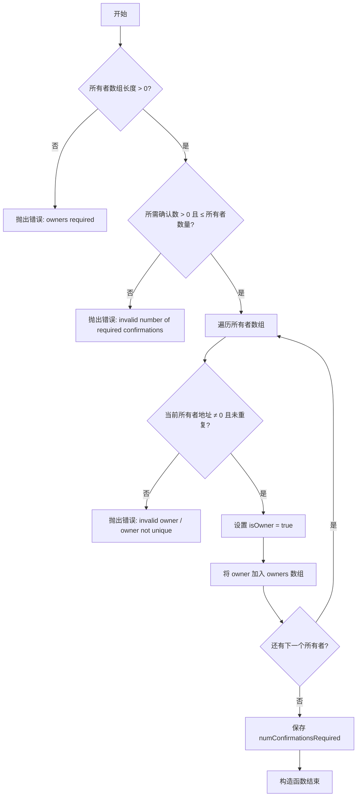
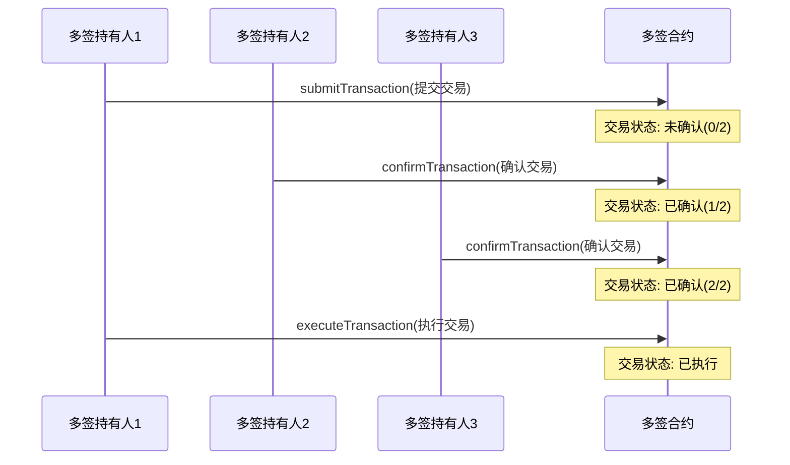

## 前言

在区块链系统中，私钥代表资产的最终控制权。传统单签名（EOA）账户存在典型的单点失效风险：一旦私钥被盗、丢失或遭胁迫，整个账户资产即面临永久性损失。

多重签名（Multi-Signature，简称多签）机制通过将交易执行权限分散至多个独立密钥，并要求达到预设阈值（M-of-N）才能生效，从根本上消除了单点风险。即使部分密钥失控，只要未满足阈值，攻击者仍无法单方面转移资产。

典型阈值配置：
- 2-of-3：3 人管钱包，任何 2 人同意就能转账
- 4-of-7：7 人理事会，超过半数即可执行，适合 DAO 金库

应用场景：

- 团队/公司资金：杜绝一人独断、防止内鬼
- DAO 金库：所有大额支出必须集体投票
- 交易所冷钱包：行业标配，99% 的头部交易所都在用多签
- 个人高净值资产：把硬件钱包 + 亲人 + 律师组合成 3-of-5，永不失控

在 EVM 生态中，多签功能通常通过智能合约账户（Smart Contract Account）实现，其中 Gnosis Safe（现更名为 Safe{Wallet}）是最为主流的生产级方案。截至 2025 年，其单一合约体系保护的链上资产总值已超过 400 亿美元，经过多次第三方审计与长期实战验证，成为事实上的行业标准。

接下来，我们用不到 200 行代码，深入剖析一个简洁、透明、可直接用于生产的多签钱包合约实现，完整展示核心机制、状态管理、安全设计与最佳实践。

## 代码拆解

### 1. 事件定义

这是多签钱包操作的关键日志记录：

```solidity
// 记录存款事件，包含发送者地址、存款金额和合约余额
event Deposit(address indexed sender, uint amount, uint balance);
// 记录提交交易事件，包含交易索引、提交者地址、目标地址、转账金额和调用数据
event SubmitTransaction(
    uint indexed txIndex,
    address indexed owner,
    address indexed to,
    uint value,
    bytes data
);
// 记录确认交易事件，包含交易索引和确认者地址
event ConfirmTransaction(uint indexed txIndex, address indexed owner);
// 记录撤销确认事件，包含交易索引和撤销者地址
event RevokeConfirmation(uint indexed txIndex, address indexed owner);
// 记录执行交易事件，包含交易索引、目标地址、转账金额和调用数据
event ExecuteTransaction(
    uint indexed txIndex,
    address indexed to,
    uint value,
    bytes data
);
```

这些事件通过`indexed`关键字优化了日志查询效率，便于前端应用监听和处理合约状态变化。

### 2. 状态变量定义

```solidity
// 多签持有人地址列表
address[] public owners;
// 记录地址是否为多签持有人
mapping(address => bool) public isOwner;
// 执行交易所需的最小确认数
uint public numConfirmationsRequired;

// 交易结构体，记录交易的详细信息
struct Transaction {
    address to;      // 目标地址
    uint value;      // 转账金额
    bytes data;      // 调用数据
    bool executed;   // 是否已执行
    uint numConfirmations;  // 已获得的确认数
}

// 记录交易的确认状态，mapping: 交易索引 => 持有人地址 => 是否确认
mapping(uint => mapping(address => bool)) public isConfirmed;

// 所有交易列表
Transaction[] public transactions;
```

这里定义了合约的核心数据结构：

- `owners`数组存储多签持有人地址
- `isOwner`映射快速验证地址是否为多签持有人
- `numConfirmationsRequired`定义执行交易所需的最小确认数
- `Transaction`结构体记录每笔交易的详细信息
- `isConfirmed`双重映射记录每笔交易的确认状态
- `transactions`数组存储所有交易记录

### 3. 访问控制修饰符

```solidity
// 限制只有多签持有人可以调用
modifier onlyOwner() {
    require(isOwner[msg.sender], "not owner");
    _;
}

// 验证交易是否存在
modifier txExists(uint _txIndex) {
    require(_txIndex < transactions.length, "tx does not exist");
    _;
}

// 验证交易是否未执行
modifier notExecuted(uint _txIndex) {
    require(!transactions[_txIndex].executed, "tx already executed");
    _;
}

// 验证交易是否未被当前调用者确认
modifier notConfirmed(uint _txIndex) {
    require(!isConfirmed[_txIndex][msg.sender], "tx already confirmed");
    _;
}
```

这些修饰符提供了关键的安全检查：

- `onlyOwner`确保只有多签持有人可以执行敏感操作
- `txExists`防止访问不存在的交易索引
- `notExecuted`防止重复执行已执行的交易
- `notConfirmed`防止重复确认

### 4. 构造函数

```solidity
// @notice 构造函数，初始化多签持有人列表和所需确认数
// @param _owners 多签持有人地址列表
// @param _numConfirmationsRequired 所需确认数
constructor(address[] memory _owners, uint _numConfirmationsRequired) {
    require(_owners.length > 0, "owners required");
    require(
        _numConfirmationsRequired > 0 &&
            _numConfirmationsRequired <= _owners.length,
        "invalid number of required confirmations"
    );

    // 初始化多签持有人
    for (uint i = 0; i < _owners.length; i++) {
        address owner = _owners[i];

        require(owner != address(0), "invalid owner");
        require(!isOwner[owner], "owner not unique");

        isOwner[owner] = true;
        owners.push(owner);
    }

    numConfirmationsRequired = _numConfirmationsRequired;
}
```

构造函数执行了必要的初始化和验证：

- 验证多签持有人数组非空
- 验证确认数在合理范围内（大于0且不超过持有人数量）
- 遍历验证并添加每个持有人
- 验证持有人地址有效性
- 设置确认数阈值



### 5. 存款功能

```solidity
// @notice 接收ETH的回调函数
receive() external payable {
    emit Deposit(msg.sender, msg.value, address(this).balance);
}
```

`receive`函数允许合约接收ETH转账，同时触发存款事件记录相关信息。

### 6. 交易提交功能

```solidity
// @notice 提交新的交易提案
// @param _to 目标地址
// @param _value 转账金额
// @param _data 调用数据
function submitTransaction(
    address _to,
    uint _value,
    bytes memory _data
) public onlyOwner {
    uint txIndex = transactions.length;

    transactions.push(
        Transaction({
            to: _to,
            value: _value,
            data: _data,
            executed: false,
            numConfirmations: 0
        })
    );

    emit SubmitTransaction(txIndex, msg.sender, _to, _value, _data);
}
```

提交交易功能允许多签持有人发起新的交易提案，创建新的交易记录并触发事件。这个函数很简单，就是把一个新的交易添加到数组中，初始状态是未确认、未执行。

### 7. 交易确认功能

```solidity
// @notice 确认交易
// @param _txIndex 交易索引
function confirmTransaction(uint _txIndex)
    public
    onlyOwner
    txExists(_txIndex)
    notExecuted(_txIndex)
    notConfirmed(_txIndex)
{
    Transaction storage transaction = transactions[_txIndex];
    transaction.numConfirmations += 1;
    isConfirmed[_txIndex][msg.sender] = true;

    emit ConfirmTransaction(_txIndex, msg.sender);
}
```

确认交易功能执行了多项验证，确保操作的安全性，并更新交易确认状态。这个函数比较关键，它会增加交易的确认数，并更新当前用户对该交易的确认状态。

### 8. 交易执行功能

```solidity
// @notice 执行已获得足够确认数的交易
// @param _txIndex 交易索引
function executeTransaction(uint _txIndex)
    public
    txExists(_txIndex)
    notExecuted(_txIndex)
{
    Transaction storage transaction = transactions[_txIndex];

    require(
        transaction.numConfirmations >= numConfirmationsRequired,
        "cannot execute tx"
    );

    transaction.executed = true;

    (bool success, ) = transaction.to.call{value: transaction.value}(
        transaction.data
    );

    require(success, "tx failed");

    emit ExecuteTransaction(
        _txIndex,
        transaction.to,
        transaction.value,
        transaction.data
    );
}
```

执行交易功能检查确认数是否达到阈值，然后通过低级`call`执行交易，并确保执行成功。这里使用了低级调用`call`，可以处理各种类型的交易（转账或调用合约）。

### 9. 确认撤销功能

```solidity
// @notice 撤销对交易的确认
// @param _txIndex 交易索引
function revokeConfirmation(uint _txIndex)
    public
    onlyOwner
    txExists(_txIndex)
    notExecuted(_txIndex)
{
    require(isConfirmed[_txIndex][msg.sender], "tx not confirmed");

    Transaction storage transaction = transactions[_txIndex];
    transaction.numConfirmations -= 1;
    isConfirmed[_txIndex][msg.sender] = false;

    emit RevokeConfirmation(_txIndex, msg.sender);
}
```

撤销确认功能允许持有人撤销他们之前的确认，更新交易状态。万一用户误确认了一笔交易，可以撤销。

### 10. 查询辅助函数

```solidity
function getOwners() public view returns (address[] memory) {
    return owners;
}

function getTransactionCount() public view returns (uint) {
    return transactions.length;
}

function getTransaction(uint _txIndex)
    public
    view
    returns (
        address to,
        uint value,
        bytes memory data,
        bool executed,
        uint numConfirmations
    )
{
    Transaction storage transaction = transactions[_txIndex];

    return (
        transaction.to,
        transaction.value,
        transaction.data,
        transaction.executed,
        transaction.numConfirmations
    );
}
```

这些辅助函数提供了对外查询合约状态的接口，便于前端应用展示多签钱包的当前状态。

### 交易流程图



## 合约安全

在实际开发中，需要特别关注几个安全点：

1. **访问控制**：通过`onlyOwner`修饰符确保只有多签持有人可以执行操作，避免外部攻击者调用敏感函数。
2. **参数验证**：在构造函数中验证输入参数的合理性（如持有人数量、确认阈值），防止无效配置导致合约锁定或漏洞。
3. **状态检查**：在执行操作前验证交易状态（存在性、执行状态、确认状态），防止重复操作或无效调用。
4. **重入保护**：在`executeTransaction`中，先更新`executed`状态再进行外部`call`，避免重入攻击（reentrancy），符合 Checks-Effects-Interactions 模式。
5. **事件记录**：所有关键操作（如提交、确认、执行）都触发事件，便于链上追踪和前端监听。
6. **Gas 效率**：使用`storage`引用避免不必要拷贝；`owners`数组只在初始化时填充，后续用`mapping`快速查询。

## Gas优化

1. **使用`indexed`参数**：在事件中使用`indexed`参数优化查询效率，降低前端监听成本（例如通过 The Graph 或 Etherscan 过滤）。
2. **存储优化**：使用`mapping`和`storage`关键字优化存储访问，减少Gas消耗；避免大数组操作。
3. **循环优化**：在构造函数中使用简单的for循环初始化数据，避免复杂计算；实际部署时，持有人数量控制在5-10以内以防Gas超限。
4. **批量处理**：可扩展支持批量确认（e.g., `confirmTransactions(uint[] calldata txIndices)`），节省多次交易Gas。
5. **低级调用**：`call`比`transfer`更灵活，支持合约交互，但需检查返回值防失败。

## 潜在风险

1. **重入攻击**：虽然已更新状态先于调用，但若外部合约回调恶意，需额外用 ReentrancyGuard（如 OpenZeppelin）。
2. **Gas限制**：大量持有人的确认操作可能消耗过多Gas，特别是在交易执行时；建议阈值不超过5。
3. **密钥管理**：如果多签持有人无法联系，可能影响紧急交易的执行；可集成时间锁模块允许超时自动执行。
4. **前端依赖**：事件监听需可靠后端（如 The Graph），否则用户可能错过状态更新。
5. **升级性**：合约不可升级，部署前需审计；推荐用 Gnosis Safe 的模块化设计替代自定义实现。
6. **链上兼容**：EVM链Gas费波动大，测试网（如 Sepolia）模拟高Gas场景。

## 完整代码

```solidity
// SPDX-License-Identifier: MIT
pragma solidity ^0.8.20;

// @title 多签钱包合约
// @notice 这是一个支持多人签名的钱包合约，可以用于团队资金管理
contract ContractWallet {
    // 记录存款事件，包含发送者地址、存款金额和合约余额
    event Deposit(address indexed sender, uint amount, uint balance);
    // 记录提交交易事件，包含交易索引、提交者地址、目标地址、转账金额和调用数据
    event SubmitTransaction(
        uint indexed txIndex,
        address indexed owner,
        address indexed to,
        uint value,
        bytes data
    );
    // 记录确认交易事件，包含交易索引和确认者地址
    event ConfirmTransaction(uint indexed txIndex, address indexed owner);
    // 记录撤销确认事件，包含交易索引和撤销者地址
    event RevokeConfirmation(uint indexed txIndex, address indexed owner);
    // 记录执行交易事件，包含交易索引、目标地址、转账金额和调用数据
    event ExecuteTransaction(
        uint indexed txIndex,
        address indexed to,
        uint value,
        bytes data
    );

    // 多签持有人地址列表
    address[] public owners;
    // 记录地址是否为多签持有人
    mapping(address => bool) public isOwner;
    // 执行交易所需的最小确认数
    uint public numConfirmationsRequired;

    // 交易结构体，记录交易的详细信息
    struct Transaction {
        address to;      // 目标地址
        uint value;      // 转账金额
        bytes data;      // 调用数据
        bool executed;   // 是否已执行
        uint numConfirmations;  // 已获得的确认数
    }

    // 记录交易的确认状态，mapping: 交易索引 => 持有人地址 => 是否确认
    mapping(uint => mapping(address => bool)) public isConfirmed;

    // 所有交易列表
    Transaction[] public transactions;

    // 限制只有多签持有人可以调用
    modifier onlyOwner() {
        require(isOwner[msg.sender], "not owner");
        _;
    }

    // 验证交易是否存在
    modifier txExists(uint _txIndex) {
        require(_txIndex < transactions.length, "tx does not exist");
        _;
    }

    // 验证交易是否未执行
    modifier notExecuted(uint _txIndex) {
        require(!transactions[_txIndex].executed, "tx already executed");
        _;
    }

    // 验证交易是否未被当前调用者确认
    modifier notConfirmed(uint _txIndex) {
        require(!isConfirmed[_txIndex][msg.sender], "tx already confirmed");
        _;
    }

    // @notice 构造函数，初始化多签持有人列表和所需确认数
    // @param _owners 多签持有人地址列表
    // @param _numConfirmationsRequired 所需确认数
    constructor(address[] memory _owners, uint _numConfirmationsRequired) {
        require(_owners.length > 0, "owners required");
        require(
            _numConfirmationsRequired > 0 &&
                _numConfirmationsRequired <= _owners.length,
            "invalid number of required confirmations"
        );

        // 初始化多签持有人
        for (uint i = 0; i < _owners.length; i++) {
            address owner = _owners[i];

            require(owner != address(0), "invalid owner");
            require(!isOwner[owner], "owner not unique");

            isOwner[owner] = true;
            owners.push(owner);
        }

        numConfirmationsRequired = _numConfirmationsRequired;
    }

    // @notice 接收ETH的回调函数
    receive() external payable {
        emit Deposit(msg.sender, msg.value, address(this).balance);
    }

    // @notice 提交新的交易提案
    // @param _to 目标地址
    // @param _value 转账金额
    // @param _data 调用数据
    function submitTransaction(
        address _to,
        uint _value,
        bytes memory _data
    ) public onlyOwner {
        uint txIndex = transactions.length;

        transactions.push(
            Transaction({
                to: _to,
                value: _value,
                data: _data,
                executed: false,
                numConfirmations: 0
            })
        );

        emit SubmitTransaction(txIndex, msg.sender, _to, _value, _data);
    }

    // @notice 确认交易
    // @param _txIndex 交易索引
    function confirmTransaction(uint _txIndex)
        public
        onlyOwner
        txExists(_txIndex)
        notExecuted(_txIndex)
        notConfirmed(_txIndex)
    {
        Transaction storage transaction = transactions[_txIndex];
        transaction.numConfirmations += 1;
        isConfirmed[_txIndex][msg.sender] = true;

        emit ConfirmTransaction(_txIndex, msg.sender);
    }

    // @notice 执行已获得足够确认数的交易
    // @param _txIndex 交易索引
    function executeTransaction(uint _txIndex)
        public
        txExists(_txIndex)
        notExecuted(_txIndex)
    {
        Transaction storage transaction = transactions[_txIndex];

        require(
            transaction.numConfirmations >= numConfirmationsRequired,
            "cannot execute tx"
        );

        transaction.executed = true;

        (bool success, ) = transaction.to.call{value: transaction.value}(
            transaction.data
        );
        
        require(success, "tx failed");

        emit ExecuteTransaction(
            _txIndex,
            transaction.to,
            transaction.value,
            transaction.data
        );
    }

    // @notice 撤销对交易的确认
    // @param _txIndex 交易索引
    function revokeConfirmation(uint _txIndex)
        public
        onlyOwner
        txExists(_txIndex)
        notExecuted(_txIndex)
    {
        require(isConfirmed[_txIndex][msg.sender], "tx not confirmed");

        Transaction storage transaction = transactions[_txIndex];
        transaction.numConfirmations -= 1;
        isConfirmed[_txIndex][msg.sender] = false;

        emit RevokeConfirmation(_txIndex, msg.sender);
    }

    // @notice 获取所有多签持有人地址
    function getOwners() public view returns (address[] memory) {
        return owners;
    }

    // @notice 获取交易总数
    function getTransactionCount() public view returns (uint) {
        return transactions.length;
    }

    // @notice 获取交易详情
    // @param _txIndex 交易索引
    // @return to 目标地址
    // @return value 转账金额
    // @return data 调用数据
    // @return executed 是否已执行
    // @return numConfirmations 已获得的确认数
    function getTransaction(uint _txIndex)
        public
        view
        returns (
            address to,
            uint value,
            bytes memory data,
            bool executed,
            uint numConfirmations
        )
    {
        Transaction storage transaction = transactions[_txIndex];

        return (
            transaction.to,
            transaction.value,
            transaction.data,
            transaction.executed,
            transaction.numConfirmations
        );
    }
}
```

## 总结

本文通过不到 200 行核心代码，完整呈现了一个经典多签钱包实现。该合约作为教学与二次开发的理想起点，已包含多签机制的全部核心要素：
- 灵活的 M-of-N 阈值配置
- 防止重复确认/执行的安全修饰符
- 完整的交易生命周期管理（提交 → 确认 → 执行 → 撤销）
- 完善的事件系统，便于链下索引与前端集成

通过这种设计，我们可以实现多方共同管理资产，有效提升资金安全性，防止单点故障风险。在实际应用中，建议根据具体需求进行适当的定制和扩展。