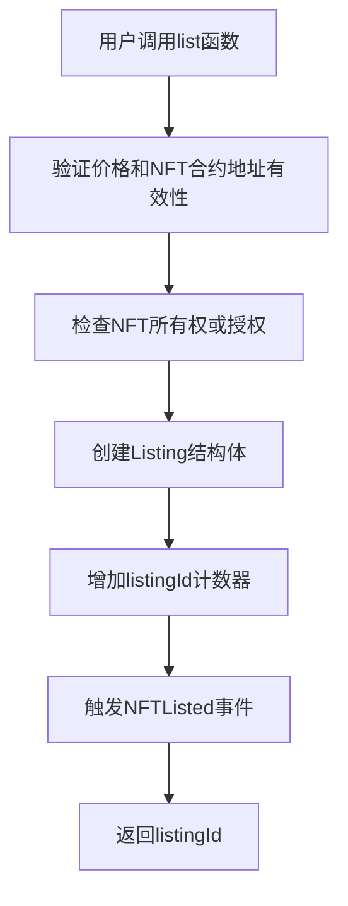
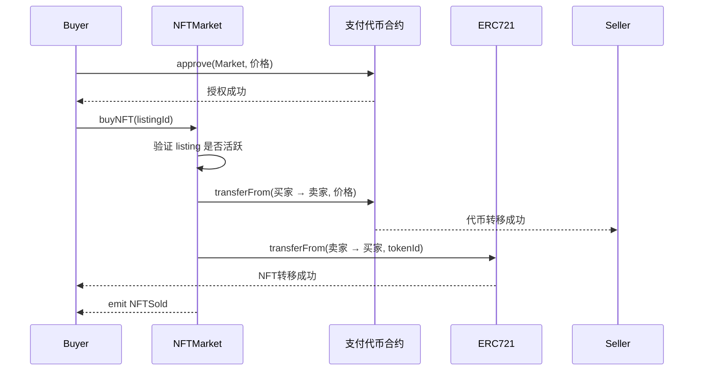
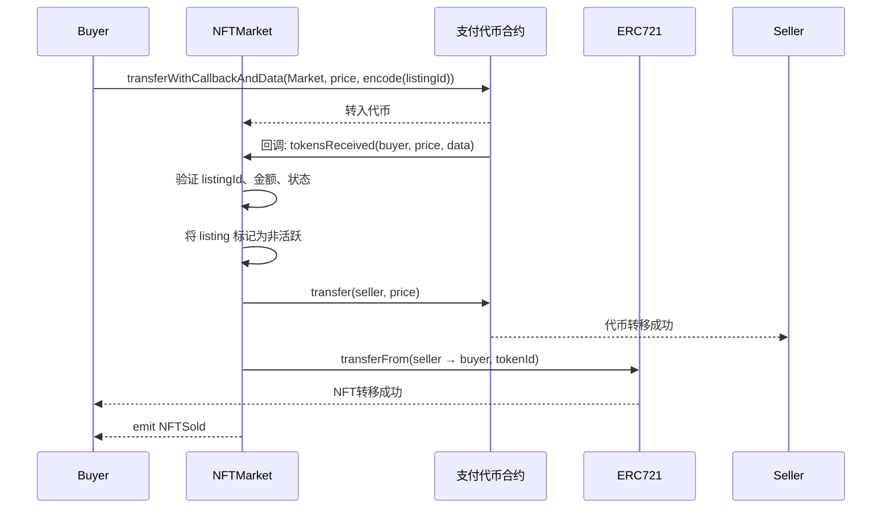

## 概述与背景

在去中心化交易场景中，NFT 交易需要同时完成支付代币和 NFT 的转移。传统的实现方式需要买家分两次交易操作：先 `approve` 代币给市场合约，再调用 `buy` 函数。这种方式存在用户体验差、操作复杂、Gas 消耗高等问题。

随着 NFT 市场的快速发展，用户对交易体验的要求日益提高。在高频交易场景下，传统的 approve + buy 模式不仅增加了用户的操作步骤，还提高了交易失败的风险。本文将深入剖析基于回调机制的 NFT 市场合约，展示如何通过扩展 ERC20 的回调机制（`transferWithCallback` + `tokensReceived`），在不依赖提前 `approve` 的前提下，实现支付代币与 NFT 转移的单交易原子完成。

当前主流的解决方案包括 ERC-1363（Transfer And Call）和 ERC-677（transferFrom And Call），这些标准已被多个主流 DeFi 协议采用。本方案的技术实现与这些标准完全兼容，代表了 NFT 市场技术架构的重要演进方向。

## 核心架构设计

### 架构概览

NFTMarket 合约采用了典型的多接口集成架构：

- **IERC20**: 用于处理支付代币的基本操作
- **ITokenReceiver**: 实现接收回调功能，核心原子化交易机制的关键
- **IERC721**: 用于处理 NFT 的转移与所有权验证
- **IExtendedERC20**: 扩展接口，提供带回调的转账功能

### 关键数据结构

```solidity
struct Listing {
    address seller;      // 卖家地址
    address nftContract; // NFT合约地址
    uint256 tokenId;     // NFT的tokenId
    uint256 price;       // 价格（以Token为单位）
    bool isActive;       // 是否处于活跃状态
}
```

Listing 结构体是市场合约的核心数据结构，包含了 NFT 上架的所有必要信息。

## 业务流程详解

### 1. NFT 上架流程

```solidity
function list(address _nftContract, uint256 _tokenId, uint256 _price) external returns (uint256) {
    require(_price > 0, "NFTMarket: price must be greater than zero");  // 检查价格是否大于0
    require(_nftContract != address(0), "NFTMarket: NFT contract address cannot be zero");  // 检查NFT合约地址是否有效

    // 获取NFT合约实例并查询NFT的当前所有者
    IERC721 nftContract = IERC721(_nftContract);
    address owner = nftContract.ownerOf(_tokenId);

    // 验证调用者是否为NFT所有者或已获得授权
    // 支持三种授权方式：1)直接所有者 2)批量授权(isApprovedForAll) 3)单个NFT授权(getApproved)
    require(
        owner == msg.sender ||
        nftContract.isApprovedForAll(owner, msg.sender) ||
        nftContract.getApproved(_tokenId) == msg.sender,
        "NFTMarket: caller is not owner nor approved"
    );

    // 创建新的上架信息并分配唯一的listingId
    uint256 listingId = nextListingId;
    listings[listingId] = Listing({
        seller: owner,          // 卖家地址（即NFT所有者）
        nftContract: _nftContract,  // NFT合约地址
        tokenId: _tokenId,      // NFT的唯一标识符
        price: _price,          // 以支付代币计价的售价
        isActive: true          // 设置为活跃状态，允许购买
    });

    nextListingId++;  // 递增下一个可用的listingId
    // 触发NFT上架事件，便于前端和第三方服务跟踪
    emit NFTListed(listingId, owner, _nftContract, _tokenId, _price);

    return listingId;  // 返回新创建的listingId
}
```

**上架流程图：**


上架流程中，合约会严格验证：
- 价格必须大于零
- NFT 合约地址有效
- 调用者为 NFT 所有者或获得授权（支持 `isApprovedForAll` 和 `getApproved` 两种授权方式）

### 2. 传统购买路径（保留兼容性）

```solidity
function buyNFT(uint256 _listingId) external {
    // 获取指定listingId的上架信息，使用storage关键字避免复制到内存
    Listing storage listing = listings[_listingId];
    require(listing.isActive, "NFTMarket: listing is not active");  // 验证上架是否仍处于活跃状态

    // 检查买家是否有足够的代币余额用于支付
    require(paymentToken.balanceOf(msg.sender) >= listing.price, "NFTMarket: insufficient token balance");

    // 将上架状态设置为非活跃，防止重复购买（Checks-Effects-Interactions模式）
    listing.isActive = false;

    // 从买家账户向卖家转移相应数量的支付代币
    bool success = paymentToken.transferFrom(msg.sender, listing.seller, listing.price);
    require(success, "NFTMarket: token transfer failed");  // 验证代币转移是否成功

    // 将NFT从卖家转移给买家
    IERC721(listing.nftContract).transferFrom(listing.seller, msg.sender, listing.tokenId);

    // 触发NFT售出事件，记录交易详情
    emit NFTSold(_listingId, msg.sender, listing.seller, listing.nftContract, listing.tokenId, listing.price);
}
```

**传统购买时序图：**


此版本保留了传统的 `approve` + `buy` 交易模式，以确保与现有系统的兼容性。

**传统购买路径痛点：**

1. **用户体验差**：需要两个独立的交易步骤（先`approve`后`buy`），增加操作复杂性
2. **Gas费用高**：用户需要支付两次交易的Gas费用，成本较高
3. **交易耗时**：需要等待第一个交易确认后才能执行第二个交易，延长了整个购买流程
4. **安全风险**：`approve`操作存在授权风险，如果市场合约被攻击或存在漏洞，可能导致用户资产损失
5. **交易失败风险**：两个独立的交易增加了失败的可能性，可能出现只完成`approve`但购买失败的情况

### 3. 单交易原子化购买（核心机制）

#### 3.1 购买入口函数

``` typescript
import { useWalletClient, usePublicClient } from 'wagmi';
import { encodeAbiParameters, parseEther } from 'viem';

function BuyButton({ listingId, price }: { listingId: bigint; price: bigint }) {
  // 获取钱包客户端（用于签名和发送交易）
  const { data: walletClient } = useWalletClient();
  
  // 获取公共客户端（用于读取链上数据和等待交易确认）
  const publicClient = usePublicClient();

  const handleBuy = async () => {
    // 如果没有连接钱包，直接返回
    if (!walletClient) {
      alert('请先连接钱包');
      return;
    }

    // 将 listingId 编码为 bytes 数据（对应 Solidity 中的 abi.encode(uint256)）
    // 这是为了在代币转账回调中让市场合约知道要购买哪个 NFT 上架项
    const data = encodeAbiParameters(
      [{ type: 'uint256' }],
      [listingId]
    );

    try {
      // 调用支付代币合约的 transferWithCallbackAndData 函数
      // 参数：
      //   - nftMarketAddress：收款地址（市场合约地址）
      //   - price：支付金额（已转为 bigint，通常由后端或合约查询得到）
      //   - data：附加数据，包含 listingId
      // 该调用会：
      // 1. 从用户钱包直接转账指定金额到市场合约
      // 2. 自动触发市场合约的 tokensReceived 回调完成 NFT 转移
      const hash = await walletClient.writeContract({
        address: paymentTokenAddress,   // 支付代币合约地址
        abi: paymentTokenAbi,           // 代币合约的 ABI（需包含 transferWithCallbackAndData）
        functionName: 'transferWithCallbackAndData',
        args: [nftMarketAddress, price, data],
      });

      console.log('交易已提交，hash:', hash);

      // 等待交易上链确认
      await publicClient.waitForTransactionReceipt({ hash });

      // 交易成功提示
      alert('购买成功！NFT 已转入你的钱包');
    } catch (error: any) {
      console.error('购买失败:', error);
      alert('购买失败：' + (error?.shortMessage || error?.message || '未知错误'));
    }
  };

  return (
    <button onClick={handleBuy}>
      一键购买
    </button>
  );
}

export default BuyButton;
```

#### 3.2 回调处理函数（核心业务逻辑）

```solidity
function tokensReceived(address from, uint256 amount, bytes calldata data) external override returns (bool) {
    // 安全验证：确保调用者确实是支付代币合约，防止恶意合约调用此回调函数
    require(msg.sender == address(paymentToken), "NFTMarket: caller is not the payment token contract");

    // 验证传入数据的长度是否为32字节（一个uint256的大小），防止数据损坏或恶意构造
    require(data.length == 32, "NFTMarket: invalid data length");
    // 解码传入的数据，提取出原始的listingId
    uint256 listingId = abi.decode(data, (uint256));

    // 获取对应的上架信息
    Listing storage listing = listings[listingId];
    require(listing.isActive, "NFTMarket: listing is not active");  // 验证上架是否仍处于活跃状态

    // 验证收到的代币数量是否与NFT价格匹配，确保支付金额正确
    require(amount == listing.price, "NFTMarket: incorrect payment amount");

    // 将上架状态设置为非活跃，防止重复购买（关键的安全措施）
    listing.isActive = false;

    // 将收到的代币转移给卖家（使用普通transfer，因为资金已在合约中）
    bool success = paymentToken.transfer(listing.seller, amount);
    require(success, "NFTMarket: token transfer to seller failed");  // 验证代币转移是否成功

    // 将NFT从卖家转移给买家（from参数是实际的买家地址）
    IERC721(listing.nftContract).transferFrom(listing.seller, from, listing.tokenId);

    // 触发NFT售出事件，记录完整的交易信息
    emit NFTSold(listingId, from, listing.seller, listing.nftContract, listing.tokenId, amount);

    return true;  // 返回true表示回调处理成功
}
```

**单交易购买时序图：**


## 技术实现深度分析

### 1. 回调机制原理

回调机制基于 "支付即执行" 的设计模式。当买家调用 `transferWithCallbackAndData` 时，支付代币合约会先将代币转入市场合约，然后立即调用市场合约的 `tokensReceived` 函数。这使得支付和业务逻辑执行在同一个交易中原子化完成。

### 2. 安全性保障

| 风险类型 | 防御措施位置 | 详细说明 |
|---------|-------------|----------|
| 重入攻击 | `isActive = false` 在任何外部调用之前 | 遵循 Checks-Effects-Interactions 模式，状态变更优先于外部调用 |
| 伪造代币触发回调 | `msg.sender == address(paymentToken)` | 严格验证调用者必须是支付代币合约 |
| 支付金额不符 | `amount == listing.price` | 确保收到的代币数量与预设价格一致 |
| calldata 篡改 | `data.length == 32` + `abi.decode` | 防止恶意构造的数据注入 |
| 代币转账失败卡资金 | 仅在 `tokensReceived` 返回 true 时确认 | 依赖代币合约的标准行为机制 |

### 3. 数据验证机制

回调处理函数中对数据进行了多层验证：

1. **来源验证**: 确保回调来自支付代币合约
2. **数据长度验证**: 防止恶意数据注入
3. **业务逻辑验证**: 验证上架状态、支付金额等
4. **状态更新**: 将上架标记为非活跃，防止重复购买

## 实际业务场景应用

### 1. 加密艺术交易

在加密艺术市场中，艺术家可以将其作品上架，收藏家可以通过单个交易完成购买，无需预先授权代币。这大大提升了用户体验，降低了操作复杂性。

### 2. 游戏道具市场

游戏道具通常具有时效性，快速交易至关重要。单交易购买机制可以确保道具转移的即时性，提升游戏体验。

### 3. 域名注册服务

ENS 等域名服务可以使用此机制实现域名购买，用户在一次交易中完成支付和域名转移。

### 4. 高价 NFT 交易

对于高价 NFT，传统模式需要先 `approve` 大额代币，存在安全风险。回调机制避免了这一问题。

## 扩展功能设计

### 1. 交易手续费机制

```solidity
contract NFTMarketWithFees is ITokenReceiver {
    uint256 public feePercentage; // 交易手续费百分比，以basis points为单位（1/10000）
    address public feeRecipient;  // 手续费接收地址，通常是平台所有者或治理合约

    function tokensReceived(address from, uint256 amount, bytes calldata data) external override returns (bool) {
        // ... 验证逻辑 ...

        // 计算手续费：使用basis points（万分比）进行计算，例如feePercentage为50表示0.5%的手续费
        uint256 fee = (amount * feePercentage) / 10000; // 以 basis points 计算
        uint256 netAmount = amount - fee;  // 计算扣除手续费后的净额

        // 将计算出的手续费转移给平台
        paymentToken.transfer(feeRecipient, fee);
        // 将净额（扣除手续费后）转移给卖家
        paymentToken.transfer(listing.seller, netAmount);

        // ... 其他逻辑 ...
    }
}
```

### 2. 价格保护机制

```solidity
// 添加滑点保护，防止在交易执行过程中价格发生变动
function buyNFTWithCallback(uint256 _listingId, uint256 _maxAmount) external {
    // 获取指定listingId的上架信息
    Listing storage listing = listings[_listingId];
    // 验证当前价格不超过用户设定的最大支付金额，防止价格在交易期间发生不利变动
    require(listing.price <= _maxAmount, "Price exceeds maximum allowed");
    // ... 其他逻辑
}
```

### 3. 批量交易支持

```solidity
// 支持批量购买多个NFT，通过循环调用单个购买函数实现
function buyMultipleWithCallback(uint256[] memory listingIds) external {
    // 遍历要购买的NFT列表，对每个listingId执行购买操作
    for (uint i = 0; i < listingIds.length; i++) {
        // 调用单个NFT购买函数，利用现有的原子化交易逻辑
        buyNFTWithCallback(listingIds[i]);
    }
}
```

## 性能优化策略

### 1. Gas 优化

- **状态变量缓存**: 在函数开始时缓存状态变量，减少存储读取次数
- **require 字符串优化**: 使用短字符串或自定义错误类型
- **内存分配优化**: 合理使用 `memory` 和 `storage` 关键字

### 2. 批处理优化

对于高频交易场景，可以通过批处理技术进一步优化 Gas 成本。

## 部署与集成注意事项

### 1. 依赖合约要求

支付代币合约必须支持 `transferWithCallbackAndData` 函数，这通常需要:
- 实现 ERC-677 或 ERC-1363 标准
- 或自定义扩展 ERC20 实现

### 2. 安全审计要点

- 验证回调函数的访问控制
- 检查重入攻击防护机制
- 确认代币转账失败的处理逻辑

### 3. 监控与日志

合约提供了完整的事件系统：
- `NFTListed`: 记录上架信息
- `NFTSold`: 记录购买交易
- `NFTListingCancelled`: 记录取消上架

## 生态兼容性分析

### 1. 与 OpenZeppelin 的集成

合约可以轻松与 OpenZeppelin 库集成：

```solidity
// 导入重入攻击防护合约和安全的ERC20操作库
import "@openzeppelin/contracts/security/ReentrancyGuard.sol";
import "@openzeppelin/contracts/token/ERC20/utils/SafeERC20.sol";

// 继承ITokenReceiver接口和ReentrancyGuard以提供重入防护
contract NFTMarket is ITokenReceiver, ReentrancyGuard {
    // 使用SafeERC20库替代原始的transfer/transferFrom调用，提供额外的安全检查
    using SafeERC20 for IERC20;

    // 使用nonReentrant修饰符防止重入攻击，在函数执行期间锁定合约状态
    function tokensReceived(...) external override nonReentrant returns (bool) {
        // ... 业务逻辑 ...
    }
}
```

### 2. 跨链支持

通过跨链桥接技术，该合约设计可以扩展支持多链部署，实现跨链 NFT 交易。

## 未来发展方向

### 1. 智能定价机制

集成 Chainlink 等预言机服务，实现动态定价和价格发现机制。

### 2. 去中心化治理

通过治理代币实现市场治理，让社区参与手续费调整、功能升级等决策。

### 3. 聚合交易协议

与 0x、1inch 等聚合协议集成，实现更优的交易执行价格。

## 完整合约代码

```solidity
pragma solidity ^0.8.0;

// 导入IERC20接口，用于与ERC20代币交互
interface IERC20 {
    function balanceOf(address account) external view returns (uint256);
    function transfer(address recipient, uint256 amount) external returns (bool);
    function transferFrom(address sender, address recipient, uint256 amount) external returns (bool);
    function approve(address spender, uint256 amount) external returns (bool);
    function allowance(address owner, address spender) external view returns (uint256);
}

// 定义接收代币回调的接口
interface ITokenReceiver {
    function tokensReceived(address from, uint256 amount, bytes calldata data) external returns (bool);
}

// 简单的ERC721接口
interface IERC721 {
    function ownerOf(uint256 tokenId) external view returns (address);
    function transferFrom(address from, address to, uint256 tokenId) external;
    function safeTransferFrom(address from, address to, uint256 tokenId) external;
    function isApprovedForAll(address owner, address operator) external view returns (bool);
    function getApproved(uint256 tokenId) external view returns (address);
}

// 扩展的ERC20接口，添加带有回调功能的转账函数
interface IExtendedERC20 is IERC20 {
    function transferWithCallback(address _to, uint256 _value) external returns (bool);
    function transferWithCallbackAndData(address _to, uint256 _value, bytes calldata _data) external returns (bool);
}

// NFT市场合约
contract NFTMarket is ITokenReceiver {
    // 扩展的ERC20代币合约地址
    IExtendedERC20 public paymentToken;

    // NFT上架信息结构体
    struct Listing {
        address seller;      // 卖家地址
        address nftContract; // NFT合约地址
        uint256 tokenId;     // NFT的tokenId
        uint256 price;       // 价格（以Token为单位）
        bool isActive;       // 是否处于活跃状态
    }

    // 所有上架的NFT，使用listingId作为唯一标识
    mapping(uint256 => Listing) public listings;
    uint256 public nextListingId;

    // NFT上架和购买事件
    event NFTListed(uint256 indexed listingId, address indexed seller, address indexed nftContract, uint256 tokenId, uint256 price);
    event NFTSold(uint256 indexed listingId, address indexed buyer, address indexed seller, address nftContract, uint256 tokenId, uint256 price);
    event NFTListingCancelled(uint256 indexed listingId);

    // 构造函数，在合约部署时设置支付代币地址
    constructor(address _paymentTokenAddress) {
        // 验证支付代币地址不是零地址，防止合约配置错误
        require(_paymentTokenAddress != address(0), "NFTMarket: payment token address cannot be zero");
        // 将传入的代币地址转换为IExtendedERC20接口实例
        paymentToken = IExtendedERC20(_paymentTokenAddress);
    }

    // 上架NFT - 允许NFT所有者将其NFT放入市场进行销售
    function list(address _nftContract, uint256 _tokenId, uint256 _price) external returns (uint256) {
        // 检查价格是否大于0，防止零价格上架
        require(_price > 0, "NFTMarket: price must be greater than zero");

        // 检查NFT合约地址是否有效，防止上架来自零地址的NFT
        require(_nftContract != address(0), "NFTMarket: NFT contract address cannot be zero");

        // 检查调用者是否为NFT的所有者或已获得授权
        // 支持ERC721的两种授权方式：批量授权(isApprovedForAll)和单个NFT授权(getApproved)
        IERC721 nftContract = IERC721(_nftContract);
        address owner = nftContract.ownerOf(_tokenId);  // 查询NFT的当前所有者
        require(
            owner == msg.sender ||  // 调用者是NFT所有者
            nftContract.isApprovedForAll(owner, msg.sender) ||  // 调用者被批量授权
            nftContract.getApproved(_tokenId) == msg.sender,  // 调用者被授权此特定NFT
            "NFTMarket: caller is not owner nor approved"  // 如果以上条件都不满足，抛出错误
        );

        // 创建新的上架信息
        uint256 listingId = nextListingId;  // 使用当前的nextListingId作为新的listingId
        listings[listingId] = Listing({
            seller: owner,      // 记录卖家地址（即NFT所有者）
            nftContract: _nftContract,  // 记录NFT合约地址
            tokenId: _tokenId,  // 记录NFT的tokenId
            price: _price,      // 记录销售价格
            isActive: true      // 设置为活跃状态，允许购买
        });

        // 增加listingId计数器，为下一个上架分配新的ID
        nextListingId++;

        // 触发NFT上架事件，便于前端和第三方服务跟踪市场活动
        emit NFTListed(listingId, owner, _nftContract, _tokenId, _price);

        return listingId;  // 返回新创建的上架ID
    }

    // 取消上架NFT - 允许卖家取消其上架的NFT
    function cancelListing(uint256 _listingId) external {
        // 从存储中获取指定listingId的上架信息，使用storage避免复制到内存
        Listing storage listing = listings[_listingId];
        // 检查上架信息是否存在且处于活跃状态，防止取消已售出或已取消的上架
        require(listing.isActive, "NFTMarket: listing is not active");

        // 检查调用者是否为原始卖家，确保只有卖家可以取消上架
        require(listing.seller == msg.sender, "NFTMarket: caller is not the seller");

        // 将上架信息标记为非活跃状态，阻止后续购买
        listing.isActive = false;

        // 触发NFT上架取消事件，便于前端和第三方服务跟踪市场活动
        emit NFTListingCancelled(_listingId);
    }

    // 普通购买NFT功能 - 传统购买方式，需要先approve代币
    function buyNFT(uint256 _listingId) external {
        // 从存储中获取指定listingId的上架信息，使用storage避免复制到内存
        Listing storage listing = listings[_listingId];
        // 验证上架信息是否存在且处于活跃状态，防止购买已售出或已取消的NFT
        require(listing.isActive, "NFTMarket: listing is not active");

        // 检查买家是否有足够的代币余额用于支付，但不会检查是否已授权
        require(paymentToken.balanceOf(msg.sender) >= listing.price, "NFTMarket: insufficient token balance");

        // 将上架状态设置为非活跃，防止重复购买（采用Checks-Effects-Interactions模式）
        listing.isActive = false;

        // 从买家账户向卖家转移相应数量的支付代币（需要买家已提前approve）
        bool success = paymentToken.transferFrom(msg.sender, listing.seller, listing.price);
        require(success, "NFTMarket: token transfer failed");  // 验证代币转移是否成功

        // 将NFT从卖家转移给买家
        IERC721(listing.nftContract).transferFrom(listing.seller, msg.sender, listing.tokenId);

        // 触发NFT售出事件，记录交易详情包括买家、卖家、NFT信息和价格
        emit NFTSold(_listingId, msg.sender, listing.seller, listing.nftContract, listing.tokenId, listing.price);
    }

    // 实现tokensReceived接口，处理通过transferWithCallback接收到的代币
    // 这是单交易原子化购买的核心函数，在代币转移时被自动调用
    function tokensReceived(address from, uint256 amount, bytes calldata data) external override returns (bool) {
        // 安全验证：确保调用者确实是支付代币合约，防止恶意合约调用此回调函数
        require(msg.sender == address(paymentToken), "NFTMarket: caller is not the payment token contract");

        // 验证传入数据的长度是否为32字节（一个uint256的大小），防止数据损坏或恶意构造
        require(data.length == 32, "NFTMarket: invalid data length");
        // 解码传入的数据，提取出原始的listingId
        uint256 listingId = abi.decode(data, (uint256));

        // 获取对应的上架信息，使用storage避免复制到内存
        Listing storage listing = listings[listingId];
        // 验证上架是否仍处于活跃状态，防止已售出或已取消的NFT被重复购买
        require(listing.isActive, "NFTMarket: listing is not active");

        // 验证收到的代币数量是否与NFT价格匹配，确保支付金额正确
        require(amount == listing.price, "NFTMarket: incorrect payment amount");

        // 将上架状态设置为非活跃，防止重复购买（关键的安全措施，采用Checks-Effects-Interactions模式）
        listing.isActive = false;

        // 将收到的代币转移给卖家（使用普通transfer，因为资金已在合约中）
        bool success = paymentToken.transfer(listing.seller, amount);
        require(success, "NFTMarket: token transfer to seller failed");  // 验证代币转移是否成功

        // 将NFT从卖家转移给买家（from参数是实际的买家地址）
        IERC721(listing.nftContract).transferFrom(listing.seller, from, listing.tokenId);

        // 触发NFT售出事件，记录完整的交易信息
        emit NFTSold(listingId, from, listing.seller, listing.nftContract, listing.tokenId, amount);

        return true;  // 返回true表示回调处理成功，允许代币转移完成
    }

    // 使用transferWithCallbackAndData购买NFT的辅助函数
    // 这是单交易原子化购买的主要入口函数
    function buyNFTWithCallback(uint256 _listingId) external {
        // 获取指定listingId的上架信息，使用storage避免复制到内存
        Listing storage listing = listings[_listingId];
        // 验证上架是否仍处于活跃状态，防止购买已售出或已取消的NFT
        require(listing.isActive, "NFTMarket: listing is not active");

        // 检查买家是否有足够的代币余额用于支付
        require(paymentToken.balanceOf(msg.sender) >= listing.price, "NFTMarket: insufficient token balance");

        // 将listingId编码为字节数据，用于在回调中识别此次购买交易
        bytes memory data = abi.encode(_listingId);

        // 调用扩展ERC20合约的transferWithCallbackAndData函数
        // 此操作将执行两个步骤：
        // 1. 将指定数量的代币从买家账户转移到市场合约
        // 2. 自动调用市场合约的tokensReceived回调函数处理后续逻辑
        bool success = paymentToken.transferWithCallbackAndData(address(this), listing.price, data);
        require(success, "NFTMarket: token transfer with callback failed");  // 验证代币转移和回调调用是否成功
    }
}
```

## 总结

NFT 市场合约通过回调机制设计，实现了单交易原子化购买功能。通过 `tokensReceived` 回调函数，合约能够在一次交易中完成代币支付和 NFT 转移，解决了传统 approve + buy 模式的用户体验问题。

从技术角度看，回调机制的设计需要特别关注安全事项：确保回调仅由合法的代币合约触发、验证回调数据的完整性和正确性、在外部调用前更新合约状态以防止重入攻击。这些安全措施是实现可靠单交易原子化交换的基础。

当前的技术挑战包括：如何在保证安全性的同时优化 Gas 消耗、如何与不同标准的代币合约兼容、如何在合约升级时保持向后兼容性。这些挑战推动了智能合约设计模式的持续演进。

随着 DeFi 和 NFT 生态的成熟，原子化交换模式正在成为标准实践。这种设计不仅适用于 NFT 市场，也可以扩展到其他需要跨合约原子操作的场景。对于开发者而言，理解回调机制的实现原理和安全要点，对构建安全高效的区块链应用具有重要意义。