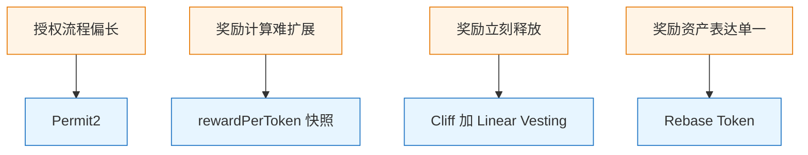

很多人第一次看质押协议，注意力都会落在存款按钮上。

连接钱包、点击质押、资产进池子、前端更新仓位。只看这条链路，事情并不复杂。很多 Demo 也确实只做到这里：用户先授权，合约再收款，流程跑通，页面能显示余额，项目似乎就完成了。

但协议一旦从 Demo 走向真实运行环境，问题很快就会出现。

- 入口上，传统 approve + deposit 需要两次链上交易，用户交互路径较长且 Gas 成本较高
- 计账上，若按用户逐个累加奖励，分发 Gas 消耗会随参与用户数量线性增长，难以扩展
- 释放上，奖励计算完成后若立即全部可领，激励与抛售压力高度同步，易引发持续卖压和价格冲击
- 奖励资产上，若仅使用普通 ERC20，无法原生实现自动通缩、弹性供应或份额式复利等机制，限制经济模型表达能力

所以真正值得分析的，不是"用户能不能把钱存进去"，而是一个质押系统怎样把**入口、计账、释放和奖励资产**这四层设计补齐。

这篇文章结合 `PermitVault` 的实现来看这个问题。重点不是逐行解释源码，而是分析它为什么会同时引入 Permit2、收益快照、Cliff + Linear Vesting、Rebase Token，以及这四层设计分别解决了什么问题。

---

## PermitVault：一个把四层机制跑通的完整实现

在展开分析之前，先简要介绍这个项目本身。

PermitVault 是一个完整的链上质押协议，把几个真实 DeFi 协议中的核心机制拼接成了一个可运行的系统。它不是某个生产合约的精简复刻，而是一套有意识地把 **Permit2、Synthetix 快照算法、Cliff + Linear Vesting、Rebase Token** 四种机制整合进同一条链路的工程实践。


核心特性：

- **Gasless Deposit**：基于 Permit2，对 Permit2 合约做一次 `approve` 后，后续每次存款通过链下签名完成，永久免额外授权交易
- **O(1) 收益计算**：Synthetix Snapshot 算法，分发成本不随用户数量线性增长
- **Cliff + Linear Vesting**：奖励先经历锁定期，再按时间线性释放，激励节奏可控
- **Rebase Token 模型**：奖励代币采用 gons/fragments 机制，余额随时间自动缩放
- **安全机制**：Permit2 nonce bitmap 防重放 + ReentrancyGuard 防重入

技术栈：Solidity 0.8.34 + Foundry + Next.js 16 + wagmi 2，从签名构造到合约交互到前端展示，全流程打通。

---

## 普通质押方案，只解决了第一层

如果目标只是"让用户把钱存进来"，那么 `approve + deposit` 已经足够。很多演示项目的核心逻辑都类似下面这样：

```solidity
function deposit(uint256 amount) external {
    stakeToken.transferFrom(msg.sender, address(this), amount);
    tokenStakes[msg.sender][address(stakeToken)] += amount;
    totalStaked += amount;
}
```

这段逻辑本身没有问题。问题在于，它只解决了"资产进入合约"这一件事，没有处理协议在真实运行中最容易暴露的复杂度来源。

一个完整的质押协议，至少要同时回答四个问题：

- 用户怎么进场，授权流程能不能更短
- 奖励怎么算，分发成本能不能稳定下来
- 奖励什么时候释放，激励节奏要不要被控制
- 奖励资产本身长什么样，能不能承载额外机制

换句话说，`deposit` 只是入口，不是系统设计的全部。

---

## 四个问题，对应四层设计



这四层并不是并排堆在一起的功能点，而是一条顺序很明确的设计链路：先解决用户怎么进入系统，再解决系统怎么计账，然后决定奖励如何释放，最后才处理奖励资产本身的表达方式。

---

## 先看入口：为什么要用 Permit2

传统 ERC20 质押通常需要两笔交易：先调用 `approve` 授权，然后再调用 `deposit` 存入资产。这套流程本身没问题，但用户体验较差——每次质押前都得补一笔授权交易，交互碎片化且增加 Gas 成本。

EIP-2612 通过链下签名实现授权 + 转账的单笔交易优化，但它有个明显局限：只有代币合约本身实现了 `permit` 函数才能使用。如果遇到不支持 permit 的代币（比如很多老版本或非标准 ERC20），这条路径就完全走不通。

Permit2 则提供了一个更通用的解决方案：它将“签名授权转账”抽离成独立的基础设施层。用户只需对 Permit2 合约进行一次链上授权，之后所有支持的代币都可以通过链下签名 + 单笔交易完成转账和存款，彻底避免了反复授权的麻烦。

在 `PermitVault` 里，关键逻辑不是简单调用一个接口，而是先构造签名消息，再交给 Permit2 验证和执行：

```solidity
ISignatureTransfer.PermitTransferFrom memory permitMsg =
    ISignatureTransfer.PermitTransferFrom({
        permitted: ISignatureTransfer.TokenPermissions({
            token: address(stakeToken),
            amount: amount
        }),
        nonce: nonce,
        deadline: deadline
    });

ISignatureTransfer.SignatureTransferDetails memory transferDetails =
    ISignatureTransfer.SignatureTransferDetails({
        to: address(this),
        requestedAmount: amount
    });

permit2.permitTransferFrom(permitMsg, transferDetails, msg.sender, signature);
```

这里有三个细节值得注意。

第一，`to` 被限定为 `address(this)`，也就是 Vault 合约本身。这个签名不是泛化的转账许可，而是只允许资产流入当前合约。

第二，`nonce` 使用的是 Permit2 的 bitmap 消费模型，而不是简单递增 nonce。这样多笔签名可以乱序使用，前端不需要维护严格顺序。

第三，前端构造的 EIP-712 消息还会把 `spender` 绑定为 Vault 地址：

```typescript
domain: { name: "Permit2", chainId, verifyingContract: permit2Address }
message: {
  permitted: { token: stakeToken, amount },
  spender: vaultAddress,
  nonce,
  deadline,
}
```

这意味着签名即使泄露，也不能被其他合约直接复用。

所以，Permit2 在这里解决的并不只是"少一笔交易"，而是把授权入口从"重复 approve"改成了"统一授权入口 + 按次签名消费"。

在整个系统里，这一层负责的是**进场效率**。

> **前端实现**：质押面板通过 viem `signTypedData` 在本地构造 EIP-712 结构体，弹出签名请求后（0 Gas），把 signature + nonce + deadline 一起发送给合约，完成一笔原子操作。


---

## 再看计账：为什么 rewardPerToken 这么常见

用户进入系统之后，真正困难的部分才开始出现。

奖励分发最直观的思路是：谁质押得多、质押得久，谁拿得多。但链上环境不支持每次结算都去遍历所有用户。用户一多，成本就会迅速失控。

Synthetix 体系里广泛使用的 `rewardPerToken`，核心就在于把"每个人该拿多少"转成"每单位质押累计分到了多少奖励"。

对应的全局公式通常是这样：

```solidity
function _rewardPerToken() internal view returns (uint256) {
    if (totalStaked == 0) return rewardPerTokenStored;
    return rewardPerTokenStored
        + (rewardRate * (block.timestamp - lastUpdateTime) * 1e18)
        / totalStaked;
}
```

然后，每个用户只需要记录两类状态：

- 上一次结算时对应的全局快照
- 尚未领取的累计奖励

在 `PermitVault` 里，用户奖励的计算方式如下：

```solidity
function _earned(address user) internal view returns (uint256) {
    uint256 stake = ethStakes[user] + tokenStakes[user][address(stakeToken)];
    return (stake * (_rewardPerToken() - userRewardPerTokenPaid[user])) / 1e18
        + pendingRewards[user];
}
```

它的含义很明确：用户当前应得奖励，等于当前仓位乘上"全局累计值相对上次快照新增的那一段"，再加上此前尚未领取的部分。

更关键的是，协议把更新动作统一收进了 modifier：

```solidity
modifier updateReward(address user) {
    rewardPerTokenStored = _rewardPerToken();
    lastUpdateTime = block.timestamp;
    if (user != address(0)) {
        pendingRewards[user] = _earned(user);
        userRewardPerTokenPaid[user] = rewardPerTokenStored;
    }
    _;
}
```

这样一来，存款、提款、领取奖励都可以复用同一套更新逻辑。每次用户有动作时，先刷新全局快照，再结算该用户的位置，而不是在链上维护一个随用户数增长的分发循环。

这套设计的关键，不在公式本身，而在于它把"全体用户的历史变化"压缩进了一个全局变量里。

在整个系统里，这一层负责的是**持续计账**。

---

## 账算清楚了，不代表奖励要立刻发完

到这里，协议已经解决了两个问题：用户怎么进入系统，奖励怎么计算。

但还有一个单独的问题：奖励是不是应该在计算出来之后立刻全部可领。

如果奖励一产生就全部发放，设计当然更简单，但它往往会把激励和卖压直接绑定。用户领到奖励后立刻卖出，协议的分发节奏就会直接传导到二级市场。

因此，很多协议会在"已经记账"和"当前可领"之间再加一层释放机制。最常见的组合，就是 Cliff 加线性释放。


`PermitVault` 这里还有一个关键选择：它不是每来一笔新奖励就重开一轮 Vesting，而是把时间锚点固定在首次质押时刻。用户后续追加质押，不会把整个释放周期重新刷新。

这让释放规则更稳定，也更容易被用户理解。

对应实现如下：

```solidity
error StillInCliff(uint256 unlocksAt);

function _releasable(address user) internal view returns (uint256) {
    uint256 start = vestingStart[user];
    if (start == 0) return 0;

    uint256 unlocksAt = start + CLIFF;
    if (block.timestamp < unlocksAt) revert StillInCliff(unlocksAt);

    uint256 totalEarned = pendingRewards[user];
    uint256 elapsed = block.timestamp - unlocksAt;

    uint256 vested = elapsed >= VEST_PERIOD
        ? totalEarned
        : (totalEarned * elapsed) / VEST_PERIOD;

    if (vested <= claimed[user]) return 0;
    return vested - claimed[user];
}
```

这里有两个很典型的工程化细节。

第一，`StillInCliff(uint256 unlocksAt)` 不只是告诉前端"当前不能领取"，还把解锁时间直接带出来了。前端可以直接用这个值做倒计时，而不需要额外查询。

第二，真正可领取的数量不是 `vested`，而是 `vested - claimed[user]`。合约记录的是"累计已解锁多少"和"历史已领取多少"，这比只维护一个临时结果更稳定。

在真正领取时，合约会先更新状态，再执行外部 mint：

```solidity
function claimReward() external updateReward(msg.sender) nonReentrant {
    uint256 releasable = _releasable(msg.sender);
    if (releasable == 0) revert NothingToClaim();

    claimed[msg.sender] += releasable;
    rewardToken.mint(msg.sender, releasable);
}
```

账已经算清楚了，但“算出来了”不等于“现在就能领”。这一层要回答的其实是：在已经记账的奖励里，当前到底有多少是真正可动用的？计账和释放，看似一步之遥，其实是两个完全不同的设计考量。

在整个系统里，这一层负责的是**奖励释放节奏**。

> **前端实现**：收益面板通过 `getStakeInfo` 读取累计奖励、已解锁比例、可领取数量，并实时渲染 Vesting 进度条。Cliff 期间按钮处于不可用状态，解锁后才开放领取。


---

## 最后看奖励资产：为什么会用 Rebase Token

前面三层都在处理流程：怎么进入系统、怎么计账、什么时候释放。到了这里，协议开始处理另一个维度：**发出去的奖励资产，本身要不要带机制**。

如果奖励只是一个普通 ERC20，那么它只能表达一个静态余额。很多协议希望奖励资产本身还能承载额外逻辑，例如通缩、自动缩放，或者更接近份额制的表示方式。

Rebase Token 的核心思路，是把真正存储的内容变成内部份额，然后用一个统一比例映射成用户看到的余额。

在 `PermitVault` 对应的 `RebaseToken` 中，这个关系可以概括为：

```solidity
balanceOf(user) = _gonBalances[user] / _gonsPerFragment
```

也就是说：

- `_gonBalances` 存的是内部份额
- `_gonsPerFragment` 是份额到外部余额的换算比例
- 发生 rebase 时，变化的是比例，而不是逐个账户改余额

这类实现通常会先把总份额常量算好，避免精度和除零问题：

```solidity
uint256 private constant TOTAL_GONS =
    MAX_UINT256 - (MAX_UINT256 % INITIAL_FRAGMENTS_SUPPLY);

uint256 private constant INITIAL_GONS_PER_FRAGMENT =
    TOTAL_GONS / INITIAL_FRAGMENTS_SUPPLY;
```

真正执行 rebase 时，逻辑通常比较集中：

```solidity
function _rebase() internal {
    require(_totalSupply > 0, "No supply to rebase");
    uint256 newTotalSupply = (_totalSupply * DEFLATION_RATE) / RATE_DENOMINATOR;
    _totalSupply = newTotalSupply;
    _gonsPerFragment = TOTAL_GONS / _totalSupply;
    lastRebaseTime = block.timestamp;
}
```

这里最重要的一点是：用户的 `_gonBalances` 不动，变化的是 `_gonsPerFragment`。一旦比例变化，所有账户的 `balanceOf` 都会同步缩放。

用户领取奖励时，再按当前比例换成内部份额记账：

```solidity
function mint(address to, uint256 amount) external onlyOwner {
    uint256 gonValue = amount * _gonsPerFragment;
    _gonBalances[to] += gonValue;
    _totalSupply += amount;
}
```

这样做的价值在于，协议可以一次性调整所有账户的表面余额，而不需要逐个更新。

当然，这并不意味着 Rebase Token 一定"比普通 ERC20 更高级"。更准确的说法是，它适合承担奖励层的经济表达，而不一定适合所有资产场景。质押资产通常更适合稳定、直接；奖励资产则更适合承载额外机制。

在整个系统里，这一层负责的是**奖励资产的表达方式**。

> **前端实现**：仓位面板展示 ETH 与代币质押量、累计奖励以及 RDT（Rebase Token）余额，支持独立提取 ETH 或代币仓位。


---

## 为什么这四层会一起出现

单看 Permit2、快照计账、Vesting、Rebase Token，这些都不算新机制。真正值得关注的是，它们放在同一个协议里之后，正好连成了一条完整链路。


到这里，问题本质已经变了：我们不再问“这个机制好不好”，而是问“一个能长期跑通的协议，到底还缺哪一层设计”。

假如只把入口做得丝滑，却没处理好计账，那用户一多系统就瘫；

假如账算得很准，却让奖励随时可领，那激励很快就变成“挖完就跑”的短期游戏；

假如前三层都到位，奖励资产却只是个普通 ERC20，那协议想表达的任何高级经济模型都无从谈起。

这四层之所以同时出现，是因为任何一个环节缺位，整个系统在真实环境里都会迅速暴露短板。

---

## 关键工程实现细节

在主线设计之外，以下几处细节是协议迈向生产时的考量：

1. Permit2 nonce 采用 bitmap 模型而非递增 nonce
   Bitmap 方案允许签名乱序消费，避免了递增 nonce 在前端并发操作时因顺序依赖导致的失败风险。尽管引入了 bitmap slot 的存储成本，但在高并发存款场景下显著提升了前端交互的鲁棒性与用户体验。

2. 全局快照更新与用户结算分离**
   通过 `updateReward(address(0))` 这种调用模式，管理员可在不触发具体用户结算的情况下单独推进全局 `rewardPerTokenStored` 和 `lastUpdateTime`。这在调整 `rewardRate` 时尤为关键：先结算旧速率周期，再切换新速率，避免时间窗口重叠导致的奖励计算偏差。

   ```solidity
   function setRewardRate(uint256 newRate) external onlyOwner updateReward(address(0)) {
       rewardRate = newRate;
   }
   ```

3. 自定义错误作为数据载体**
   `StillInCliff(uint256 unlocksAt)` 错误不仅用于 revert，还将解锁时间戳直接传递给调用者。前端可直接读取该值渲染倒计时或禁用按钮，减少额外的 view 调用，提升交互效率与用户感知。

4. ETH 转出采用低级 call 而非 transfer
   鉴于 `transfer` 在某些合约钱包（EIP-1271 等）实现中可能 revert，当前最佳实践是使用带 gas forwarding 的 `call` 并配合 `nonReentrant` 防护：

   ```solidity
   (bool success, ) = payable(msg.sender).call{value: amount}("");
   require(success, "ETH transfer failed");
   ```

   该写法在兼容性、安全性和可预测性上均优于 `transfer`。

5. Rebase Token 中 TOTAL_GONS 的预计算设计
   通过将 `TOTAL_GONS = MAX_UINT256 - (MAX_UINT256 % INITIAL_FRAGMENTS_SUPPLY)` 作为常量提前计算，彻底消除了后续 rebase 操作中的除零风险和精度截断隐患。这种边界前置处理是成熟 rebase 实现的重要标志。

> **开发体验优化**：项目集成了本地 anvil 开发面板，支持直接修改 `block.timestamp`，便于在不依赖手动推进区块的情况下快速验证 Cliff、线性释放进度及 rebase 时序逻辑。


---

## 总结

质押协议真正的难点，从来不在“把钱收进来”，而在于如何让系统在规模扩大之后依然保持可控。

当用户数量增长、交互频率提升、资金规模放大，任何一个被忽略的环节都会被迅速放大成系统性问题。入口、计账、释放和资产表达，本质上对应的是四种不同的压力来源，而不是四个可以随意取舍的功能模块。

回到 PermitVault，这个项目的意义正是在于把这些本来分散在不同协议里的设计，放进同一条链路里跑通。从签名授权到收益计账，从释放节奏到奖励资产表达，展示这些组件如何在实际交互和状态演化中彼此衔接。

---

> PermitVault 完整代码见 GitHub: [https://github.com/ciphermagic/permit-vault](https://github.com/ciphermagic/permit-vault)