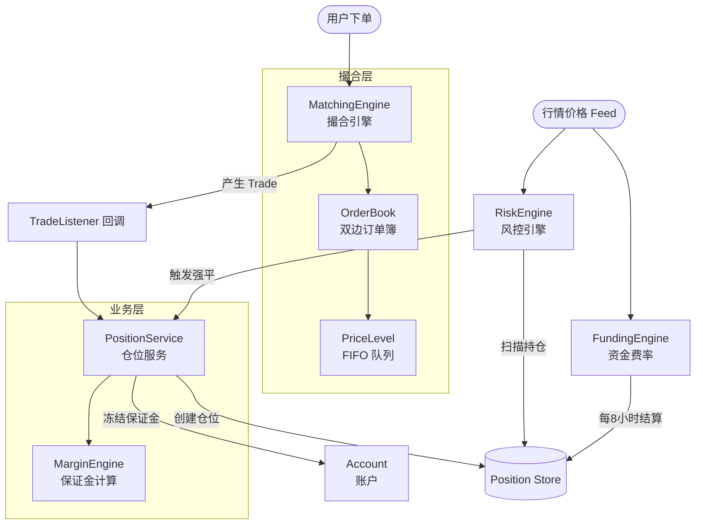
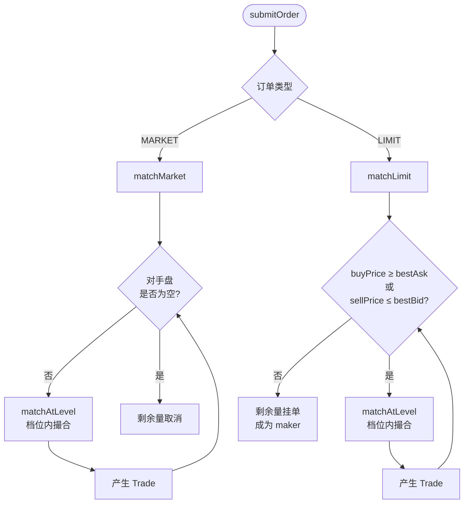
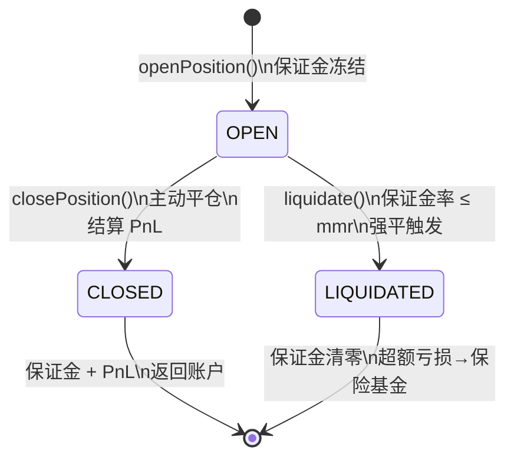
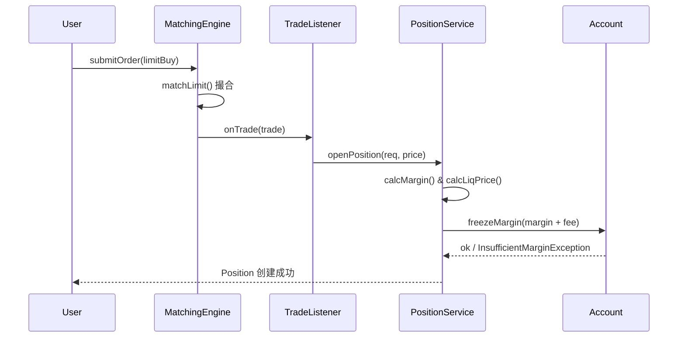

> 本文通过一个纯 Java（无任何第三方依赖）的 Demo 项目，拆解中心化交易所（CEX）永续合约（Perpetual Swap）后端的三大核心子系统：**撮合引擎**、**保证金系统**与**风控引擎**。代码可直接编译运行，适合 Java 合约开发方向的学习与研究。

---

## 什么是永续合约

永续合约（Perpetual Swap，简称 Perp）是没有到期日的衍生品合约。传统期货到期必须交割，而永续合约通过**资金费率（Funding Rate）** 机制将合约价格持续锚定至现货指数，可以无限期持有。

币安、OKX、dYdX、Hyperliquid 的核心产品都是永续合约，其后端用 Java 实现的撮合引擎、仓位系统是招聘中所说"Java 合约开发"的主要工作内容。

---

## 整体架构



系统分为三层：

- **撮合层**：接收委托单，产生成交记录（Trade）
- **业务层**：根据成交记录开平仓，管理保证金和仓位状态
- **风控层**：监控价格变动，扫描并触发强平

---

## 一、撮合引擎

### 数据结构设计

订单簿的核心是一个**双边 TreeMap**：

```java
// 卖单：价格升序，firstKey() = bestAsk，O(1)
TreeMap<BigDecimal, PriceLevel> asks =
    new TreeMap<>(Comparator.naturalOrder());

// 买单：价格降序，firstKey() = bestBid，O(1)
TreeMap<BigDecimal, PriceLevel> bids =
    new TreeMap<>(Comparator.reverseOrder());
```

每个价格档位（`PriceLevel`）内部是一个 `ArrayDeque`，保证同价格订单按**提交时间 FIFO** 撮合：

```java
public class PriceLevel {
    private final BigDecimal price;
    private final Deque<Order> orders = new ArrayDeque<>();
    private BigDecimal totalQty = BigDecimal.ZERO;

    public void add(Order order) {
        orders.addLast(order);          // 追加到队尾
        totalQty = totalQty.add(order.remainingQty());
    }

    public Order peek() {
        return orders.peekFirst();      // 队头是最早挂单的 maker
    }
}
```

各操作的时间复杂度：

| 操作 | 复杂度 | 说明 |
|------|--------|------|
| 挂限价单 | O(log N) | TreeMap 插入 |
| 查最优价 | O(1) | `firstKey()` |
| 成交撮合 | O(k log N) | k = 跨越档位数 |
| 撤单 | O(log N) | 查档位 + Deque 移除 |

### 撮合流程



**档位内撮合（核心逻辑）**：

成交价取 maker 价格（价格优先原则，taker 享受 maker 报价）。

```java
private List<Trade> matchAtLevel(Order taker, PriceLevel level,
                                 BigDecimal matchPrice, String symbol) {
    List<Trade> trades = new ArrayList<>();

    while (!taker.isDone() && !level.isEmpty()) {
        Order maker = level.peek();
        if (maker.isDone()) { level.pollHead(); continue; } // 惰性清理

        // 本次成交量 = min(taker剩余, maker剩余)
        BigDecimal fillQty = taker.remainingQty().min(maker.remainingQty());

        taker.fill(fillQty, matchPrice);
        maker.fill(fillQty, matchPrice);
        level.reduceQty(fillQty);

        Trade trade = new Trade(symbol, taker.getId(), maker.getId(),
                taker.getSide(), matchPrice, fillQty);
        trades.add(trade);
        tradeListener.onTrade(trade);   // 触发仓位开仓回调

        if (maker.isDone()) level.pollHead();
    }
    return trades;
}
```

### 加权均价计算

每次部分成交时更新加权均价，避免浮点误差：

```java
public void fill(BigDecimal fillQty, BigDecimal fillPrice) {
    BigDecimal prevNotional = avgFillPrice.multiply(filledQty);
    BigDecimal newNotional  = fillPrice.multiply(fillQty);
    filledQty    = filledQty.add(fillQty);
    avgFillPrice = prevNotional.add(newNotional)
            .divide(filledQty, 8, RoundingMode.HALF_UP);
}
```

**验证**：Bob 市价扫穿三个档位的均价计算：

```
档位1：price=94050, qty=0.5  → notional=47025
档位2：price=94100, qty=3.5  → notional=329350
档位3：price=94200, qty=4.0  → notional=376800

总成交量 = 8.0 BTC
总名义价值 = 753175
加权均价 = 753175 / 8.0 = 94146.875 ✓
```

### 实际运行输出

```
Part 3: Market Order - Sweep Multiple Levels

  Bob market BUY 8.0 BTC (sweeps multiple ask levels)
  Trades:
    [TRADE] BTC-USDT side=BUY  price=94050  qty=0.5  notional=47025.00
    [TRADE] BTC-USDT side=BUY  price=94100  qty=3.5  notional=329350.00
    [TRADE] BTC-USDT side=BUY  price=94200  qty=4.0  notional=376800.00
  Bob order: status=FILLED filled=8.0 avg_price=94146.87500000
```

---

## 二、保证金系统

### 核心公式（逐仓模式）

$$\text{初始保证金} = \frac{\text{size} \times \text{price}}{\text{leverage}}$$

$$\text{强平价（多头）} = \text{entryPrice} \times \left(1 - \frac{1}{\text{leverage}} + \text{mmr}\right)$$

$$\text{强平价（空头）} = \text{entryPrice} \times \left(1 + \frac{1}{\text{leverage}} - \text{mmr}\right)$$

$$\text{当前保证金率} = \frac{\text{margin} + \text{unrealizedPnl}}{\text{size} \times \text{markPrice}}$$

其中 mmr（Maintenance Margin Rate）= 维持保证金率，默认 0.5%。

### 强平价推导

以多头为例，当保证金余额恰好等于维持保证金时触发强平：

$$\text{margin} + (\text{liqPrice} - \text{entryPrice}) \times \text{size} = \text{liqPrice} \times \text{size} \times \text{mmr}$$

整理得：

$$\text{liqPrice} = \text{entryPrice} - \frac{\text{margin}}{\text{size}} + \text{entryPrice} \times \text{mmr}$$

代入 $\frac{\text{margin}}{\text{size}} = \frac{\text{entryPrice}}{\text{leverage}}$，化简为：

$$\text{liqPrice} = \text{entryPrice} \times \left(1 - \frac{1}{\text{leverage}} + \text{mmr}\right)$$

### Java 实现

```java
public BigDecimal calcLiquidationPrice(Side side, BigDecimal entryPrice,
                                        int leverage, BigDecimal margin,
                                        BigDecimal size) {
    // margin/size = 每单位 BTC 对应的保证金
    BigDecimal marginPerUnit = margin.divide(size, 8, RoundingMode.DOWN);

    BigDecimal liqPrice;
    if (side == Side.LONG) {
        liqPrice = entryPrice
                .subtract(marginPerUnit)
                .add(entryPrice.multiply(maintenanceMarginRate));
    } else {
        liqPrice = entryPrice
                .add(marginPerUnit)
                .subtract(entryPrice.multiply(maintenanceMarginRate));
    }
    return liqPrice.max(BigDecimal.ZERO).setScale(2, RoundingMode.HALF_UP);
}
```

### 验证示例

Trader1 开 50 倍多仓，开仓价 94000 USDT，0.1 BTC：

```
初始保证金 = 0.1 × 94000 / 50 = 188 USDT
手续费     = 0.1 × 94000 × 0.02% = 1.88 USDT

强平价 = 94000 × (1 - 1/50 + 0.005)
       = 94000 × (1 - 0.02 + 0.005)
       = 94000 × 0.985
       = 92590 USDT ✓
```

运行输出印证：

```
[OPEN] Position[BTC-USDT LONG x50 size=0.1 entry=94000 liq=92590.00]
       margin=188.00 fee=1.88

价格跌至 92100（< 92590），触发强平：
[LIQUIDATION] liqPrice=92590.00 markPrice=92100 marginRate=-0.00021715
[LIQUIDATED]  pnl=-190.0
```

保证金率为负说明亏损已超出保证金，超出部分由保险基金承担（Demo 中忽略）。

---

## 三、资金费率（Funding Rate）

### 为什么需要资金费率

永续合约没有到期日，因此缺乏类似交割合约的“强制收敛机制”。  
如果不引入额外约束，合约价格可能长期偏离现货（指数）价格。

资金费率的设计本质是一个**价格回归机制**：

- 合约价 > 现货价（正溢价）  
  → 资金费率为正  
  → **多头向空头支付资金费**  
  → 提高做空收益，压低合约价格  

- 合约价 < 现货价（负溢价）  
  → 资金费率为负  
  → **空头向多头支付资金费**  
  → 提高做多收益，抬高合约价格  

> 通过多空之间的周期性资金交换，驱动合约价格向现货价格收敛。

---

### 计算流程

资金费率的计算可以拆解为三个步骤：

#### 1. 溢价（Premium）

$$
\text{Premium} = \frac{P_{\text{mid}} - P_{\text{index}}}{P_{\text{index}}}
$$

- $P_{\text{mid}}$：盘口中间价（mid price）
- $P_{\text{index}}$：指数价格（index price）

表示当前合约价格相对于现货价格的**相对偏离程度**。

---

#### 2. 资金费率（Funding Rate）

$$
\text{FundingRate} = \mathrm{clamp}\left(\text{Premium} + r,\ -0.0075,\ +0.0075\right)
$$

- $r$：利率项（interest rate），固定为 **0.01% / 8 小时**
- $\mathrm{clamp}$：将结果限制在区间 [-0.75\%, +0.75\%]

资金费率由两部分组成：

- **溢价项（Premium）**：反映市场多空偏离
- **利率项（Interest）**：提供基础资金成本

并通过限幅机制防止极端行情下费率失控。

---

#### 3. 资金费用（Funding Fee）

$$
\text{FundingFee} = Q \times P_{\text{mark}} \times \text{FundingRate}
$$

- $Q$：持仓数量（size）
- $P_{\text{mark}}$：标记价格（mark price）

资金费用按**持仓名义价值**计算：

- 当 FundingRate > 0：多头支付，空头收取
- 当 FundingRate < 0：空头支付，多头收取

### Java 实现

```java
public BigDecimal calcFundingRate(BigDecimal midPrice, BigDecimal indexPrice) {
    BigDecimal premium = midPrice.subtract(indexPrice)
            .divide(indexPrice, 8, RoundingMode.HALF_UP);

    BigDecimal rawRate = premium.add(INTEREST_RATE);

    // clamp 至 [-0.75%, +0.75%]
    return rawRate.min(FUNDING_CAP).max(FUNDING_CAP.negate())
            .setScale(6, RoundingMode.HALF_UP);
}
```

---

## 四、仓位状态机



### 开仓流程



---

## 五、测试覆盖

撮合引擎的 9 个测试用例（无 JUnit 依赖，可直接 `java` 运行）：

```
=== Matching Engine Test Suite ===

  [PASS] Full match limit vs limit
  [PASS] Partial match taker larger
  [PASS] Multi-level sweep
  [PASS] Market order full fill
  [PASS] Market order insufficient liquidity
  [PASS] Cancel order
  [PASS] Price priority + FIFO
  [PASS] No match price gap
  [PASS] Depth snapshot

  Result: 9 passed, 0 failed
```

值得一提的一个容易忽略的 Bug：最初 `OrderBook.cancel()` 使用**惰性移除**——只把 Order 标记为 CANCELLED，不从 `PriceLevel` 的 Deque 里实际删除。导致 `bestAsk()` 在撤单后依然返回旧价格。

修复方案是在 `PriceLevel` 里增加主动 `remove(Order)` 方法，撤单时立即移除，档位为空则从 TreeMap 清掉：

```java
// PriceLevel.java
public boolean remove(Order order) {
    boolean removed = orders.remove(order);
    if (removed) {
        totalQty = totalQty.subtract(order.remainingQty())
                           .max(BigDecimal.ZERO);
    }
    return removed;
}

// OrderBook.java
public boolean cancel(String orderId) {
    Order order = orderIndex.remove(orderId);
    if (order == null || order.isDone()) return false;
    order.cancel();

    PriceLevel level = bookFor(order.getSide()).get(order.getPrice());
    if (level != null) {
        level.remove(order);
        if (level.isEmpty()) bookFor(order.getSide()).remove(order.getPrice());
    }
    return true;
}
```

---

## 六、与生产系统的差距

本 Demo 刻意简化，生产系统的差异如下：

| 模块 | Demo | 生产实现 |
|------|------|---------|
| 并发控制 | `ReentrantLock` per symbol | Disruptor 单线程 per symbol，彻底无锁 |
| 持久化 | `ConcurrentHashMap` 内存 | MySQL/TiDB + Redis 热数据 |
| 消息推送 | `TradeListener` 同步回调 | Kafka Producer 异步解耦 |
| 标记价格 | 直接用成交价 | 现货指数 + 基差加权，防操纵 |
| 阶梯保证金 | 固定 mmr = 0.5% | 按名义价值分级（Notional Tier） |
| 保险基金 | 忽略 | 强平亏损超保证金时动用 |
| ADL 自动减仓 | 未实现 | 保险基金耗尽后按盈利率强制减仓 |
| 撮合性能 | 微秒级 | 纳秒级（C++/Java + DPDK 网络栈） |

---

## 快速运行

```bash
# 解压后编译
unzip perp-engine-v2.zip && cd perp-engine
javac -d out $(find src/main -name "*.java")

# 运行演示（6 个场景）
java -cp out com.perp.PerpEngineDemo

# 运行测试（无需 JUnit）
javac -cp out -d out src/test/java/com/perp/matching/MatchingEngineTest.java
java -cp out com.perp.matching.MatchingEngineTest
```

**环境要求：** JDK 17+（推荐 Temurin 17），无其他依赖。

---

## 总结

这套 Demo 覆盖了 Java 合约开发中最常用的知识点：

- **撮合引擎**：TreeMap 双边订单簿、价格优先 + FIFO、市价单多档穿越、撤单精确维护深度
- **保证金**：逐仓模式初始保证金、强平价推导与实现、BigDecimal 精度控制
- **风控**：实时强平扫描、保证金率计算、仓位状态流转
- **资金费率**：premium 计算、clamp 防极端行情、按仓位方向结算

代码约 800 行，结构清晰，每个类职责单一，适合直接作为面试讲解材料或进一步扩展为 Spring Boot 服务。

完整代码: https://github.com/ciphermagic/perp-engine-demo
