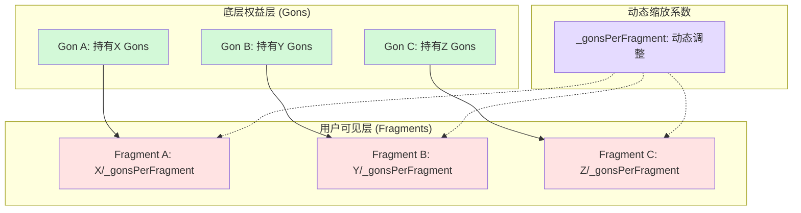
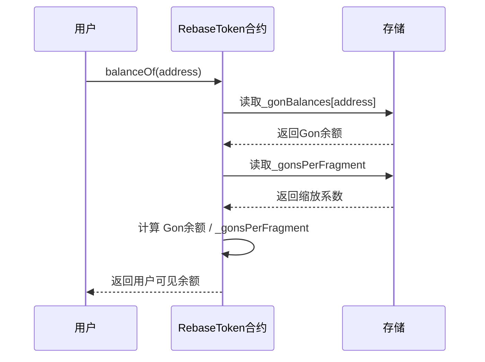
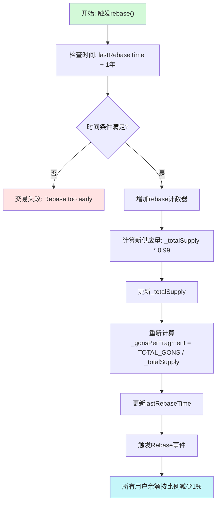
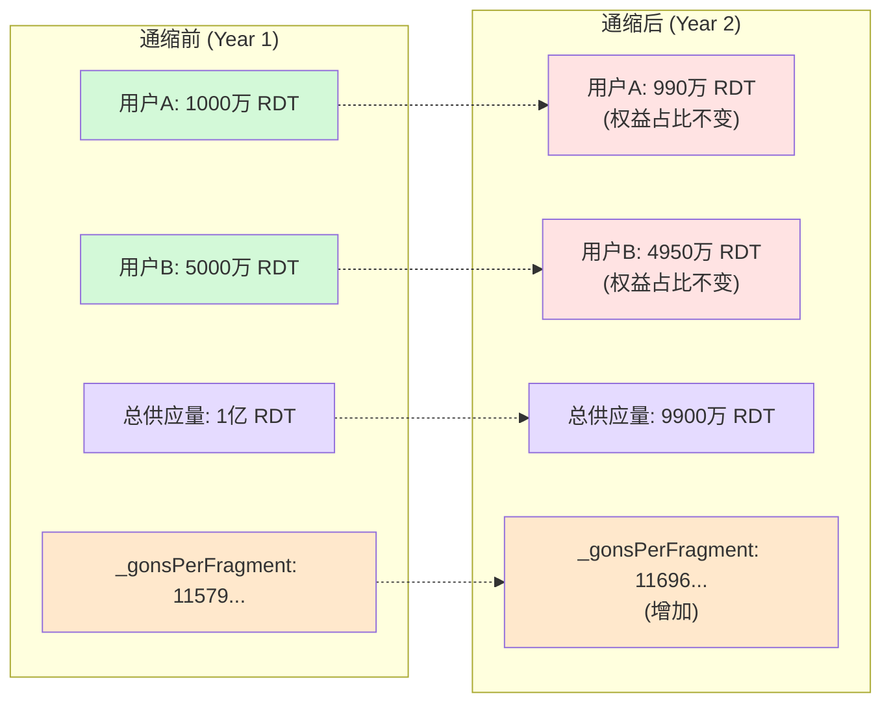

## 一、前言

在区块链技术迅猛发展的今天，代币经济学作为DeFi生态的核心组成部分，正在不断演进与创新。传统代币往往面临供应量固定带来的流动性问题，或者通胀模型带来的价值稀释风险。为了解决这些问题，一类创新的代币机制——Rebase Token应运而生。通缩型Rebase Token作为其中的独特分支，通过独特的数学机制实现了按比例削减供应量的新型代币模式。

本文将深入分析RebaseToken合约的设计原理和实现细节，探讨基于Ampleforth变种机制的通缩型代币系统。通过逐行解析合约代码、详解数学模型核心以及实际案例演示，帮助读者全面理解通缩型rebase机制的实现原理、技术挑战以及实际应用场景。

## 二、Rebase Token 基础概念

### 2.1 Rebase机制的核心思想

Rebase Token（有时称为'rebasing 代币'）是一类特殊的ERC-20代币，其总供应量和Token持有者的余额可以在没有实际的转移、铸造或销毁的情况下进行更改。这种机制允许代币系统根据预设规则动态调整所有持有者的余额，保持其在总供应量中的比例不变。

以Ampleforth（AMPL）为代表的经典rebase机制，旨在通过向上rebase造成通胀、向下rebase增加稀缺性来实现价格稳定。而我们即将介绍的通缩型rebase机制则有所不同——它每年主动减少总供应量1%，实现主动通缩。

### 2.2 Share系统与双层记账机制

Rebase Token采用了一种巧妙的"份额（share）系统"来追踪所有权比例。在数学模型中，用户余额的计算公式可以表示为：

```
balanceOf(account) = _shareBalance[account] * address(this).balance / _totalShares
```

这种设计允许系统在不实际转移代币的情况下，通过调整缩放系数来改变所有用户的余额。Lido的stETH Token是share系统的一个设计参考，而Ampleforth和OlympusDao的sOHM Token则是rebasing机制的典型案例。

## 三、RebaseToken合约核心机制解析

### 3.1 双层账户体系概述

RebaseToken合约采用了经典的Gons与Fragments双层记账系统，其核心思路在于将用户的"权益"和"表现"分离。这种设计的核心在于：用户看到的余额（Fragments）可以动态变化，但其在总供应量中的权益占比（Gons）保持恒定。

我们可以把RebaseToken想象为一个总价值不变但总份数减少的蛋糕：
- `_totalSupply`（总供应量）：蛋糕的总份数，起始1亿枚，每年减少1%
- 权益占比：由`_gonBalances`这个底层"权益单位"记录，始终保持不变
- 余额（balanceOf）：用户当前分到的蛋糕份数，每次"Rebase"后份数变少，但**持有者的份额比例不变**
- `_gonsPerFragment`：衡量一份蛋糕的"最小单位"，总供应量减少时，每份代表的Gons就变多

关键点在于：当Rebase通缩机制触发时，用户看到的余额（蛋糕份数）会减少，但其持有的**底层权益（Gons）**数量不变，因此占总价值的比例恒定。

以下图表展示了Gons与Fragments双层记账系统的结构：



### 3.2 核心变量设计

让我们先看看合约中最重要的几个变量及其作用：

```solidity
// 核心映射
mapping(address => uint256) private _gonBalances;                    // 每个地址的底层权益单位
mapping(address => mapping(address => uint256)) private _allowances; // 标准ERC-20授权

// 总量和缩放系数
uint256 private _totalSupply;                                        // 用户可见的总供应量
uint256 private _gonsPerFragment;                                    // 动态缩放系数

// rebase相关参数
uint256 public lastRebaseTime;                                       // 上次rebase时间
uint256 public rebaseCount;                                          // rebase次数计数
address public owner;                                                // 合约所有者

// 通缩参数
uint256 private constant DEFLATION_RATE = 99;                       // 通缩率：99/100 = 每年减少1%
uint256 private constant RATE_DENOMINATOR = 100;                    // 分母：用于计算百分比
uint256 private constant REBASE_INTERVAL = 365 days;                // rebase间隔：一年
```

- **`_gonBalances`**：记录每个地址底层的、永不改变的"权益单位"（Gons）数量，这是实现比例不变的关键。
- **`_gonsPerFragment`**：一个**动态缩放系数**，它定义了每1个"用户可见代币"对应多少底层Gons。**当总供应量减少时，这个系数会增大**。
- **`_totalSupply`**：用户可见的代币总供应量，每年通缩1%。

### 3.3 TOTAL_GONS数学原理详解

在RebaseToken合约中最为关键的一个设计是TOTAL_GONS的定义：

```solidity
uint256 private constant MAX_UINT256 = ~uint256(0);                 // uint256最大值：2^256 - 1
uint256 private constant INITIAL_FRAGMENTS_SUPPLY = 100_000_000 * 10**18; // 初始供应量
uint256 private constant TOTAL_GONS = MAX_UINT256 - (MAX_UINT256 % INITIAL_FRAGMENTS_SUPPLY); // 总gon数
```

这行代码是Ampleforth风格rebase代币实现中最经典且最重要的常量初始化之一。其核心目的是：

**创建一个接近 2^256 的巨大整数 TOTAL_GONS，作为所有"gon"（内部记账单位）的总量**，同时保证 TOTAL_GONS 能被 INITIAL_FRAGMENTS_SUPPLY 整除，从而让初始的 `_gonsPerFragment` 是一个整数，避免精度丢失。

让我们逐部分拆解这个公式：

1. `MAX_UINT256 = 2²⁵⁶ - 1`：这是Solidity中uint256的最大值，约1.157920892373162 × 10⁷⁷（一个超级大的数）

2. `MAX_UINT256 % INITIAL_FRAGMENTS_SUPPLY`：
   - INITIAL_FRAGMENTS_SUPPLY = 100_000_000 × 10¹⁸ = 10²⁶
   - 这行计算把MAX_UINT256除以10²⁶后的**余数**，即MAX_UINT256能被10²⁶整除多少次后还剩下的部分

3. `MAX_UINT256 - (MAX_UINT256 % INITIAL_FRAGMENTS_SUPPLY)`：
   - 这一步直接把余数"抹掉"，得到一个**最接近MAX_UINT256且能被INITIAL_FRAGMENTS_SUPPLY整除**的数。
   - 数学上等价于：`TOTAL_GONS = floor(MAX_UINT256 / INITIAL_FRAGMENTS_SUPPLY) × INITIAL_FRAGMENTS_SUPPLY`

这样设计的巧妙之处在于，它确保了初始的`_gonsPerFragment`是一个精确的整数，避免后续乘除运算中的精度误差累积。如果直接使用MAX_UINT256，后续计算会产生小数误差，长期rebase后会累积偏差。

## 四、RebaseToken合约实现与分析

### 4.1 全合约代码

以下是RebaseToken合约的完整代码：

```solidity
// SPDX-License-Identifier: MIT
pragma solidity ^0.8.19;

/**
 * @title RebaseToken
 * @dev 通缩型 Rebase Token 实现
 * 起始发行量为 1 亿，每年通缩 1%
 * 参考 Ampleforth 的实现原理
 */
contract RebaseToken {
    mapping(address => uint256) private _gonBalances;                    // 每个地址的底层权益单位（Gons）
    mapping(address => mapping(address => uint256)) private _allowances; // 标准ERC-20授权映射

    uint256 private constant MAX_UINT256 = ~uint256(0);                 // uint256最大值：2^256 - 1
    uint256 private constant INITIAL_FRAGMENTS_SUPPLY = 100_000_000 * 10**18; // 初始供应量：1亿 * 10^18
    uint256 private constant TOTAL_GONS = MAX_UINT256 - (MAX_UINT256 % INITIAL_FRAGMENTS_SUPPLY); // 总Gon数，确保能被初始供应量整除

    string public name = "Rebase Deflation Token";                        // 代币名称
    string public symbol = "RDT";                                         // 代币符号
    uint8 public decimals = 18;                                           // 代币精度

    uint256 private _totalSupply;                                        // 用户可见的总供应量
    uint256 private _gonsPerFragment;                                    // 动态缩放系数：每个fragment对应的Gons数量

    uint256 public lastRebaseTime;                                       // 上次rebase时间戳
    uint256 public rebaseCount;                                          // rebase执行次数
    address public owner;                                                // 合约所有者地址

    uint256 private constant DEFLATION_RATE = 99;                        // 通缩率：99/100 = 每次减少1%
    uint256 private constant RATE_DENOMINATOR = 100;                     // 通缩率分母
    uint256 private constant REBASE_INTERVAL = 365 days;                 // rebase间隔：365天

    event Transfer(address indexed from, address indexed to, uint256 value);      // 转账事件
    event Approval(address indexed owner, address indexed spender, uint256 value); // 授权事件
    event Rebase(uint256 indexed epoch, uint256 totalSupply);                    // rebase事件

    modifier onlyOwner() {
        require(msg.sender == owner, "Not owner");                       // 验证调用者为合约所有者
        _;
    }

    constructor() {
        owner = msg.sender;                                               // 设置部署者为合约所有者
        _totalSupply = INITIAL_FRAGMENTS_SUPPLY;                          // 初始化总供应量
        _gonsPerFragment = TOTAL_GONS / _totalSupply;                     // 计算初始缩放系数
        lastRebaseTime = block.timestamp;                                 // 记录部署时间作为上次rebase时间
        _gonBalances[msg.sender] = TOTAL_GONS;                            // 将所有Gons分配给部署者
        emit Transfer(address(0), msg.sender, _totalSupply);              // 触发代币铸造事件
    }

    function totalSupply() public view returns (uint256) {
        return _totalSupply;                                              // 返回当前总供应量
    }

    function balanceOf(address who) public view returns (uint256) {
        return _gonBalances[who] / _gonsPerFragment;                      // 计算用户可见余额：Gon余额 / 缩放系数
    }

    function transfer(address to, uint256 value) public returns (bool) {
        require(to != address(0), "Transfer to zero address");            // 防止转账到零地址
        require(to != address(this), "Transfer to contract");             // 防止转账到合约自身

        uint256 gonValue = value * _gonsPerFragment;                      // 将转账金额转换为Gon单位
        _gonBalances[msg.sender] -= gonValue;                             // 从发送方扣除Gon余额
        _gonBalances[to] += gonValue;                                     // 给接收方增加Gon余额
        emit Transfer(msg.sender, to, value);                             // 触发转账事件
        return true;
    }

    function allowance(address owner_, address spender) public view returns (uint256) {
        return _allowances[owner_][spender];                             // 返回授权额度
    }

    function transferFrom(address from, address to, uint256 value) public returns (bool) {
        require(to != address(0), "Transfer to zero address");            // 防止转账到零地址
        require(to != address(this), "Transfer to contract");             // 防止转账到合约自身

        _allowances[from][msg.sender] -= value;                           // 从授权额度中扣除
        uint256 gonValue = value * _gonsPerFragment;                      // 将转账金额转换为Gon单位
        _gonBalances[from] -= gonValue;                                   // 从发送方扣除Gon余额
        _gonBalances[to] += gonValue;                                     // 给接收方增加Gon余额
        emit Transfer(from, to, value);                                   // 触发转账事件
        return true;
    }

    function approve(address spender, uint256 value) public returns (bool) {
        _allowances[msg.sender][spender] = value;                         // 设置授权额度
        emit Approval(msg.sender, spender, value);                        // 触发授权事件
        return true;
    }

    function increaseAllowance(address spender, uint256 addedValue) public returns (bool) {
        _allowances[msg.sender][spender] += addedValue;                   // 增加授权额度
        emit Approval(msg.sender, spender, _allowances[msg.sender][spender]); // 更新授权事件
        return true;
    }

    function decreaseAllowance(address spender, uint256 subtractedValue) public returns (bool) {
        uint256 oldValue = _allowances[msg.sender][spender];              // 保存原始授权额度
        if (subtractedValue >= oldValue) {
            _allowances[msg.sender][spender] = 0;                         // 防止下溢，设置为0
        } else {
            _allowances[msg.sender][spender] = oldValue - subtractedValue; // 减少授权额度
        }
        emit Approval(msg.sender, spender, _allowances[msg.sender][spender]); // 更新授权事件
        return true;
    }

    function rebase() external onlyOwner {                                // 定时rebase函数
        require(block.timestamp >= lastRebaseTime + REBASE_INTERVAL, "Rebase too early"); // 检查时间间隔
        _rebase();                                                        // 执行内部rebase逻辑
    }

    function manualRebase() external onlyOwner {                          // 手动rebase函数
        _rebase();                                                        // 执行内部rebase逻辑（无时间限制）
    }

    function _rebase() internal {                                         // 内部rebase实现
        rebaseCount++;                                                    // 增加rebase计数
        uint256 newTotalSupply = (_totalSupply * DEFLATION_RATE) / RATE_DENOMINATOR; // 计算新供应量：减少1%
        _totalSupply = newTotalSupply;                                    // 更新总供应量
        _gonsPerFragment = TOTAL_GONS / _totalSupply;                     // 重新计算缩放系数
        lastRebaseTime = block.timestamp;                                 // 更新rebase时间
        emit Rebase(rebaseCount, _totalSupply);                           // 触发rebase事件
    }

    function gonsPerFragment() external view returns (uint256) {
        return _gonsPerFragment;                                          // 返回当前缩放系数
    }

    function canRebase() external view returns (bool) {
        return block.timestamp >= lastRebaseTime + REBASE_INTERVAL;       // 检查是否可以执行rebase
    }

    function nextRebaseTime() external view returns (uint256) {
        return lastRebaseTime + REBASE_INTERVAL;                          // 返回下次rebase时间
    }

    function gonBalanceOf(address who) external view returns (uint256) {
        return _gonBalances[who];                                         // 返回用户底层Gon余额
    }
}
```

### 4.2 余额计算与转换逻辑

#### 4.2.1 核心转换公式

balanceOf函数是理解RebaseToken机制的关键：

```solidity
function balanceOf(address who) public view returns (uint256) {
    return _gonBalances[who] / _gonsPerFragment;                      // 计算用户可见余额：Gon余额 / 缩放系数
}
```

这是RebaseToken最核心的转换公式：`用户余额 = Gon余额 ÷ 当前缩放系数`。

当Rebase触发时，`_gonsPerFragment`会增大（因为总供应量减少，而TOTAL_GONS固定），所以除法得到的结果（用户余额）就会**等比例地减少**。但用户的`_gonBalances[who]`（底层权益）始终保持不变，因此其在总供应量中的比例保持恒定。

下面的时序图展示了余额计算转换的过程：



#### 4.2.2 转账实现解析

在转账过程中，合约将用户输入的value先转换为Gon值再进行操作：

```solidity
function transfer(address to, uint256 value) public returns (bool) {
    require(to != address(0), "Transfer to zero address");
    require(to != address(this), "Transfer to contract");

    uint256 gonValue = value * _gonsPerFragment;  // 转换为gon单位
    _gonBalances[msg.sender] -= gonValue;         // 减少发送方的gon余额
    _gonBalances[to] += gonValue;                 // 增加接收方的gon余额
    emit Transfer(msg.sender, to, value);         // 发送原始值作为事件
    return true;
}
```

这种设计确保了在转账过程中，系统操作的是不会改变的Gon值，保证了转账的精确性。

### 4.3 Rebase核心逻辑

#### 4.3.1 条件触发rebase

合约提供了两种触发rebase的方式：

```solidity
function rebase() external onlyOwner {                                // 定时rebase函数
    require(block.timestamp >= lastRebaseTime + REBASE_INTERVAL, "Rebase too early"); // 检查时间间隔
    _rebase();                                                        // 执行内部rebase逻辑
}

function manualRebase() external onlyOwner {                          // 手动rebase函数
    _rebase();                                                        // 执行内部rebase逻辑（无时间限制）
}
```

- `rebase()`：只能在一年（365天）后才会成功执行
- `manualRebase()`：所有者可以随时强制触发rebase（无时间限制）

#### 4.3.2 内部rebase实现

内部rebase函数是整个合约的核心：

```solidity
function _rebase() internal {
    rebaseCount++;                                                    // 增加rebase计数
    uint256 newTotalSupply = (_totalSupply * DEFLATION_RATE) / RATE_DENOMINATOR; // 计算新供应量：减少1%
    _totalSupply = newTotalSupply;                                    // 更新总供应量
    _gonsPerFragment = TOTAL_GONS / _totalSupply;                     // 重新计算缩放系数
    lastRebaseTime = block.timestamp;                                 // 更新rebase时间
    emit Rebase(rebaseCount, _totalSupply);                           // 触发rebase事件
}
```

这个过程的核心是：由于总Gons（TOTAL_GONS）不变而总供应量减少，所以缩放系数`_gonsPerFragment`会增大。而用户余额的计算公式是`_gonBalances[who] / _gonsPerFragment`，所以当分母增大时，用户看到的余额会同比例减少。

下面的流程图详细展示了rebase机制的执行流程：



### 4.4 构造函数解析

```solidity
constructor() {
    owner = msg.sender;                             // 设置部署者为所有者
    _totalSupply = INITIAL_FRAGMENTS_SUPPLY;        // 设置初始总供应量
    _gonsPerFragment = TOTAL_GONS / _totalSupply;   // 计算初始缩放系数
    lastRebaseTime = block.timestamp;               // 记录当前时间为上次rebase时间
    _gonBalances[msg.sender] = TOTAL_GONS;          // 将所有Gons分配给部署者
    emit Transfer(address(0), msg.sender, _totalSupply); // 触发铸造事件
}
```

构造函数初始化了整个rebase系统。部署者获得了所有底层Gons，初始的`balanceOf(deployer)`值为`TOTAL_GONS / (TOTAL_GONS / INITIAL_FRAGMENTS_SUPPLY) = INITIAL_FRAGMENTS_SUPPLY`。

## 五、实际应用与安全性分析

### 5.1 通缩型与通胀型rebase机制对比

传统的Ampleforth机制旨在通过动态调整供应量来实现价格稳定：
- 向上rebase时，供应量增加，每个token价值相对降低（通胀）
- 向下rebase时，供应量减少，每个token价值相对提升（通缩）

而RebaseToken的通缩机制不同：
- 每年自动减少1%的供应量
- 不依赖市场价格信号，而是主动进行通缩
- 目标是在长期内创造稀缺性，提升单个代币价值

这种机制在经济学上可以视为对持有者的一种"权益"保护，但同时也需要考虑其对市场流动性和生态发展的影响。

下面的图表直观展示了通缩前后用户余额的变化情况：



### 5.2 安全性考虑

合约实现中包含多项安全机制：

1. **权限控制**：使用onlyOwner修饰符限制关键功能的访问
2. **溢出检查**：Solidity 0.8.x自带的溢出检查
3. **安全检查**：转账时检查零地址和合约地址
4. **授权管理**：采用标准的减少授权攻击防范机制

然而，还需注意以下风险：
- 合约owner具有中心化控制权限
- 长期rebase可能积累精度误差
- 与某些DeFi协议的兼容性问题

### 5.3 实际案例与应用场景

RebaseToken这样的通缩机制在以下场景中具有应用价值：

1. **价值存储类代币**：通过通缩机制创造稀缺性，增强价值存储属性
2. **治理代币**：减少供应量以提升单个代币的治理权价值
3. **Meme代币**：作为一种实验性通缩机制吸引市场关注

## 六、总结

RebaseToken合约体现了Rebase机制的精妙设计。通过Gons与Fragments的双重记账体系，该合约成功实现了在不实际转移代币的情况下按比例调整所有持有者余额的创新机制。

虽然RebaseToken合约提供了一个学习rebase机制的良好示例，但在实际应用中需要考虑治理、安全性和去中心化等因素。这一机制为区块链代币经济学的发展提供了新的思路，展示了数学与编程结合在加密领域创造创新价值的可能性。