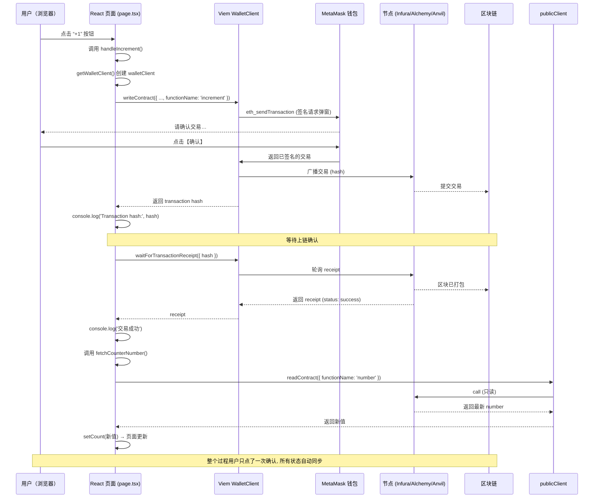

## 前言

在 Web3 开发领域，与以太坊等区块链网络进行交互是构建去中心化应用（DApp）的核心环节。传统的 Web3 开发框架如 wagmi 为开发者提供了便利的 React Hooks，但有时我们也需要更底层、更灵活的控制。

本文将介绍一个纯 Viem 脚手架项目，详细分析如何使用 Viem 库直接与 MetaMask 钱包和智能合约进行交互，不依赖 wagmi 等高级抽象库，让开发者更好地理解底层交互逻辑。Viem 作为下一代以太坊开发工具，相比传统的 ethers.js 和 web3.js，提供了更现代化的 TypeScript 接口和更轻量级的实现。

## 项目概述

这是一个使用 Next.js 和 Viem 构建的简单 DApp 脚手架项目，主要功能包括连接钱包、获取账户信息、读写智能合约以及监听钱包状态变化。该项目采用纯 Viem 实现，没有使用 wagmi 等第三方状态管理库。

### 为什么选择纯 Viem？

纯 Viem 方案在 Web3 开发中因其轻量级设计和底层控制能力，逐渐成为开发者调查中的新趋势，尤其适合追求灵活性和性能的场景。相较于 wagmi 等高级抽象库，纯 Viem 提供了以下显著优势：

- **更细粒度的控制**

  开发者可以直接操作每个链上请求，深入理解底层通信逻辑，便于调试和优化，无需受抽象层限制。

- **轻量级实现**

  不依赖额外的状态管理库，项目体积大幅减少（仅 `viem` 比 wagmi 全家桶少 70%+），加载速度显著提升。

- **灵活性更高**

  根据项目需求自由定制交互逻辑，不被高级库的预设框架束缚，适合复杂或定制化场景。

- **更好的 TypeScript 支持**

  Viem 的原生类型推断确保合约交互类型安全，降低运行时错误风险，成为开发者信赖的核心。

- **更直观的 API 设计**

  API 贴近以太坊原生操作，易于掌握区块链交互本质，减少学习曲线。

- **调试友好与未来趋势**

  出错时直接面对 Viem 的原始错误信息，无需解构 hook 问题，调试效率翻倍。同时，wagmi v2 已全面转向 Viem，纯 Viem 方案是未来 Web3 开发的标杆。


这种架构不仅适合初学者快速上手，也为高级开发者提供无限扩展空间，是链上开发的理想选择。

## 项目创建步骤

### 项目初始化

```bash
# 1. 创建 Next.js 项目（App Router）
npx create-next-app@latest simple-viem --typescript --tailwind --eslint --app --import-alias "@/*"

cd simple-viem

# 2. 安装核心依赖
pnpm install \
  viem@latest \
  antd \
  @ant-design/icons \
  @ant-design/nextjs-registry \
  dotenv

# 3. 安装开发依赖
pnpm install -D \
  prettier
```

### 智能合约部分初始化

```bash
# 在项目根目录初始化 Foundry（智能合约）
forge init contracts
cd contracts

# 删除 foundry 的 git 仓库，统一使用上层的 git 仓库
rm -rf .git

# 安装 OpenZeppelin，不能使用 git 安装，否则会使仓库管理混乱
forge install --no-git OpenZeppelin/openzeppelin-contracts

# 生成 ABI 文件
mkdir ../app/abis
forge inspect Counter abi --json > ../app/abis/Counter.json
```

### 核心依赖分析

该项目的核心依赖包括：

- **Next.js**：React 框架，提供 SSR 和现代化的开发体验
- **Viem**：用于与以太坊区块链交互的 TypeScript 库，是项目的核心
- **Ant Design**：UI 组件库
- **Foundry**：以太坊开发工具链（智能合约部分）

### 配置文件

项目的 tsconfig.json、package.json 等配置文件均遵循 next.js 的最佳实践配置，同时 TypeScript 确保了代码的类型安全。

### 项目文件结构

```
simple-viem/
├── app/
│   ├── abis/                    # 智能合约ABI文件
│   │   └── Counter.json        # Counter合约的ABI
│   ├── favicon.ico             # 网站图标
│   ├── globals.css             # 全局样式
│   ├── layout.tsx              # Next.js布局组件
│   ├── page.tsx                # 主页面，包含所有交互逻辑
│   ├── providers.tsx           # 提供者组件（空实现）
│   └── types/
│       └── ethereum.d.ts       # TypeScript类型定义
├── contracts/                  # 智能合约目录
│   ├── .env                    # 环境变量配置
│   ├── foundry.toml            # Foundry配置文件
│   ├── lib/                    # 依赖库（OpenZeppelin）
│   ├── out/                    # 编译输出目录
│   ├── script/                 # 部署脚本
│   ├── src/                    # 合约源码
│   │   └── Counter.sol         # Counter智能合约
│   └── test/                   # 测试文件
├── .gitignore                  # Git忽略文件
├── .prettierrc.cjs             # Prettier配置
├── eslint.config.mjs           # ESLint配置
├── next-env.d.ts               # Next.js类型声明
├── next.config.ts              # Next.js配置
├── package.json                # 项目依赖配置
├── postcss.config.mjs          # PostCSS配置
├── public/                     # 静态资源目录
│   ├── favicon.ico             # 网站图标
│   └── vercel.svg              # Vercel图标
└── tsconfig.json               # TypeScript配置
```

## 核心代码实现

### Page.tsx 页面的 Viem 操作分析

项目的核心交互逻辑集中在 app/page.tsx 文件中，下面详细分析其中的关键操作：

#### 支持多链配置

```typescript
// 支持的链
const SUPPORTED_CHAINS = [foundry, sepolia] as const;

const COUNTER_ADDRESS_FOUNDRY = '0xDc64a140Aa3E981100a9becA4E685f962f0cF6C9';
const COUNTER_ADDRESS_SEPOLIA = '0x7B6781B15b4f3eF8476af20Ed45Cf6d09e0Ef55F';

function getCounterAddress(chainId: number) {
  return chainId === foundry.id ? COUNTER_ADDRESS_FOUNDRY : COUNTER_ADDRESS_SEPOLIA;
}
```

该项目支持多条链（Foundry 和 Sepolia 测试网），通过地址映射实现在不同网络上访问对应的合约实例。这种设计使得 DApp 能适应不同的开发和测试环境。

#### 连接钱包

```typescript
const connectWallet = async () => {
  if (typeof window.ethereum === 'undefined') {
    alert('请安装 MetaMask');
    return;
  }
  try {
    setIsLoading(true);
    const [address] = await window.ethereum.request({ method: 'eth_requestAccounts' });
    const chainId = await window.ethereum.request({ method: 'eth_chainId' });
    setAddress(address as `0x${string}`);
    setChainId(Number(chainId));
    setIsConnected(true);
  } catch (error) {
    console.error('连接钱包失败:', error);
  } finally {
    setIsLoading(false);
  }
};
```

连接钱包功能通过直接调用 `window.ethereum.request` 方法实现，请求 `eth_requestAccounts` 方法获取用户授权的账户地址，同时获取当前链 ID。这种方式绕过了 wagmi 等高级抽象，直接使用 EIP-1193 标准与钱包通信。

#### 获取钱包信息

```typescript
// 读取余额
const fetchBalance = useCallback(async () => {
  if (!address || !chainId) return;
  try {
    const client = getPublicClient(chainId);
    const bal = await client.getBalance({ address });
    setBalance(formatEther(bal));
  } catch (err) {
    console.error('读取余额失败', err);
  }
}, [address, chainId]);

function getPublicClient(chainId: number) {
  const chain = SUPPORTED_CHAINS.find(c => c.id === chainId) ?? foundry;
  return createPublicClient({
    chain,
    transport: http(),
  }).extend(publicActions);
}
```

获取钱包信息分为几个步骤：
1. 创建 publicClient，用于与区块链进行只读交互
2. 使用 `client.getBalance` 方法获取指定地址的余额
3. 使用 `formatEther` 将 bigint 格式的余额转换为易读的 ETH 格式

#### 读写智能合约

##### 读取合约数据

```typescript
const fetchCounterNumber = useCallback(async () => {
  if (!chainId) return;
  try {
    const client = getPublicClient(chainId);
    const contract = getContract({
      address: getCounterAddress(chainId),
      abi: Counter_ABI,
      client,
    });
    const num = (await contract.read.number()) as bigint;
    setCounterNumber(num.toString());
  } catch (err) {
    console.error('读取 Counter 失败', err);
  }
}, [chainId]);
```

读取合约数据的步骤：
1. 创建 publicClient
2. 使用 `getContract` 创建合约实例
3. 调用 `contract.read[functionName]` 方法读取合约状态

##### 写入合约数据

```typescript
const handleIncrement = async () => {
  if (!address || !window.ethereum || !chainId) return;
  const walletClient = getWalletClient();
  if (!walletClient) return alert('钱包未连接');
  try {
    setIsLoading(true);
    const hash = await walletClient.writeContract({
      address: getCounterAddress(chainId),
      abi: Counter_ABI,
      functionName: 'increment',
      account: address,
    });
    console.log('Transaction hash:', hash);

    const receipt = await walletClient.waitForTransactionReceipt({ hash: hash });
    console.log(`交易状态: ${receipt.status === 'success' ? '成功' : '失败'}`);

    // 更新数值显示
    await fetchCounterNumber();
  } catch (error) {
    console.error('调用 increment 失败:', error);
  } finally {
    setIsLoading(false);
  }
};

// 创建 walletClient（只在需要签名时创建）
const getWalletClient = useCallback(() => {
  if (!window.ethereum || !chainId || !address) return null;
  const chain = SUPPORTED_CHAINS.find(c => c.id === chainId) ?? foundry;
  return createWalletClient({
    account: address,
    chain,
    transport: custom(window.ethereum),
  }).extend(publicActions);
}, [address, chainId]);
```

写入合约数据的步骤：
1. 创建 walletClient，用于需要签名的交易
2. 调用 `writeContract` 方法发送交易到合约
3. 使用 `waitForTransactionReceipt` 等待交易确认
4. 更新相关状态

时序图：


#### 断开连接

```typescript
const disconnectWallet = useCallback(async () => {
  if (!address || !window.ethereum || !chainId) return;
  setIsConnected(false);
  setAddress(undefined);
  setChainId(undefined);
  setBalance('0');
  setCounterNumber('0');
  try {
    // 对于 MetaMask 10.28+
    await window.ethereum.request({
      method: 'wallet_revokePermissions',
      params: [{ eth_accounts: {} }],
    });
    // 老版本 MM 会抛 4200 错误，捕获即可
  } catch (e: unknown) {
    if (typeof e === 'object' && e !== null && 'code' in e && (e as { code: unknown }).code === 4200) {
      alert('请手动在钱包里断开本次连接');
    }
  }
}, [address, chainId]);
```

断开连接功能不仅清空了本地状态，还通过 `wallet_revokePermissions` 方法撤销了对钱包的访问权限。

#### 监听钱包操作

```typescript
useEffect(() => {
  if (!window.ethereum) return;

  const handleAccountsChanged = (accounts: string[]) => {
    console.log('账户变化', accounts);
    if (accounts.length === 0) {
      disconnectWallet().catch(console.error);
    } else {
      setAddress(accounts[0] as `0x${string}`);
    }
  };

  const handleChainChanged = (chainIdHex: string) => {
    console.log('网络变化', chainIdHex);
    setChainId(Number(chainIdHex));
  };

  window.ethereum.on('accountsChanged', handleAccountsChanged);
  window.ethereum.on('chainChanged', handleChainChanged);

  return () => {
    window.ethereum?.removeListener('accountsChanged', handleAccountsChanged);
    window.ethereum?.removeListener('chainChanged', handleChainChanged);
  };
}, [address, disconnectWallet, fetchBalance, fetchCounterNumber]);
```

通过监听 `accountsChanged` 和 `chainChanged` 事件，DApp 能够实时响应用户的账户切换和网络切换操作，保持应用状态与钱包状态的一致性。

### Counter 智能合约分析

Counter 合约是一个简单的计数器合约，包含以下功能：

```solidity
// SPDX-License-Identifier: UNLICENSED
pragma solidity ^0.8.13;

contract Counter {
    uint256 public number;

    function setNumber(uint256 newNumber) public {
        number = newNumber;
    }

    function increment() public {
        number++;
    }
}
```

该合约提供了两个主要功能：
1. `number()` - 读取当前计数值（getter function）
2. `increment()` - 将计数值加 1
3. `setNumber()` - 设置新的计数值

## 纯 Viem 脚手架项目的架构优势

### 更细粒度的控制

使用纯 Viem 相比于 wagmi 等抽象库，开发者能够更精确地控制每个操作，了解底层通信逻辑，便于调试和优化。

### 轻量级实现

不引入额外的状态管理库，减少了项目体积，提高了加载速度。

### 灵活性更高

可以根据项目需求定制特定的交互逻辑，而不受高级抽象库的限制。

### 更好的 TypeScript 支持

Viem 提供了优秀的 TypeScript 类型推断，确保合约交互的类型安全。

### 更直观的 API 设计

Viem 的 API 设计更接近以太坊的原生操作，便于理解区块链交互的本质。

## 对比 wagmi 的核心差异

| 功能           | wagmi 写法（抽象）            | 纯 Viem 写法                     |
|----------------------|-------------------------------|------------------------------------------------|
| 连接钱包             | `useConnect()`                | `window.ethereum.request('eth_requestAccounts')` |
| 切换链/账号自动更新  | wagmi 自动                    | 手动监听 `accountsChanged` / `chainChanged`      |
| 读余额               | `useBalance()`                | `publicClient.getBalance()`                      |
| 读合约               | `useReadContract()`           | `publicClient.readContract()`                    |
| 发交易               | `useWriteContract()`          | `walletClient.writeContract()`                   |
| 等待确认             | 自动                          | `walletClient.waitForTransactionReceipt()`      |

## 完整代码示例

下面是一个完整的示例，展示了如何使用纯 Viem 构建一个功能完整的 DApp：

```tsx
'use client';

import { useState, useEffect, useCallback } from 'react';
import { createPublicClient, createWalletClient, http, formatEther, getContract, custom, publicActions } from 'viem';
import { foundry, sepolia } from 'viem/chains';
import Counter_ABI from './abis/Counter.json';

// 支持的链
const SUPPORTED_CHAINS = [foundry, sepolia] as const;

// Counter 合约地址
const COUNTER_ADDRESS_FOUNDRY = '0xDc64a140Aa3E981100a9becA4E685f962f0cF6C9';
const COUNTER_ADDRESS_SEPOLIA = '0x7B6781B15b4f3eF8476af20Ed45Cf6d09e0Ef55F';

function getCounterAddress(chainId: number) {
  return chainId === foundry.id ? COUNTER_ADDRESS_FOUNDRY : COUNTER_ADDRESS_SEPOLIA;
}

function getPublicClient(chainId: number) {
  const chain = SUPPORTED_CHAINS.find(c => c.id === chainId) ?? foundry;
  return createPublicClient({
    chain,
    transport: http(),
  }).extend(publicActions);
}

export default function Home() {
  const [balance, setBalance] = useState<string>('0');
  const [counterNumber, setCounterNumber] = useState<string>('0');
  const [address, setAddress] = useState<`0x${string}` | undefined>();
  const [isConnected, setIsConnected] = useState(false);
  const [chainId, setChainId] = useState<number | undefined>();
  const [isLoading, setIsLoading] = useState(false);

  const currentChain = SUPPORTED_CHAINS.find(c => c.id === chainId);

  // 创建 walletClient（只在需要签名时创建）
  const getWalletClient = useCallback(() => {
    if (!window.ethereum || !chainId || !address) return null;
    const chain = SUPPORTED_CHAINS.find(c => c.id === chainId) ?? foundry;
    return createWalletClient({
      account: address,
      chain,
      transport: custom(window.ethereum),
    }).extend(publicActions);
  }, [address, chainId]);

  // 获取 Counter 合约的数值
  const fetchCounterNumber = useCallback(async () => {
    if (!chainId) return;
    try {
      const client = getPublicClient(chainId);
      const contract = getContract({
        address: getCounterAddress(chainId),
        abi: Counter_ABI,
        client,
      });
      const num = (await contract.read.number()) as bigint;
      setCounterNumber(num.toString());
    } catch (err) {
      console.error('读取 Counter 失败', err);
    }
  }, [chainId]);

  // 读取余额
  const fetchBalance = useCallback(async () => {
    if (!address || !chainId) return;
    try {
      const client = getPublicClient(chainId);
      const bal = await client.getBalance({ address });
      setBalance(formatEther(bal));
    } catch (err) {
      console.error('读取余额失败', err);
    }
  }, [address, chainId]);

  // 连接钱包
  const connectWallet = async () => {
    if (typeof window.ethereum === 'undefined') {
      alert('请安装 MetaMask');
      return;
    }
    try {
      setIsLoading(true);
      const [address] = await window.ethereum.request({ method: 'eth_requestAccounts' });
      const chainId = await window.ethereum.request({ method: 'eth_chainId' });
      setAddress(address as `0x${string}`);
      setChainId(Number(chainId));
      setIsConnected(true);
    } catch (error) {
      console.error('连接钱包失败:', error);
    } finally {
      setIsLoading(false);
    }
  };

  // 断开连接
  const disconnectWallet = useCallback(async () => {
    if (!address || !window.ethereum || !chainId) return;
    setIsConnected(false);
    setAddress(undefined);
    setChainId(undefined);
    setBalance('0');
    setCounterNumber('0');
    try {
      // 对于 MetaMask 10.28+
      await window.ethereum.request({
        method: 'wallet_revokePermissions',
        params: [{ eth_accounts: {} }],
      });
      // 老版本 MM 会抛 4200 错误，捕获即可
    } catch (e: unknown) {
      if (typeof e === 'object' && e !== null && 'code' in e && (e as { code: unknown }).code === 4200) {
        alert('请手动在钱包里断开本次连接');
      }
    }
  }, [address, chainId]);

  // 调用 increment 函数
  const handleIncrement = async () => {
    if (!address || !window.ethereum || !chainId) return;
    const walletClient = getWalletClient();
    if (!walletClient) return alert('钱包未连接');
    try {
      setIsLoading(true);
      const hash = await walletClient.writeContract({
        address: getCounterAddress(chainId),
        abi: Counter_ABI,
        functionName: 'increment',
        account: address,
      });
      console.log('Transaction hash:', hash);

      const receipt = await walletClient.waitForTransactionReceipt({ hash: hash });
      console.log(`交易状态: ${receipt.status === 'success' ? '成功' : '失败'}`);

      // 更新数值显示
      await fetchCounterNumber();
    } catch (error) {
      console.error('调用 increment 失败:', error);
    } finally {
      setIsLoading(false);
    }
  };

  // 全局监听（只添加一次）
  useEffect(() => {
    if (!window.ethereum) return;

    const handleAccountsChanged = (accounts: string[]) => {
      console.log('账户变化', accounts);
      if (accounts.length === 0) {
        disconnectWallet().catch(console.error);
      } else {
        setAddress(accounts[0] as `0x${string}`);
      }
    };

    const handleChainChanged = (chainIdHex: string) => {
      console.log('网络变化', chainIdHex);
      setChainId(Number(chainIdHex));
    };

    window.ethereum.on('accountsChanged', handleAccountsChanged);
    window.ethereum.on('chainChanged', handleChainChanged);

    return () => {
      window.ethereum?.removeListener('accountsChanged', handleAccountsChanged);
      window.ethereum?.removeListener('chainChanged', handleChainChanged);
    };
  }, [address, disconnectWallet, fetchBalance, fetchCounterNumber]);

  // 连接后自动读取数据
  useEffect(() => {
    if (address && chainId) {
      console.log('连接后自动读取数据:', address);
      fetchBalance().catch(console.error);
      fetchCounterNumber().catch(console.error);
    }
  }, [address, chainId, fetchBalance, fetchCounterNumber]);

  return (
    <div className='min-h-screen flex flex-col items-center justify-center p-8'>
      <h1 className='text-3xl font-bold mb-8'>Simple Viem Demo</h1>

      <div className='bg-white p-6 rounded-lg shadow-lg w-full max-w-2xl'>
        {!isConnected ? (
          <button
            onClick={connectWallet}
            disabled={isLoading}
            className='w-full bg-blue-500 text-white py-2 px-4 rounded hover:bg-blue-600 transition-colors'
          >
            {isLoading ? '连接中...' : '连接 MetaMask'}
          </button>
        ) : (
          <div className='space-y-4'>
            <div className='text-center'>
              <p className='text-gray-600'>钱包地址:</p>
              <p className='font-mono break-all'>{address}</p>
            </div>
            <div className='text-center'>
              <p className='text-gray-600'>当前网络:</p>
              <p className='font-mono'>
                {currentChain?.name || '未知网络'} (Chain ID: {chainId})
              </p>
            </div>
            <div className='text-center'>
              <p className='text-gray-600'>余额:</p>
              <p className='font-mono'>{balance} ETH</p>
            </div>
            <div className='text-center'>
              <p className='text-gray-600'>Counter 数值:</p>
              <p className='font-mono'>{counterNumber}</p>
              <button
                onClick={handleIncrement}
                disabled={isLoading}
                className='mt-2 w-full bg-green-500 text-white py-2 px-4 rounded hover:bg-green-600 transition-colors'
              >
                {isLoading ? '交易进行中...' : '增加计数'}
              </button>
            </div>
            <button
              onClick={disconnectWallet}
              className='w-full bg-red-500 text-white py-2 px-4 rounded hover:bg-red-600 transition-colors'
            >
              断开连接
            </button>
          </div>
        )}
      </div>
    </div>
  );
}
```

## 总结

本文详细分析了一个纯 Viem 脚手架项目，展示了如何使用 Viem 库直接与 MetaMask 钱包和智能合约进行交互，包括：

1. 项目创建步骤和核心依赖
2. 如何使用 Viem 实现多链支持
3. 如何连接和断开 MetaMask 钱包
4. 如何获取钱包信息和余额
5. 如何读写智能合约
6. 如何监听钱包状态变化
7. 纯 Viem 实现相对于 wagmi 等库的优势

纯 Viem 方案为开发者提供了更底层的控制和更灵活的实现方式，适合需要深入了解区块链交互逻辑的开发者使用。这种架构不仅保持了代码的简洁性，还提供了更大的扩展空间。

## 参考资料

- [Viem 官方文档](https://viem.sh/)
- [MetaMask EIP-1193 标准](https://eips.ethereum.org/EIPS/eip-1193)
- [Foundry 文档](https://book.getfoundry.sh/)
- [Next.js App Router](https://nextjs.org/docs/app)