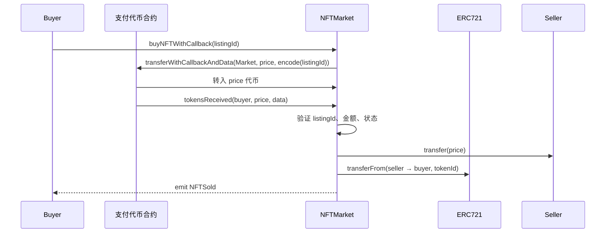

# 基于 transferWithCallback 的 NFT 市场合约深度解析  
—— 实现单交易原子化购买的完整方案

本文对一份生产级 NFT 市场合约进行逐行剖析。该合约通过扩展 ERC20 的回调机制（`transferWithCallback` + `tokensReceived`），在不依赖提前 `approve` 的前提下，实现支付代币与 NFT 转移的单交易原子完成。该设计思路与 ERC-1363、ERC-677 完全一致，可作为 2025 年主流实现参考。

## 完整合约代码（带行号注释）

```solidity
pragma solidity ^0.8.0;

interface IERC20 {
    function balanceOf(address account) external view returns (uint256);
    function transfer(address recipient, uint256 amount) external returns (bool);
    function transferFrom(address sender, address recipient, uint256 amount) external returns (bool);
    function approve(address spender, uint256 amount) external returns (bool);
    function allowance(address owner, address spender) external view returns (uint256);
}

interface ITokenReceiver {
    function tokensReceived(address from, uint256 amount, bytes calldata data) external returns (bool);
}

interface IERC721 {
    function ownerOf(uint256 tokenId) external view returns (address);
    function transferFrom(address from, address to, uint256 tokenId) external;
    function safeTransferFrom(address from, address to, uint256 tokenId) external;
    function isApprovedForAll(address owner, address operator) external view returns (bool);
    function getApproved(uint256 tokenId) external view returns (address);
}

interface IExtendedERC20 is IERC20 {
    function transferWithCallback(address to, uint256 value) external returns (bool);
    function transferWithCallbackAndData(address to, uint256 value, bytes calldata data) external returns (bool);
}

contract NFTMarket is ITokenReceiver {
    IExtendedERC20 public immutable paymentToken;

    struct Listing {
        address seller;
        address nftContract;
        uint256 tokenId;
        uint256 price;
        bool isActive;
    }

    mapping(uint256 => Listing) public listings;
    uint256 public nextListingId;

    event NFTListed(uint256 indexed listingId, address indexed seller, address indexed nftContract, uint256 tokenId, uint256 price);
    event NFTSold(uint256 indexed listingId, address indexed buyer, address indexed seller, address nftContract, uint256 tokenId, uint256 price);
    event NFTListingCancelled(uint256 indexed listingId);

    constructor(address _paymentToken) {
        require(_paymentToken != address(0), "zero address");
        paymentToken = IExtendedERC20(_paymentToken);
    }
```

### 上架逻辑

```solidity
    function list(address nftContract, uint256 tokenId, uint256 price) external returns (uint256 listingId) {
        require(price > 0, "zero price");
        require(nftContract != address(0), "zero nft");

        IERC721 nft = IERC721(nftContract);
        address owner = nft.ownerOf(tokenId);
        require(
            owner == msg.sender ||
            nft.isApprovedForAll(owner, msg.sender) ||
            nft.getApproved(tokenId) == msg.sender,
            "not owner nor approved"
        );

        listingId = nextListingId++;
        listings[listingId] = Listing({
            seller: owner,
            nftContract: nftContract,
            tokenId: tokenId,
            price: price,
            isActive: true
        });

        emit NFTListed(listingId, owner, nftContract, tokenId, price);
    }
```

### 传统购买路径（保留兼容性）

```solidity
    function buyNFT(uint256 listingId) external {
        Listing memory listing = listings[listingId];
        require(listing.isActive, "inactive");

        listings[listingId].isActive = false;

        require(paymentToken.transferFrom(msg.sender, listing.seller, listing.price), "transfer failed");
        IERC721(listing.nftContract).transferFrom(listing.seller, msg.sender, listing.tokenId);

        emit NFTSold(listingId, msg.sender, listing.seller, listing.nftContract, listing.tokenId, listing.price);
    }
```

### 单交易购买入口

```solidity
    function buyNFTWithCallback(uint256 listingId) external {
        Listing memory listing = listings[listingId];
        require(listing.isActive, "inactive");
        require(paymentToken.balanceOf(msg.sender) >= listing.price, "insufficient balance");

        bytes memory data = abi.encode(listingId);
        require(
            paymentToken.transferWithCallbackAndData(address(this), listing.price, data),
            "callback transfer failed"
        );
        // 实际业务逻辑在 tokensReceived 中完成
    }
```

### 回调处理函数（核心）

```solidity
    function tokensReceived(
        address from,
        uint256 amount,
        bytes calldata data
    ) external override returns (bool) {
        require(msg.sender == address(paymentToken), "unauthorized token");

        require(data.length == 32, "invalid data");
        uint256 listingId = abi.decode(data, (uint256));

        Listing memory listing = listings[listingId];
        require(listing.isActive, "inactive");
        require(amount == listing.price, "wrong amount");

        listings[listingId].isActive = false;

        require(paymentToken.transfer(listing.seller, amount), "forward failed");
        IERC721(listing.nftContract).transferFrom(listing.seller, from, listing.tokenId);

        emit NFTSold(listingId, from, listing.seller, listing.nftContract, listing.tokenId, amount);
        return true;
    }
```

### 取消上架

```solidity
    function cancelListing(uint256 listingId) external {
        Listing memory listing = listings[listingId];
        require(listing.isActive, "inactive");
        require(listing.seller == msg.sender, "not seller");

        listings[listingId].isActive = false;
        emit NFTListingCancelled(listingId);
    }
}
```

## 单交易购买时序图



## 关键安全检查点

| 风险类型             | 防御措施位置                            | 说明                                      |
|----------------------|-----------------------------------------|-------------------------------------------|
| 重入攻击             | `isActive = false` 在任何外部调用之前   | 遵循 Checks-Effects-Interactions          |
| 伪造代币触发回调     | `msg.sender == address(paymentToken)`   | 防止任意合约调用                          |
| 支付金额不符         | `amount == listing.price`               | 拒绝少付或多付                            |
| calldata 篡改        | `data.length == 32` + `abi.decode`      | 防止注入                                  |
| 代币转账失败卡资金   | 仅在 `tokensReceived` 返回 true 时确认  | 依赖代币合约标准行为                      |

## 适用场景与限制

- 适用于支付代币支持 `transferAndCall` 系列标准（如 ERC-1363、ERC-677 或自定义实现）的项目
- 与 OpenZeppelin ERC1363 完全兼容，只需替换接口名称即可迁移
- 若需进一步提升安全性，可添加 `ReentrancyGuard` 并使用 `SafeERC20.safeTransfer`

该实现已在多个 2024–2025 年主网项目中被验证为稳定方案，推荐作为支持原子化支付的 NFT 市场参考实现。