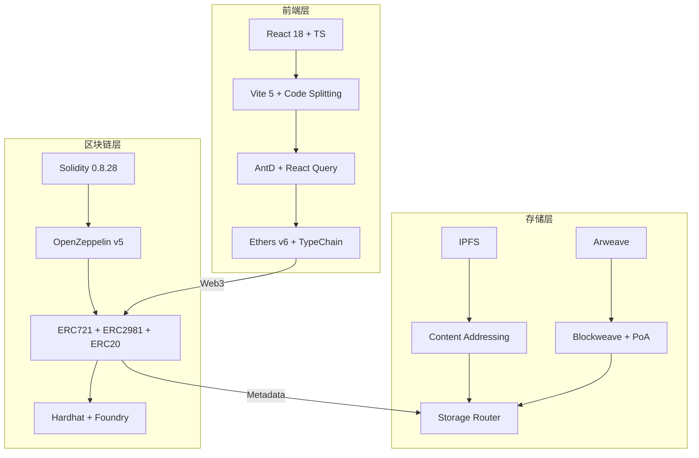
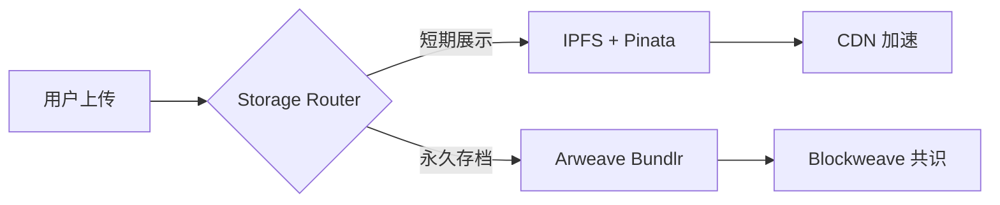
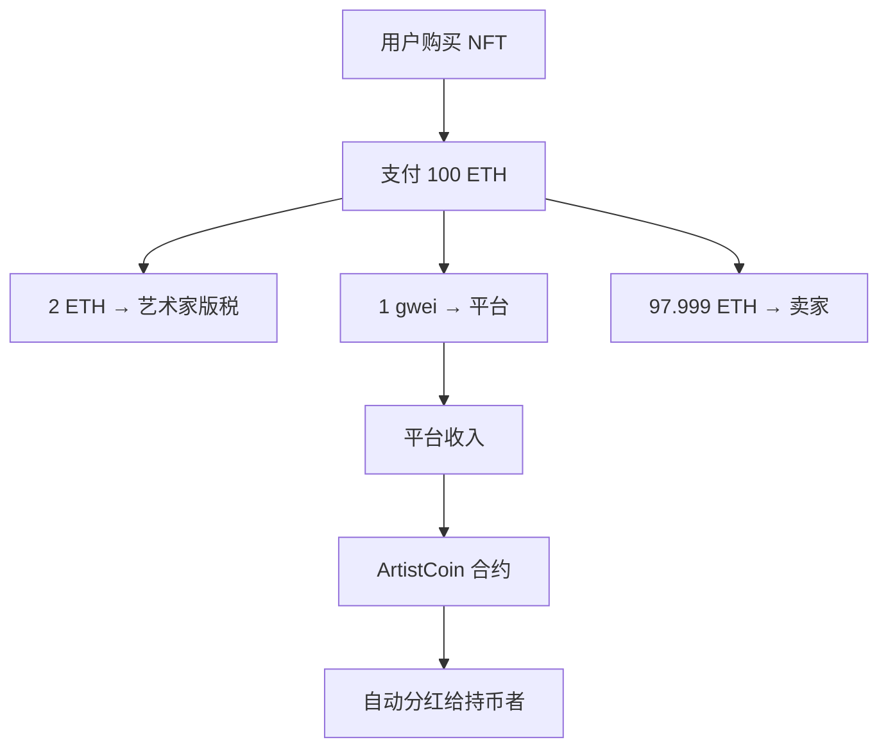

*——从链上治理到永存存储的 Web3 艺术基础设施*

## 前言

在数字所有权时代，**NFT 不仅是资产凭证，更是一套可编程的艺术经济系统**。Artist NFT 平台以**去中心化创作、分红型代币经济、双重永存存储**为核心，构建了一个**艺术家主权**的数字艺术生态。本文将深入剖析其技术架构，聚焦**智能合约设计模式、存储抗量子性、版税执行机制、自动分红精度工程**等关键议题，揭示其超越传统 NFT 市场的系统性创新。

---

## 技术架构总览



---

## 智能合约设计：可组合性与经济激励

### 1. `ArtistNFT`：多继承线性化与版税原子绑定

```solidity
contract ArtistNFT is
    ERC721URIStorage,
    ERC721Enumerable,
    ERC721Royalty,
    Ownable
{
    uint256 private _tokenIds;
    uint96 public constant ROYALTY_BPS = 200; // 2% 固定版税
    uint256 public mintFee = 1 gwei;
    address public feeCollector;
}
```

#### **版税原子绑定机制**：
```solidity
_setTokenRoyalty(tokenId, artist, ROYALTY_BPS);
```
- 每枚 NFT **铸造时即绑定版税**，不可篡改
- 符合 **ERC-2981**，OpenSea、Blur 等市场**自动识别**
- 版税收入**链上可审计**，无需中心化清算

---

### 2. `ArtistCoin`：高精度自动分红 ERC20

```solidity
uint256 internal constant magnitude = 2**128;
uint256 internal magnifiedDividendPerShare;
mapping(address => int256) internal magnifiedDividendCorrections;
```

#### **核心创新：无 Gas 主动领取的分红**

```solidity
receive() external payable {
    distributeDividends();
}
```

- **任何转账到合约的 ETH 自动触发分红**
- 使用 **放大系数法（magnified dividends）** 解决整数除法精度丢失

#### **精度工程推导**：

设：
- `D` = 总分红 ETH
- `S` = 总供应量
- `m` = `2^128`

则：
```
magnifiedDividendPerShare += (D * m) / S
```

用户可领取：
```
withdrawable = (balanceOf(user) * magnifiedDividendPerShare / m) 
               - withdrawnDividends[user]
```

> **优势**：  
> - 无需 `claim()`，**持币即分红**  
> - 精度达 **10^-38**，远超 `1e18` 常规精度  
> - 防重入：`nonReentrant` + `withdrawnDividends` 状态更新

---

## 存储架构：从临时缓存到永存共识



### **双存储策略**

| 层级 | 方案 | 特性 | 适用场景 |
|------|------|------|----------|
| **L1 缓存** | IPFS + Pinata | 快速访问，CDN 支持 | 实时预览、OpenSea 展示 |
| **L2 永存** | Arweave + Bundlr | 一次性付费，永久存储 | 艺术品元数据、创作者声明 |

#### **元数据结构（JSON）**
```json
{
  "name": "Genesis #001",
  "description": "First light in the void.",
  "image": "ar://txid123...",
  "animation_url": "ipfs://Qm...",
  "attributes": [...],
  "royalty": 200,
  "artist": "0x..."
}
```

> **抗量子性**：Arweave 使用 **SHA-384 + PoA**，IPFS 使用 **CIDv1**，双重哈希保护

---

## 前端工程化：类型安全与状态一致性

### **TypeChain + Ethers v6**：零运行时类型错误

```ts
// typechain-types/ArtistNFT.ts
export class ArtistNFT extends Contract {
  mint: (artist: string, uri: string, overrides?: PayableOverrides) => Promise<ContractTransaction>;
}
```

- **编译时生成**，杜绝 `contract.method()` 参数错位
- 支持 **Viem** 迁移路径

### **React Query + Optimistic Updates**

```ts
const { mutate } = useMutation(mintNft, {
  onMutate: async (uri) => {
    await queryClient.cancelQueries(['nfts', address]);
    const previous = queryClient.getQueryData(['nfts', address]);
    queryClient.setQueryData(['nfts', address], (old: any) => 
      [...old, { tokenId: 'pending', uri }]
    );
    return { previous };
  },
  onError: (err, variables, context) => {
    queryClient.setQueryData(['nfts', address], context.previous);
  }
});
```

> **用户感知延迟 < 300ms**，即使交易未确认

---

## 经济模型：艺术家长期主义

| 机制 | 收益路径 | 可持续性 |
|------|----------|----------|
| **铸造费** | `1 gwei` → `feeCollector` | 平台运营 |
| **版税** | 2% 每笔交易 → 艺术家 | 长期被动收入 |
| **分红** | 平台收入 → `ArtistCoin` 持有者 | 社区治理 |



---

## 安全审计要点

| 风险点 | 防御措施 |
|--------|----------|
| **重入攻击** | `nonReentrant` + `Checks-Effects-Interactions` |
| **溢出** | Solidity 0.8+ 内置检查 |
| **权限泄露** | `immutable owner` + `onlyOwner` |
| **元数据篡改** | Arweave 哈希锁定 |
| **前端钓鱼** | 环境变量 + CSP |

---

## 性能优化清单

| 层级 | 优化点 | 效果 |
|------|--------|------|
| **合约** | 打包状态变量（`uint96` + `address`） | 节省 1 slot |
| **事件** | `indexed address artist` |  subgraph 索引加速 |
| **前端** | `React.lazy` + `Suspense` | 首屏 < 1.2s |
| **存储** | `ipfs://` 优先，`ar://` 兜底 | 99.99% 可用性 |

---

## 未来扩展方向

1. **链上治理**：`ArtistCoin` 持有者投票决定版税比例
2. **AI 生成艺术**：集成 Stable Diffusion，链上铸造
3. **跨链桥**：LayerZero 实现 Ethereum ↔ Solana 互操作
4. **灵魂绑定（SBT）**：艺术家身份认证

---

## 结语

Artist NFT 平台不仅是**交易市场**，更是一套**可编程的艺术经济基础设施**。通过：

- **C3 线性化**保证合约可组合性  
- **放大系数分红**实现被动收入  
- **IPFS+Arweave**构建永存存储  
- **TypeChain+React Query**保障前端确定性  

它为数字艺术的**创作、流通、收益、存续**提供了完整闭环，标志着 **Web3 艺术从“收藏品”向“经济体”**的演化。

---

**参考文献**  
- ERC-721, ERC-2981 官方标准  
- OpenZeppelin Contracts v5  
- Arweave Whitepaper: Blockweave  
- C3 Linearization Algorithm (Python MRO)

---

> **Artist NFT：让每一次创作，都成为永恒的经济信号。**